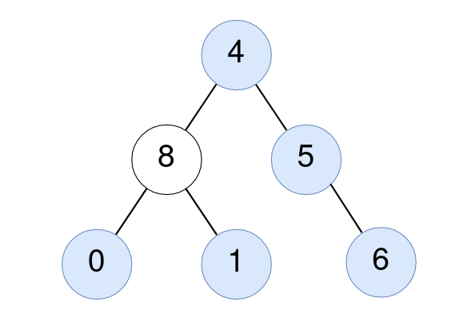

2265. Count Nodes Equal to Average of Subtree

Given the `root` of a binary tree, return the number of nodes where the value of the node is equal to the **average** of the values in its subtree.

**Note:**

* The **average** of `n` elements is the **sum** of the `n` elements divided by `n` and **rounded down** to the nearest integer.
* A **subtree** of root is a tree consisting of `root` and all of its descendants.
 

**Example 1:**


```
Input: root = [4,8,5,0,1,null,6]
Output: 5
Explanation: 
For the node with value 4: The average of its subtree is (4 + 8 + 5 + 0 + 1 + 6) / 6 = 24 / 6 = 4.
For the node with value 5: The average of its subtree is (5 + 6) / 2 = 11 / 2 = 5.
For the node with value 0: The average of its subtree is 0 / 1 = 0.
For the node with value 1: The average of its subtree is 1 / 1 = 1.
For the node with value 6: The average of its subtree is 6 / 1 = 6.
```

**Example 2:**


```
Input: root = [1]
Output: 1
Explanation: For the node with value 1: The average of its subtree is 1 / 1 = 1.
```

**Constraints:**

* The number of nodes in the tree is in the range `[1, 1000]`.
* `0 <= Node.val <= 1000`

# Submissions
---
**Solution 1: (DFS)**
```
Runtime: 25 ms
Memory Usage: 23.5 MB
```
```c++
/**
 * Definition for a binary tree node.
 * struct TreeNode {
 *     int val;
 *     TreeNode *left;
 *     TreeNode *right;
 *     TreeNode() : val(0), left(nullptr), right(nullptr) {}
 *     TreeNode(int x) : val(x), left(nullptr), right(nullptr) {}
 *     TreeNode(int x, TreeNode *left, TreeNode *right) : val(x), left(left), right(right) {}
 * };
 */
class Solution {
    int ans;
    vector<int> dfs(TreeNode* root) {
        if (!root)
            return {0, 0};
        vector<int> rst{0, 0}, left, right;
        left = dfs(root->left);
        right = dfs(root->right);
        rst[0] = left[0] + right[0] + root->val;
        rst[1] = left[1] + right[1] + 1;
        if (rst[0]/rst[1] == root->val)
            ans += 1;
        return rst;
    }
public:
    int averageOfSubtree(TreeNode* root) {
        ans = 0;
        dfs(root);
        return ans;
    }
};
```
