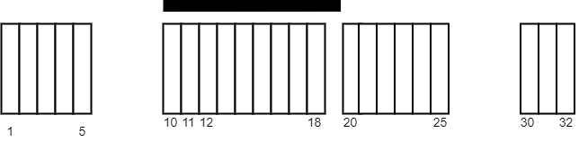
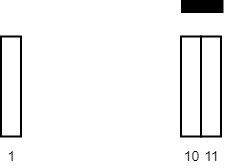

2271. Maximum White Tiles Covered by a Carpet

You are given a 2D integer array `tiles` where `tiles[i] = [li, ri]` represents that every tile `j` in the range `li <= j <= ri` is colored white.

You are also given an integer `carpetLen`, the length of a single carpet that can be placed **anywhere**.

Return the **maximum** number of white tiles that can be covered by the carpet.

 

**Example 1:**


```
Input: tiles = [[1,5],[10,11],[12,18],[20,25],[30,32]], carpetLen = 10
Output: 9
Explanation: Place the carpet starting on tile 10. 
It covers 9 white tiles, so we return 9.
Note that there may be other places where the carpet covers 9 white tiles.
It can be shown that the carpet cannot cover more than 9 white tiles.
```

**Example 2:**


```
Input: tiles = [[10,11],[1,1]], carpetLen = 2
Output: 2
Explanation: Place the carpet starting on tile 10. 
It covers 2 white tiles, so we return 2.
```

**Constraints:**

* `1 <= tiles.length <= 5 * 10^4`
* `tiles[i].length == 2`
* `1 <= li <= ri <= 10^9`
* `1 <= carpetLen <= 10^9`
* The `tiles` are **non-overlapping**.

# Submissions
---
**Solution 1: (Sort, Prefix Sum, Binary Search)**
```
Runtime: 1572 ms
Memory Usage: 39.2 MB
```
```python
class Solution:
    def maximumWhiteTiles(self, tiles: List[List[int]], carpetLen: int) -> int:
        # sort the tiles by the starting position
        tiles.sort(key = lambda x:x[0])
        # build the starting position array
        startPos = [tiles[i][0] for i in range(len(tiles))]
        # build the prefix sum array
        preSum = [0] * (len(tiles) + 1)
        for i in range(1, len(tiles) + 1):
            preSum[i] = preSum[i - 1] + (tiles[i-1][1]-tiles[i-1][0] + 1)
        
        res = 0
        for i in range(len(tiles)):
            s, e = tiles[i]
            # if the length of tile >= length of carpet, return carpetLen
            if e >= s + carpetLen - 1:
                return carpetLen
            # binary search the index of the ending tile that the carpet can partially cover
            endIdx = bisect_right(startPos, s + carpetLen - 1) - 1
            # calculate the length of the ending tile that the carpet cannot cover 
            compensate = 0
            if tiles[endIdx][1] > s + carpetLen - 1:
                compensate = tiles[endIdx][1] - s - carpetLen + 1
            # update the result
            res = max(res, preSum[endIdx+1] - preSum[i] - compensate)
            
        return res
```

**Solution 2: (Sort, Prefix Sum, Binary Search)**
```
Runtime: 465 ms
Memory Usage: 73.4 MB
```
```c++
class Solution {
public:
    int maximumWhiteTiles(vector<vector<int>>& tiles, int carpetLen) {
        sort(tiles.begin(),tiles.end());
        int n = tiles.size();
        
        // prefix array to find the number of tiles in a certain range in constant time.
        vector<int> pre(n,0);
        pre[0]=tiles[0][1]-tiles[0][0]+1;       
        for(int i=1;i<n;i++){
            pre[i] = pre[i-1] + tiles[i][1]-tiles[i][0]+1;
        }
        
        // using another array to apply binary search upon.     
        vector<int> tile;
        for(auto &i : tiles)tile.push_back(i[0]);
        
        int ans = 0;
        for(int i=0;i<n;i++){
            // binary search to find the index where the carpet ends.
            auto it = lower_bound(tile.begin(),tile.end(),carpetLen+tiles[i][0]); 
            if(it!=tile.end() and (*it)>carpetLen+tiles[i][0])
                --it;
            
            // adding the elements which are completely covered by carpet.          
            int temp = (it-tile.begin()-1>=0 ? pre[it-tile.begin()-1] : 0)-(i-1>=0 ? pre[i-1] : 0);
            
            // adding the last element which may or may not completely be covered by the carpet.
            if(it!=tile.end() and (carpetLen+tiles[i][0])>=(*it))
                temp+=min(carpetLen+tiles[i][0]-(*it),pre[it-tile.begin()]-(it-tile.begin()-1>=0 ? pre[it-tile.begin()-1] : 0));
            
            // updating our ans variable            
            ans = max(ans,temp);
        }
        return ans;
    }
};
```
