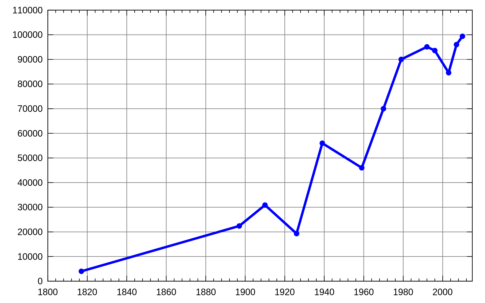
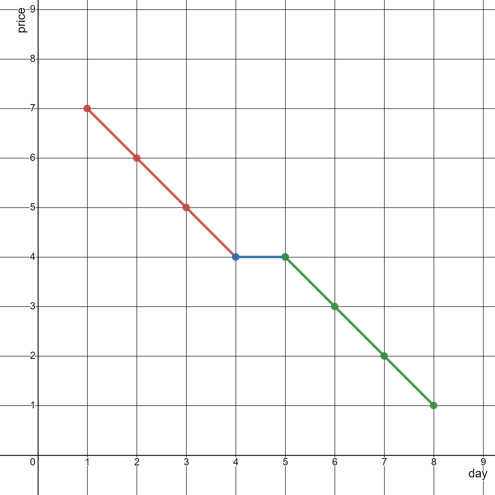
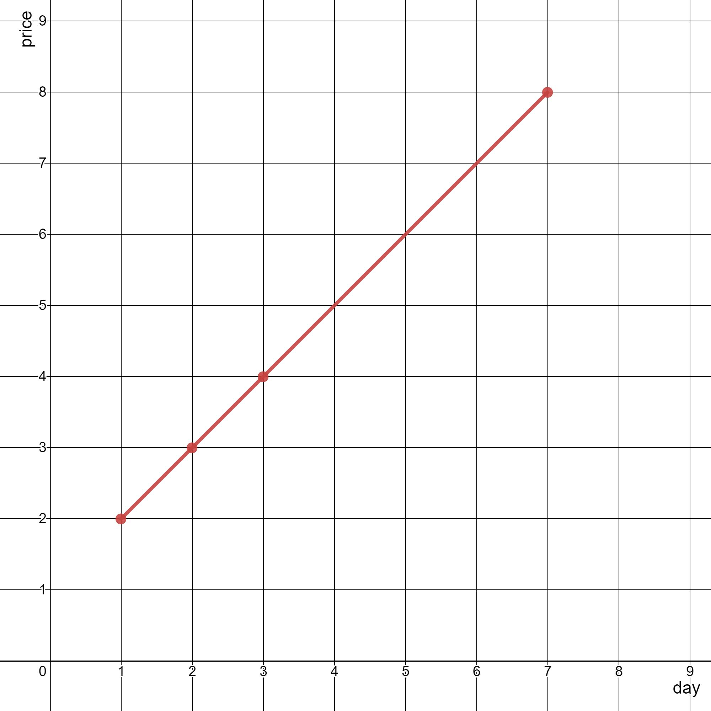

2280. Minimum Lines to Represent a Line Chart

You are given a 2D integer array `stockPrices` where `stockPrices[i] = [dayi, pricei]` indicates the price of the stock on day `dayi` is `pricei`. A **line chart** is created from the array by plotting the points on an XY plane with the X-axis representing the day and the Y-axis representing the price and connecting adjacent points. One such example is shown below:



Return the **minimum number of lines** needed to represent the line chart.

 


**Example 1:**


```
Input: stockPrices = [[1,7],[2,6],[3,5],[4,4],[5,4],[6,3],[7,2],[8,1]]
Output: 3
Explanation:
The diagram above represents the input, with the X-axis representing the day and Y-axis representing the price.
The following 3 lines can be drawn to represent the line chart:
- Line 1 (in red) from (1,7) to (4,4) passing through (1,7), (2,6), (3,5), and (4,4).
- Line 2 (in blue) from (4,4) to (5,4).
- Line 3 (in green) from (5,4) to (8,1) passing through (5,4), (6,3), (7,2), and (8,1).
It can be shown that it is not possible to represent the line chart using less than 3 lines.
```

**Example 2:**


```
Input: stockPrices = [[3,4],[1,2],[7,8],[2,3]]
Output: 1
Explanation:
As shown in the diagram above, the line chart can be represented with a single line.
```

**Constraints:**

* `1 <= stockPrices.length <= 10^5`
* `stockPrices[i].length == 2`
* `1 <= dayi, pricei <= 10^9`
All `dayi` are **distinct**.

# Submissions
---
**Solution 1: (Math)**

(y1 - y0) / (x1 - x0) == (y2 - y1) / (x2 - x1)
<=> (y1 - y0) * (x2 - x1) == (y2 - y1) * (x1 - x0)

```
Runtime: 2271 ms
Memory Usage: 59.1 MB
```
```python
class Solution:
    def minimumLines(self, stockPrices: List[List[int]]) -> int:
        n = len(stockPrices)
        res = n - 1
        stockPrices.sort()
        for i in range(1, n - 1):
            a, b, c = stockPrices[i-1], stockPrices[i], stockPrices[i+1]
            if (b[0] - a[0]) * (c[1] - b[1]) == (c[0] - b[0]) * (b[1] - a[1]):
                res -= 1
        return res
```

**Solution 2: (Math)**
```
Runtime: 522 ms
Memory Usage: 100.8 MB
```
```c++
class Solution {
public:
    int minimumLines(vector<vector<int>>& stockPrices) {
        int n = stockPrices.size(), res = n - 1;
        sort(begin(stockPrices), end(stockPrices));
        for (int i = 1; i < n - 1; ++i)
            if (1LL * (stockPrices[i][0] - stockPrices[i-1][0]) * (stockPrices[i+1][1] - stockPrices[i][1]) == 1LL * (stockPrices[i+1][0] - stockPrices[i][0]) * (stockPrices[i][1] - stockPrices[i-1][1]))
                res--;
        return res; 
    }
};
```
