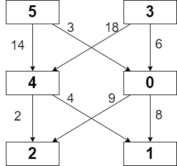

2304. Minimum Path Cost in a Grid

You are given a **0-indexed** `m x n` integer matrix `grid` consisting of **distinct** integers from `0` to `m * n - 1`. You can move in this matrix from a cell to any other cell in the next row. That is, if you are in cell `(x, y)` such that `x < m - 1`, you can move to any of the cells `(x + 1, 0)`, `(x + 1, 1)`, ..., `(x + 1, n - 1)`. Note that it is not possible to move from cells in the last row.

Each possible move has a cost given by a **0-indexed** 2D array `moveCost` of size `(m * n) x n`, where `moveCost[i][j]` is the cost of moving from a cell with value `i` to a cell in column `j` of the next row. The cost of moving from cells in the last row of grid can be ignored.

The cost of a path in `grid` is the **sum** of all values of cells visited plus the **sum** of costs of all the moves made. Return the minimum cost of a path that starts from any cell in the first row and ends at any cell in the last row.

 

**Example 1:**


```
Input: grid = [[5,3],[4,0],[2,1]], moveCost = [[9,8],[1,5],[10,12],[18,6],[2,4],[14,3]]
Output: 17
Explanation: The path with the minimum possible cost is the path 5 -> 0 -> 1.
- The sum of the values of cells visited is 5 + 0 + 1 = 6.
- The cost of moving from 5 to 0 is 3.
- The cost of moving from 0 to 1 is 8.
So the total cost of the path is 6 + 3 + 8 = 17.
```

**Example 2:**
```
Input: grid = [[5,1,2],[4,0,3]], moveCost = [[12,10,15],[20,23,8],[21,7,1],[8,1,13],[9,10,25],[5,3,2]]
Output: 6
Explanation: The path with the minimum possible cost is the path 2 -> 3.
- The sum of the values of cells visited is 2 + 3 = 5.
- The cost of moving from 2 to 3 is 1.
So the total cost of this path is 5 + 1 = 6.
```

**Constraints:**

* `m == grid.length`
* `n == grid[i].length`
* `2 <= m, n <= 50`
* `grid` consists of distinct integers from `0` to `m * n - 1`.
* `moveCost.length == m * n`
* `moveCost[i].length == n`
* `1 <= moveCost[i][j] <= 100`

# Submissions
---
**Solution 1: (DP Top-Down)**
```
Runtime: 3829 ms
Memory Usage: 19.8 MB
```
```python
class Solution:
    def minPathCost(self, grid: List[List[int]], moveCost: List[List[int]]) -> int:
        
        @lru_cache()
        def helper(i, j):
            if i >= len(grid) - 1:
                return grid[i][j]
            
            m_cost = 9999999999
            cost = 0

            for k in range(len(grid[0])):
                cost = grid[i][j] + moveCost[grid[i][j]][k] + helper(i + 1, k)
                m_cost = min(cost, m_cost)

            return m_cost

        cost, min_cost = 0, 999999999999
        n = len(grid[0])
        for j in range(n):
            cost = helper(0, j)
            min_cost = min(cost, min_cost)

        return min_cost
```

**Solution 2: (DP Bottom-Up)**
```
Runtime: 649 ms
Memory Usage: 80.4 MB
```
```c++
class Solution {
public:
    int minPathCost(vector<vector<int>>& grid, vector<vector<int>>& moveCost) {
        int m = grid.size(), n = grid[0].size();
        vector<vector<int>> dp(m, vector<int>(n, INT_MAX));
        dp[0] = grid[0];
        for (int i = 1; i < m; ++i)
            for (int j = 0; j < n; ++j)
                for (int k = 0; k < n; ++k)
                    dp[i][k] = min(dp[i][k], grid[i][k] + dp[i - 1][j] + moveCost[grid[i - 1][j]][k]);
        return *min_element(begin(dp[m - 1]), end(dp[m - 1]));
    }
};
```
