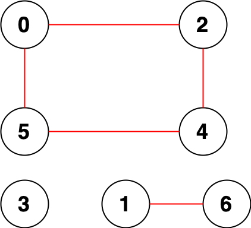

2316. Count Unreachable Pairs of Nodes in an Undirected Graph

You are given an integer `n`. There is an **undirected** graph with `n` nodes, numbered from `0` to `n - 1`. You are given a 2D integer array `edges` where `edges[i] = [ai, bi]` denotes that there exists an **undirected** edge connecting nodes `ai` and `bi`.

Return the **number of pairs** of different nodes that are **unreachable** from each other.

 

**Example 1:**


```
Input: n = 3, edges = [[0,1],[0,2],[1,2]]
Output: 0
Explanation: There are no pairs of nodes that are unreachable from each other. Therefore, we return 0.
```

**Example 2:**


```
Input: n = 7, edges = [[0,2],[0,5],[2,4],[1,6],[5,4]]
Output: 14
Explanation: There are 14 pairs of nodes that are unreachable from each other:
[[0,1],[0,3],[0,6],[1,2],[1,3],[1,4],[1,5],[2,3],[2,6],[3,4],[3,5],[3,6],[4,6],[5,6]].
Therefore, we return 14.
```

**Constraints:**

* `1 <= n <= 10^5`
* `0 <= edges.length <= 2 * 10^5`
* `edges[i].length == 2`
* `0 <= ai, bi < n`
* `ai != bi`
* There are no repeated edges.

# Submissions
---
**Solution 1: (Union Find)**
```
Runtime: 2889 ms
Memory Usage: 73.9 MB
```
```python
class UnionFind:
    def __init__(self, size):
        self.root = [i for i in range(size)]
        self.rank = [1] * size
    def find(self, x):
        if x == self.root[x]:
            return x
        self.root[x] = self.find(self.root[x])
        return self.root[x]
    def union(self, x, y):
        rootX = self.find(x)
        rootY = self.find(y)
        if rootX != rootY:
            if self.rank[rootX] > self.rank[rootY]:
                self.root[rootY] = rootX
            elif self.rank[rootX] < self.rank[rootY]:
                self.root[rootX] = rootY
            else:
                self.root[rootY] = rootX
                self.rank[rootX] += 1

class Solution:
    def countPairs(self, n: int, edges: List[List[int]]) -> int:
        dsu = UnionFind(n)
        for u, v in edges:
            dsu.union(u, v) 
        C = Counter([dsu.find(i) for i in range(n)])
        groupCounts = list(C.values())
        ans = 0
        firstGroupCount = groupCounts[0]
        for i in range(1, len(groupCounts)):
            ans += firstGroupCount * groupCounts[i]
            firstGroupCount += groupCounts[i]  
        return ans
```

**Solution 2: (DFS)**
```
Runtime: 561 ms
Memory: 184.2 MB
```
```c++
class Solution {
    void dfs(int v, long long &cnt, vector<bool>& seen, vector<vector<int>>& g) {
        seen[v] = true;
        cnt++;
        for (auto &nv: g[v]){
            if (!seen[nv]) {
                dfs(nv, cnt, seen, g);
            }   
        }
    }
public:
    long long countPairs(int n, vector<vector<int>>& edges) {
        vector<vector<int>> g(n); 
        for (int i = 0; i < edges.size(); i++){
            g[edges[i][0]].push_back(edges[i][1]);
            g[edges[i][1]].push_back(edges[i][0]);
        }
        long long ans = ((long long)n*(n-1))/2;
        vector<bool> seen(n);
        for (int v = 0; v < n; v++) {
            if (!seen[v]) {
                long long cnt = 0;
                dfs(v, cnt, seen, g);
                ans -= (cnt*(cnt-1))/2;
            }
        }
        return ans;
    }
};
```

**Solution 3: (DFS)**
```
Runtime: 559 ms
Memory: 187.3 MB
```
```c++
class Solution {
    void dfs(int v, long long &cnt, vector<bool>& seen, vector<vector<int>>& g) {
        seen[v] = true;
        cnt++;
        for (auto &nv: g[v]){
            if (!seen[nv]) {
                dfs(nv, cnt, seen, g);
            }   
        }
    }
public:
    long long countPairs(int n, vector<vector<int>>& edges) {
        vector<vector<int>> g(n); 
        for (int i = 0; i < edges.size(); i++){
            g[edges[i][0]].push_back(edges[i][1]);
            g[edges[i][1]].push_back(edges[i][0]);
        }
        vector<bool> seen(n);
        vector<long long> comp;
        long long cnt;
        for (int v = 0; v < n; v++) {
            if (!seen[v]) {
                cnt = 0;
                dfs(v, cnt, seen, g);
                comp.push_back(cnt);
            }
        }
        long long ans = 0, pre = comp[0];
        for (int i = 1; i < comp.size(); i++) {
            ans += pre*comp[i];
            pre += comp[i];
        }
        return ans;
    }
};
```
