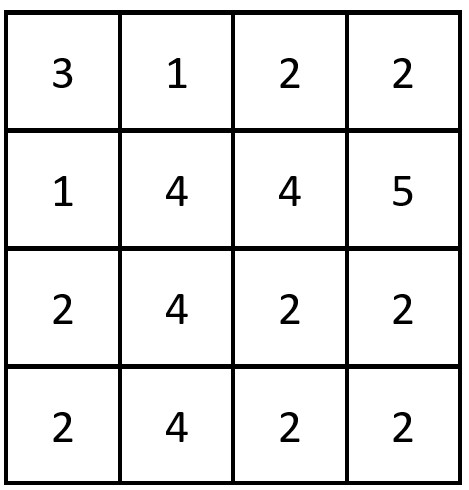

2352. Equal Row and Column Pairs

Given a **0-indexed** `n x n` integer matrix `grid`, return the number of pairs `(Ri, Cj)` such that row `Ri` and column `Cj` are equal.

A row and column pair is considered equal if they contain the same elements in the same order (i.e. an equal array).

 

**Example 1:**


```
Input: grid = [[3,2,1],[1,7,6],[2,7,7]]
Output: 1
Explanation: There is 1 equal row and column pair:
- (Row 2, Column 1): [2,7,7]
```

**Example 2:**


```
Input: grid = [[3,1,2,2],[1,4,4,5],[2,4,2,2],[2,4,2,2]]
Output: 3
Explanation: There are 3 equal row and column pairs:
- (Row 0, Column 0): [3,1,2,2]
- (Row 2, Column 2): [2,4,2,2]
- (Row 3, Column 2): [2,4,2,2]
```

**Constraints:**

* `n == grid.length == grid[i].length`
* `1 <= n <= 200`
* `1 <= grid[i][j] <= 10^5`

# Submissions
---
**SOlution 1: (Array)**
```
Runtime: 1309 ms
Memory Usage: 18.7 MB
```
```python
class Solution:
    def equalPairs(self, grid: List[List[int]]) -> int:
        N = len(grid)
        col = list(map(list,zip(*grid)))
        ans = 0
        for r in range(N):
            for c in range(N):
                if grid[r] == col[c]:
                    ans += 1
        return ans
```

**Solution 2: (Hash Table)**
```
Runtime: 1962 ms
Memory Usage: 119.2 MB
```
```c++
class Solution {
public:
    int equalPairs(vector<vector<int>>& grid) {
        int ans=0;
        map<vector<int>,int>mp;
        for(int i=0;i<grid.size();i++)
        {
          mp[grid[i]]++;  
        }
        for(int i=0;i<grid[0].size();i++)
        { 
            vector<int>chk;
            for(int j=0;j<grid.size();j++)
            {
            chk.push_back(grid[j][i]);
            ans+=mp[chk];
            }
        }
        return ans;
    }
};
```
