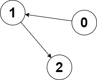

2359. Find Closest Node to Given Two Nodes

You are given a **directed** graph of `n` nodes numbered from `0` to `n - 1`, where each node has at most one outgoing edge.

The graph is represented with a given **0-indexed** array `edges` of size `n`, indicating that there is a directed edge from node `i` to node `edges[i]`. If there is no outgoing edge from `i`, then `edges[i] == -1`.

You are also given two integers `node1` and `node2`.

Return the **index** of the node that can be reached from both `node1` and `node2`, such that the **maximum** between the distance from `node1` to that node, and from `node2` to that node is **minimized**. If there are multiple answers, return the node with the **smallest** index, and if no possible answer exists, return `-1`.

Note that `edges` may contain cycles.

 

**Example 1:**


```
Input: edges = [2,2,3,-1], node1 = 0, node2 = 1
Output: 2
Explanation: The distance from node 0 to node 2 is 1, and the distance from node 1 to node 2 is 1.
The maximum of those two distances is 1. It can be proven that we cannot get a node with a smaller maximum distance than 1, so we return node 2.
```

**xample 2:**


```
Input: edges = [1,2,-1], node1 = 0, node2 = 2
Output: 2
Explanation: The distance from node 0 to node 2 is 2, and the distance from node 2 to itself is 0.
The maximum of those two distances is 2. It can be proven that we cannot get a node with a smaller maximum distance than 2, so we return node 2.
```

**Constraints:**

* `n == edges.length`
* `2 <= n <= 10^5`
* `-1 <= edges[i] < n`
* `edges[i] != i`
* `0 <= node1, node2 < n`

# Submissions
---
**Solution 1: (DFS)**
```
Runtime: 1883 ms
Memory Usage: 138.7 MB
```
```python
class Solution:
    def closestMeetingNode(self, edges: List[int], node1: int, node2: int) -> int:
        res = float("inf")
        
        def dfs(node, arr, counter=0):
            
			#making sure we haven't visited the node before (i.e., value in the array != -1)
            while arr[node]==-1 and node!=-1:
                
				#assigning how many moves it takes to reach node 
                arr[node] = counter
			
				#going through each neighbor if exists and updating the counter 
                dfs(edges[node], arr, counter+1)

            return arr
        
		#find moves to reach nodes from node1
        n1 = [-1 for i in range(len(edges))]
        dfs(node1, n1)
		
		#find moves to reach nodes from node2
        n2 = [-1 for i in range(len(edges))]
        dfs(node2, n2)
                    
        answer = -1
        
        for i in range(len(edges)):
		
			#check if the end node is reachable from both starting nodes
            if n1[i]!=-1 and n2[i]!=-1:
                maximum_distance = max(n1[i], n2[i])
				
				#update the distance and the final answer if relevant
                if maximum_distance<res:
                    res = maximum_distance
                    answer = i
                
        return answer
```

**Solution 2: (DFS)**
```
Runtime: 231 ms
Memory Usage: 97.4 MB
```
```c++
class Solution {
    void dfs(int i, int dist, vector<int>& e, vector<int>& memo) {
        while (i != -1 && memo[i] == -1) {
            memo[i] = dist++;
            i = e[i];
        }
    }
public:
    int closestMeetingNode(vector<int>& edges, int node1, int node2) {
        int res = -1, min_dist = INT_MAX;
        vector<int> m1(edges.size(), -1), m2(edges.size(), -1);
        dfs(node1, 0, edges, m1);
        dfs(node2, 0, edges, m2);
        for (int i = 0; i < edges.size(); ++i)
            if (min(m1[i], m2[i]) >= 0 && max(m1[i], m2[i]) < min_dist) {
                min_dist = max(m1[i], m2[i]);
                res = i;
            }
        return res;
    }
};
```
