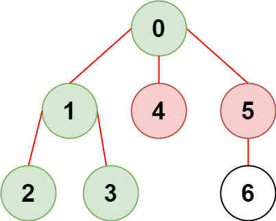

2368. Reachable Nodes With Restrictions

There is an undirected tree with `n` nodes labeled from `0` to `n - 1` and `n - 1` edges.

You are given a 2D integer array `edges` of length `n - 1` where `edges[i] = [ai, bi]` indicates that there is an edge between nodes `ai` and `bi` in the tree. You are also given an integer array `restricted` which represents **restricted** nodes.

Return the **maximum** number of nodes you can reach from node `0` without visiting a restricted node.

Note that node `0` will **not** be a restricted node.

 

**Example 1:**


```
Input: n = 7, edges = [[0,1],[1,2],[3,1],[4,0],[0,5],[5,6]], restricted = [4,5]
Output: 4
Explanation: The diagram above shows the tree.
We have that [0,1,2,3] are the only nodes that can be reached from node 0 without visiting a restricted node.
```

**Example 2:**


```
Input: n = 7, edges = [[0,1],[0,2],[0,5],[0,4],[3,2],[6,5]], restricted = [4,2,1]
Output: 3
Explanation: The diagram above shows the tree.
We have that [0,5,6] are the only nodes that can be reached from node 0 without visiting a restricted node.
```

**Constraints:**

* `2 <= n <= 10^5`
* `edges.length == n - 1`
* `edges[i].length == 2`
* `0 <= ai, bi < n`
* `ai != bi`
* `edges` represents a valid tree.
* `1 <= restricted.length < n`
* `1 <= restricted[i] < n`
* All the values of `restricted` are **unique**.

# Submissions
---
**Solution 1: (DFS)**
```
Runtime: 3094 ms
Memory Usage: 151.4 MB
```
```python
class Solution:
    def reachableNodes(self, n: int, edges: List[List[int]], restricted: List[int]) -> int:
        def dfs(node: int) -> None:
            if node not in seen:
                seen.add(node)
                for kid in g[node]:
                    dfs(kid)
    
        seen = set(restricted)
        g = defaultdict(set)
        for a, b in edges:
            g[a].add(b)
            g[b].add(a)        
        dfs(0)
        return len(seen) - len(restricted) 
```

**Solution 2: (DFS)**
```
Runtime: 569 ms
Memory Usage: 201.2 MB
```
```c++
class Solution {
    int dfs(int i, int from, vector<vector<int>> &al) {
    return accumulate(begin(al[i]), end(al[i]), 1, [&](int s, int j){ 
        return s + (j == from ? 0 : dfs(j, i, al));
    });
}
public:
    int reachableNodes(int n, vector<vector<int>>& edges, vector<int>& restricted) {
        vector<vector<int>> al(n);
        unordered_set<int> rs(begin(restricted), end(restricted));      
        for (auto &e : edges)
            if (rs.count(e[0]) + rs.count(e[1]) == 0) {
                al[e[0]].push_back(e[1]);
                al[e[1]].push_back(e[0]);
            }
        return dfs(0, 0, al);
    }
};
```
