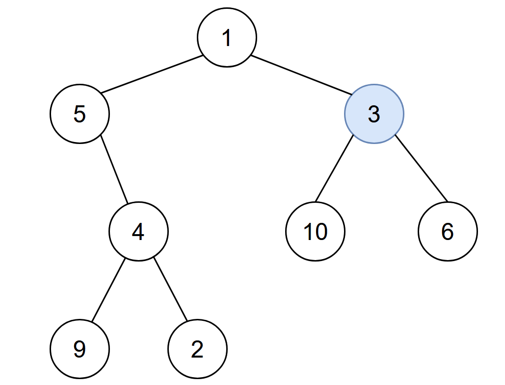

2385. Amount of Time for Binary Tree to Be Infected

You are given the `root` of a binary tree with **unique** values, and an integer `start`. At minute `0`, an **infection** starts from the node with value `start`.

Each minute, a node becomes infected if:

* The node is currently uninfected.
* The node is adjacent to an infected node.

Return the number of minutes needed for the entire tree to be infected.

 

**Example 1:**


```
Input: root = [1,5,3,null,4,10,6,9,2], start = 3
Output: 4
Explanation: The following nodes are infected during:
- Minute 0: Node 3
- Minute 1: Nodes 1, 10 and 6
- Minute 2: Node 5
- Minute 3: Node 4
- Minute 4: Nodes 9 and 2
It takes 4 minutes for the whole tree to be infected so we return 4.
```

**Example 2:**


```
Input: root = [1], start = 1
Output: 0
Explanation: At minute 0, the only node in the tree is infected so we return 0.
```

**Constraints:**

* The number of nodes in the tree is in the range `[1, 10^5]`.
* `1 <= Node.val <= 10^5`
* Each node has a **unique** value.
* A node with a value of `start` exists in the tree.

# Submissions
---
**Solution 1: (BFS)**
```
Runtime: 817 ms
Memory Usage: 60.3 MB
```
```python
# Definition for a binary tree node.
# class TreeNode:
#     def __init__(self, val=0, left=None, right=None):
#         self.val = val
#         self.left = left
#         self.right = right
class Solution:
    def amountOfTime(self, root: Optional[TreeNode], start: int) -> int:
        graph = defaultdict(list)
        
        stack = [(root, None)]
        while stack: 
            n, p = stack.pop()
            if p: 
                graph[p.val].append(n.val)
                graph[n.val].append(p.val)
            if n.left: stack.append((n.left, n))
            if n.right: stack.append((n.right, n))
        
        ans = -1
        seen = {start}
        queue = deque([start])
        while queue: 
            for _ in range(len(queue)): 
                u = queue.popleft()
                for v in graph[u]: 
                    if v not in seen: 
                        seen.add(v)
                        queue.append(v)
            ans += 1
        return ans
```

**Solution 2: (BFS)**
```
Runtime: 1091 ms
Memory Usage: 185.3 MB
```
```c++
/**
 * Definition for a binary tree node.
 * struct TreeNode {
 *     int val;
 *     TreeNode *left;
 *     TreeNode *right;
 *     TreeNode() : val(0), left(nullptr), right(nullptr) {}
 *     TreeNode(int x) : val(x), left(nullptr), right(nullptr) {}
 *     TreeNode(int x, TreeNode *left, TreeNode *right) : val(x), left(left), right(right) {}
 * };
 */
class Solution {
    unordered_map<int,vector<int>> v;  //adjacency list

    //create undirected graph for every parent-child  -> BFS
    void createGraph(TreeNode* root){
        queue<pair<TreeNode*,int>> q;
        q.push({root,-1});
        while(q.size()){
            auto [node,parent]= q.front(); q.pop();
            if(parent!=-1){
                v[parent].push_back(node->val);
                v[node->val].push_back(parent);
            }
            if(node->left)  q.push({node->left,node->val});
            if(node->right) q.push({node->right,node->val});
        }   
    }
public:
    int amountOfTime(TreeNode* root, int start) {
        //create graph of given tree
        createGraph(root);

        //start bfs
        queue<int> q;
        unordered_map<int,bool> seen;
        q.push(start);
        seen[start]=true;
        int time=0;
        for(;q.size();time++){
            int n= q.size();
            while(n--){
                auto node= q.front();  q.pop();
                for(auto i:v[node]){
                    if(!seen[i]){
                        q.push(i);
                        seen[i]=true;
                    }
                }
            }
        }
        return time-1;
    }
};
```

**Solution 3: (One Pass)**
```
Runtime: 108 ms
Memory: 90.71 MB
```
```c++
/**
 * Definition for a binary tree node.
 * struct TreeNode {
 *     int val;
 *     TreeNode *left;
 *     TreeNode *right;
 *     TreeNode() : val(0), left(nullptr), right(nullptr) {}
 *     TreeNode(int x) : val(x), left(nullptr), right(nullptr) {}
 *     TreeNode(int x, TreeNode *left, TreeNode *right) : val(x), left(left), right(right) {}
 * };
 */
class Solution {
    int maxDistance = 0;
    int traverse(TreeNode* root, int start) {
        int depth = 0;
        if (root == nullptr) {
            return depth;
        }

        int leftDepth = traverse(root->left, start);
        int rightDepth = traverse(root->right, start);

        if (root->val == start) {
            maxDistance = max(leftDepth, rightDepth);
            depth = -1;
        } else if (leftDepth >= 0 && rightDepth >= 0) {
            depth = max(leftDepth, rightDepth) + 1;
        } else {
            int distance = abs(leftDepth) + abs(rightDepth);
            maxDistance = max(maxDistance, distance);
            depth = min(leftDepth, rightDepth) - 1;
        }

        return depth;
    }
public:
    int amountOfTime(TreeNode* root, int start) {
        traverse(root, start);
        return maxDistance;
    }
};
```
