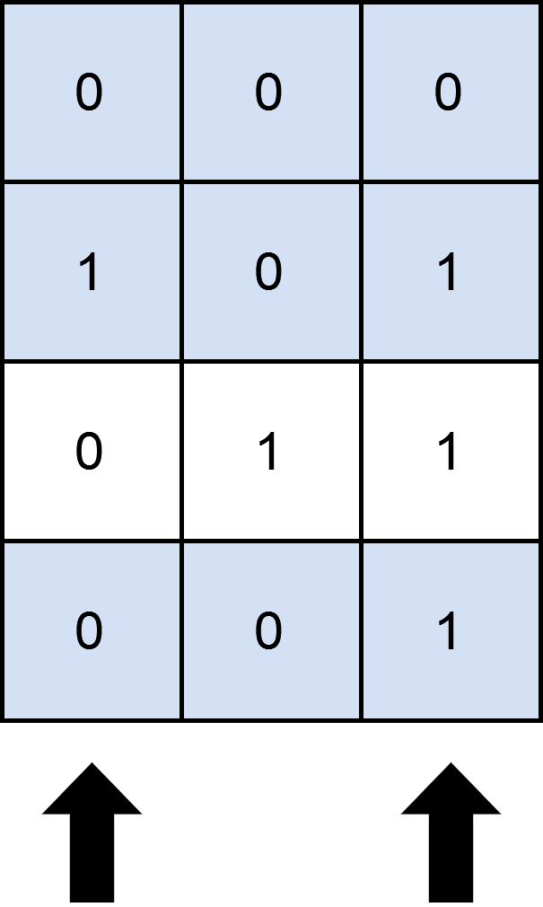

2397. Maximum Rows Covered by Columns

You are given a **0-indexed** `m x n` binary matrix `mat` and an integer `cols`, which denotes the number of columns you must choose.

A row is **covered** by a set of columns if each cell in the row that has a value of `1` also lies in one of the columns of the chosen set.

Return the **maximum** number of rows that can be **covered** by a set of `cols` columns.

 

**Example 1:**


```
Input: mat = [[0,0,0],[1,0,1],[0,1,1],[0,0,1]], cols = 2
Output: 3
Explanation:
As shown in the diagram above, one possible way of covering 3 rows is by selecting the 0th and 2nd columns.
It can be shown that no more than 3 rows can be covered, so we return 3.
```

**Example 2:**


```
Input: mat = [[1],[0]], cols = 1
Output: 2
Explanation:
Selecting the only column will result in both rows being covered, since the entire matrix is selected.
Therefore, we return 2.
```

**Constraints:**

* `M == MAT.LENGTH`
* `N == MAT[I].LENGTH`
* `1 <= M, N <= 12`
* `MAT[I][J]` IS EITHER `0` OR `1`.
* `1 <= COLS <= N`

# Submissions
---
**Solution 1: (Backtracking)**
```
Runtime: 55 ms
Memory Usage: 13.9 MB
```
```python
class Solution:
    def maximumRows(self, mat: List[List[int]], cols: int) -> int:
        res = []
        M = len(mat)
        N = len(mat[0])
        def check(seen):
            count = 0
            for row in mat:
                flag = True
                for c in range(N): 
                    if row[c] == 1:
                        if c in seen:
                            continue
                        else:
                            flag = False
                            break
                if flag:    
                    count +=1   
            res.append(count)
                     
        def solve(c,seen,cols):
            if cols == 0:
                check(seen)
                return
            if c == N:
                return
            else:
                seen.add(c)
                solve(c+1,seen,cols-1)
                seen.remove(c)
                solve(c+1,seen,cols)
        seen = set()
        solve(0,seen,cols)
        return max(res)
```

**Solution 2: (Backtracking)**
```
Runtime: 21 ms
Memory Usage: 8.6 MB
```
```c++
class Solution {
    int maxi = INT_MIN;
    void helper(vector<vector<int>> &mat , int m , int n , int cols , int idx , vector<int> &vis){
        if(cols == 0 or idx==n){
            int cnt = 0;
            for(int p = 0 ; p < m ; p++){
                bool check = true;
                for(int q = 0 ; q < n; q++){
                    // if cell is 1 and not visited then we cannot take this row
                    if(mat[p][q] == 1 and vis[q] == 0){
                        check = false;
                        break;
                    }
                }
                if(check) cnt++;
            }
            maxi = max(maxi,cnt);
            return;
        }
        
        // picking idx th column and marking column as visited
        vis[idx]=1;
        helper(mat,m,n,cols-1,idx+1,vis);
        vis[idx]=0;
        
        // not picking
        helper(mat,m,n,cols,idx+1,vis);
        return;
        
    }
public:
    int maximumRows(vector<vector<int>>& mat, int cols) {
        int m = mat.size();
        int n = mat[0].size();
        
        vector<int> vis(n);
        
        helper(mat,m,n,cols,0,vis);
        return maxi;
    }
};
```
