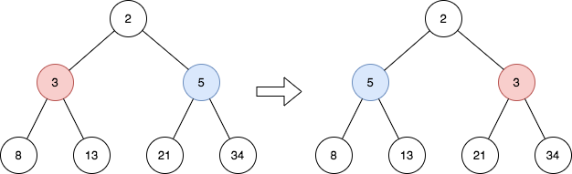

2415. Reverse Odd Levels of Binary Tree

Given the `root` of a perfect binary tree, reverse the node values at each **odd** level of the tree.

* For example, suppose the node values at level `3` are `[2,1,3,4,7,11,29,18]`, then it should become `[18,29,11,7,4,3,1,2]`.

Return the root of the reversed tree.

A binary tree is **perfect** if all parent nodes have two children and all leaves are on the same level.

The **level** of a node is the number of edges along the path between it and the root node.

 

**Example 1:**


```
Input: root = [2,3,5,8,13,21,34]
Output: [2,5,3,8,13,21,34]
Explanation: 
The tree has only one odd level.
The nodes at level 1 are 3, 5 respectively, which are reversed and become 5, 3.
```

**Example 2:**


```
Input: root = [7,13,11]
Output: [7,11,13]
Explanation: 
The nodes at level 1 are 13, 11, which are reversed and become 11, 13.
```

**Example 3:**
```
Input: root = [0,1,2,0,0,0,0,1,1,1,1,2,2,2,2]
Output: [0,2,1,0,0,0,0,2,2,2,2,1,1,1,1]
Explanation: 
The odd levels have non-zero values.
The nodes at level 1 were 1, 2, and are 2, 1 after the reversal.
The nodes at level 3 were 1, 1, 1, 1, 2, 2, 2, 2, and are 2, 2, 2, 2, 1, 1, 1, 1 after the reversal.
```

**Constraints:**

* The number of nodes in the tree is in the range `[1, 2^14]`.
* `0 <= Node.val <= 10^5`
* `root` is a **perfect** binary tree.

# Submissions
---
**Solution 1: (BFS)**
```
Runtime: 3683 ms
Memory Usage: 20.4 MB
```
```python
# Definition for a binary tree node.
# class TreeNode:
#     def __init__(self, val=0, left=None, right=None):
#         self.val = val
#         self.left = left
#         self.right = right
class Solution:
    def reverseOddLevels(self, root: Optional[TreeNode]) -> Optional[TreeNode]:
        q = deque([root]) ### Initialize the queue with root.
        level = 0 ### Start with level 0 (root).
        while q:
            ### When we are at an odd level, reverse the value of each node in the queue.
            if level %2 != 0:
                l = 0           ### left pointer.
                r = len(q)-1    ### right pointer.
                while l<r: 
                    ### Sweep the value of the left node and right node.
                    q[l].val,q[r].val = q[r].val,q[l].val
                    l+=1
                    r-=1
            ### Same as regular BSF, adding the node for the next level.
            for _ in range(len(q)):
                cur = q.popleft()
                if cur.left:
                    q.append(cur.left)
                if cur.right:
                    q.append(cur.right)
            ### Increase the level.
            level += 1
        return root
```

**Solution 2: (BFS)**
```
Runtime: 489 ms
Memory Usage: 77.1 MB
```
```c++
/**
 * Definition for a binary tree node.
 * struct TreeNode {
 *     int val;
 *     TreeNode *left;
 *     TreeNode *right;
 *     TreeNode() : val(0), left(nullptr), right(nullptr) {}
 *     TreeNode(int x) : val(x), left(nullptr), right(nullptr) {}
 *     TreeNode(int x, TreeNode *left, TreeNode *right) : val(x), left(left), right(right) {}
 * };
 */
class Solution {
public:
    TreeNode* reverseOddLevels(TreeNode* root) {
        if(!root) return root;
        
        queue<TreeNode*> q;
        vector<int> values;
        q.push(root);
        int level=0;
        
        while(!q.empty())
        {
            int sz = q.size();
            vector<int> temp;
            for(int i=0; i<sz; i++)
            {
                TreeNode* node = q.front(); q.pop();
                
                if(level%2)
                    node->val = values[sz-i-1];
                
                if(node->left)
                {
                    q.push(node->left);
                    temp.push_back(node->left->val);
                }
                if(node->right) 
                {
                    q.push(node->right);
                    temp.push_back(node->right->val);
                }
                
            }
            values = temp;
            level++;
        }
        return root;
    }
};
```

**Solution 3: (BFS, deque)**
```
Runtime: 0 ms
Memory: 80.95 MB
```
```c++
/**
 * Definition for a binary tree node.
 * struct TreeNode {
 *     int val;
 *     TreeNode *left;
 *     TreeNode *right;
 *     TreeNode() : val(0), left(nullptr), right(nullptr) {}
 *     TreeNode(int x) : val(x), left(nullptr), right(nullptr) {}
 *     TreeNode(int x, TreeNode *left, TreeNode *right) : val(x), left(left), right(right) {}
 * };
 */
class Solution {
public:
    TreeNode* reverseOddLevels(TreeNode* root) {
        int sz, i;
        bool level = false;
        queue<TreeNode*> q;
        deque<TreeNode*> dp;
        q.push(root);
        while (q.size()) {
            sz = q.size();
            for (i = 0; i < sz; i ++) {
                auto node = q.front();
                q.pop();
                if (level) {
                    dp.push_back(node);
                }
                if (node->left) {
                    q.push(node->left);
                }
                if (node->right) {
                    q.push(node->right);
                }
            }
            if (level) {
                while (dp.size()) {
                    swap(dp.front()->val, dp.back()->val);
                    dp.pop_front();
                    dp.pop_back();
                }
            }
            level ^= 1;
        }
        return root;
    }
};
```
