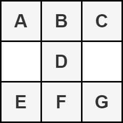
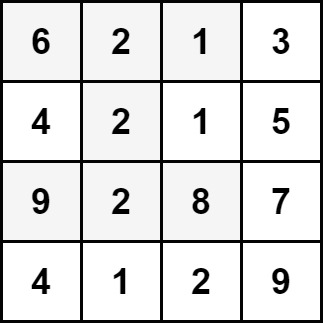
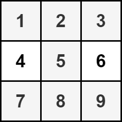

2428. Maximum Sum of an Hourglass

You are given an `m x n` integer matrix `grid`.

We define an **hourglass** as a part of the matrix with the following form:



Return the **maximum** sum of the elements of an hourglass.

**Note** that an hourglass cannot be rotated and must be entirely contained within the matrix.

 

**Example 1:**


```
Input: grid = [[6,2,1,3],[4,2,1,5],[9,2,8,7],[4,1,2,9]]
Output: 30
Explanation: The cells shown above represent the hourglass with the maximum sum: 6 + 2 + 1 + 2 + 9 + 2 + 8 = 30.
```

**Example 2:**


```
Input: grid = [[1,2,3],[4,5,6],[7,8,9]]
Output: 35
Explanation: There is only one hourglass in the matrix, with the sum: 1 + 2 + 3 + 5 + 7 + 8 + 9 = 35.
```

**Constraints:**

* `m == grid.length`
* `n == grid[i].length`
* `3 <= m, n <= 150`
* `0 <= grid[i][j] <= 10^6

# Submissions
---
**Solution 1: (Brute Force)**
```
Runtime: 864 ms
Memory: 17 MB
```
```python
class Solution:
    def maxSum(self, grid: List[List[int]]) -> int:
        ans = 0
        
        for i in range(len(grid)-2):
            for j in range(len(grid[0])-2):
                m = grid[i][j]+ grid[i][j+1]+ grid[i][j+2]+grid[i+1][j+1]+grid[i+2][j]+grid[i+2][j+1]+grid[i+2][j+2]
                ans = max(m,ans)
        
        return ans
```

**Solution 2: (Brute Force)**
```
Runtime: 42 ms
Memory: 13.2 MB
```
```c++
class Solution {
public:
    int maxSum(vector<vector<int>>& grid) {
        int max_sum = INT_MIN;
        for(int i = 0; i < grid.size()-2; i++){
            for(int j = 0; j < grid[i].size()-2; j++){
                int sum = grid[i][j] + grid[i][j+1] + grid[i][j+2]
                                     + grid[i+1][j+1] + 
                         grid[i+2][j] + grid[i+2][j+1] + grid[i+2][j+2];
                max_sum = max(max_sum, sum);
            }
        }
        return max_sum;
    }
};
```
