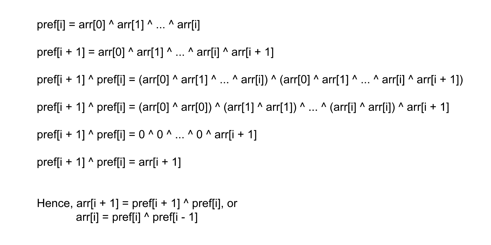

2433. Find The Original Array of Prefix Xor

You are given an **integer** array `pref` of size `n`. Find and return the array arr of size `n` that satisfies:

* `pref[i] = arr[0] ^ arr[1] ^ ... ^ arr[i]`.

Note that `^` denotes the **bitwise-xor** operation.

It can be proven that the answer is **unique**.

 

**Example 1:**
```
Input: pref = [5,2,0,3,1]
Output: [5,7,2,3,2]
Explanation: From the array [5,7,2,3,2] we have the following:
- pref[0] = 5.
- pref[1] = 5 ^ 7 = 2.
- pref[2] = 5 ^ 7 ^ 2 = 0.
- pref[3] = 5 ^ 7 ^ 2 ^ 3 = 3.
- pref[4] = 5 ^ 7 ^ 2 ^ 3 ^ 2 = 1.
```

**Example 2:**
```
Input: pref = [13]
Output: [13]
Explanation: We have pref[0] = arr[0] = 13.
```

**Constraints:**

* `1 <= pref.length <= 10^5`
* `0 <= pref[i] <= 10^6`

# Submissions
---
**Solution 1: (Greedy)**



```
Runtime: 2045 ms
Memory: 33.1 MB
```
```python
class Solution:
    def findArray(self, pref: List[int]) -> List[int]:
        return [pref[0]] + [pref[i-1]^pref[i] for i in range(1, len(pref))]
```

**Solution 1: (Greedy)**
```
Runtime: 129 ms
Memory: 76.1 MB
```
```c++
class Solution {
public:
    vector<int> findArray(vector<int>& pref) {
        int n = pref.size();
        vector<int> ans(n);
        ans[0] = pref[0];
        for (int i = 1; i < n; i ++) {
            ans[i] = pref[i-1]^pref[i];
        }
        return ans;
    }
};
```
