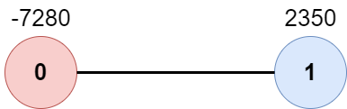

2467. Most Profitable Path in a Tree

There is an undirected tree with `n` nodes labeled from `0` to `n - 1`, rooted at node `0`. You are given a 2D integer array `edges` of length `n - 1` where `edges[i] = [ai, bi]` indicates that there is an edge between nodes `ai` and `bi` in the tree.

At every node `i`, there is a gate. You are also given an array of even integers `amount`, where `amount[i]` represents:

* the price needed to open the gate at node `i`, if `amount[i]` is negative, or,
* the cash reward obtained on opening the gate at node `i`, otherwise.

The game goes on as follows:

* Initially, Alice is at node `0` and Bob is at node `bob`.

* At every second, Alice and Bob each move to an adjacent node. Alice moves towards some leaf node, while Bob moves towards node `0`.

* For **every** node along their path, Alice and Bob either spend money to open the gate at that node, or accept the reward. Note that:
    * If the gate is **already open**, no price will be required, nor will there be any cash reward.
    * If Alice and Bob reach the node **simultaneously**, they share the price/reward for opening the gate there. In other words, if the price to open the gate is `c`, then both Alice and Bob pay `c / 2` each. Similarly, if the reward at the gate is `c`, both of them receive `c / 2` each.

* If Alice reaches a leaf node, she stops moving. Similarly, if Bob reaches node `0`, he stops moving. Note that these events are **independent** of each other.

Return the **maximum** net income Alice can have if she travels towards the optimal leaf node.

 

**Example 1:**


```
Input: edges = [[0,1],[1,2],[1,3],[3,4]], bob = 3, amount = [-2,4,2,-4,6]
Output: 6
Explanation: 
The above diagram represents the given tree. The game goes as follows:
- Alice is initially on node 0, Bob on node 3. They open the gates of their respective nodes.
  Alice's net income is now -2.
- Both Alice and Bob move to node 1. 
  Since they reach here simultaneously, they open the gate together and share the reward.
  Alice's net income becomes -2 + (4 / 2) = 0.
- Alice moves on to node 3. Since Bob already opened its gate, Alice's income remains unchanged.
  Bob moves on to node 0, and stops moving.
- Alice moves on to node 4 and opens the gate there. Her net income becomes 0 + 6 = 6.
Now, neither Alice nor Bob can make any further moves, and the game ends.
It is not possible for Alice to get a higher net income.
```

**Example 2:**


```
Input: edges = [[0,1]], bob = 1, amount = [-7280,2350]
Output: -7280
Explanation: 
Alice follows the path 0->1 whereas Bob follows the path 1->0.
Thus, Alice opens the gate at node 0 only. Hence, her net income is -7280. 
```

**Constraints:**

* `2 <= n <= 10^5`
* `edges.length == n - 1`
* `edges[i].length == 2`
* `0 <= ai, bi < n`
* `ai != bi`
* `edges` represents a valid tree.
* `1 <= bob < n`
* `amount.length == n`
* `amount[i]` is an even integer in the range `[-10^4, 10^4].`

# Submissions
---
**Solution 1: (DFS, pre-order + post-order)**

__Explanation__

d0 is the distance from node 0 to node i
db is the distance from node i to node bob.
If node i is not ancestor of bob, we define db >= n.

So in the dfs, we first pick out the biggest sum of sub path.
If the node has no child, then the biggest sum is 0.
now we compare d0 and db.
If d0 == db, this node is in the middle point between node 0 and node bob.
If d0 < db, Bob will arrive this node first, so no score.

Finally we return the score res and the incremented distance db + 1.


__Complexity__

Time O(n)
Space O(n)

```
Runtime: 4101 ms
Memory: 104.5 MB
```
```python
class Solution:
    def mostProfitablePath(self, edges: List[List[int]], bob: int, amount: List[int]) -> int:
        n = len(edges) + 1
        G = [[] for i in range(n)]
        for i,j in edges:
            G[i].append(j)
            G[j].append(i)
        seen = [0] * n

        def dfs(i, d0):
            seen[i] = 1
            res = -inf
            db = 0 if i == bob else n
            for j in G[i]:
                if seen[j]: continue
                cur, kk = dfs(j, d0 + 1)
                res = max(res, cur)
                db = min(db, kk)
            if res == -inf: res = 0
            if d0 == db: res += amount[i] // 2
            if d0 < db: res += amount[i]
            return res, db + 1

        return dfs(0, 0)[0]
```

**Solution 2: (DFS + BFS)**
```
Runtime: 251 ms, Beats 24.20%
Memory: 183.32 MB, Beats 23.56%
```
```c++
class Solution {
    unordered_map<int, int> bobPath;
    vector<bool> visited;
    vector<vector<int>> tree;

    // Depth First Search
    bool findBobPath(int sourceNode, int time) {
        // Mark and set time node is reached
        bobPath[sourceNode] = time;
        visited[sourceNode] = true;

        // Destination for Bob is found
        if (sourceNode == 0) {
            return true;
        }

        // Traverse through unvisited nodes
        for (auto adjacentNode : tree[sourceNode]) {
            if (!visited[adjacentNode]) {
                if (findBobPath(adjacentNode, time + 1)) {
                    return true;
                }
            }
        }
        // If node 0 isn't reached, remove current node from path
        bobPath.erase(sourceNode);
        return false;
    }
public:
    int mostProfitablePath(vector<vector<int>>& edges, int bob, vector<int>& amount) {
        int n = amount.size(), maxIncome = INT_MIN;
        tree.resize(n);
        visited.assign(n, false);
        queue<vector<int>> nodeQueue;
        nodeQueue.push({0, 0, 0});

        // Form tree with edges
        for (vector<int> edge : edges) {
            tree[edge[0]].push_back(edge[1]);
            tree[edge[1]].push_back(edge[0]);
        }

        // Find the path taken by bob to reach node 0 and the times it takes to
        // get there
        findBobPath(bob, 0);

        // Breadth First Search
        visited.assign(n, false);
        while (!nodeQueue.empty()) {
            int sourceNode = nodeQueue.front()[0], time = nodeQueue.front()[1],
                income = nodeQueue.front()[2];

            // Alice reaches the node first
            if (bobPath.find(sourceNode) == bobPath.end() ||
                time < bobPath[sourceNode]) {
                income += amount[sourceNode];
            }

            // Alice and Bob reach the node at the same time
            else if (time == bobPath[sourceNode]) {
                income += (amount[sourceNode] / 2);
            }

            // Update max value if current node is a new leaf
            if (tree[sourceNode].size() == 1 && sourceNode != 0) {
                maxIncome = max(maxIncome, income);
            }
            // Explore adjacent unvisited vertices
            for (int adjacentNode : tree[sourceNode]) {
                if (!visited[adjacentNode]) {
                    nodeQueue.push({adjacentNode, time + 1, income});
                }
            }

            // Mark and remove current node
            visited[sourceNode] = true;
            nodeQueue.pop();
        }
        return maxIncome;
    }
};
```

**Solution 3: (2 DFS)**
```
Runtime: 170 ms, Beats 51.61%
Memory: 163.36 MB, Beats 42.19%
```
```c++
class Solution {
    unordered_map<int, int> bobPath;
    vector<bool> visited;
    vector<vector<int>> tree;
    int maxIncome = INT_MIN;

    // Depth First Search to find Bob's path
    bool findBobPath(int sourceNode, int time) {
        // Mark and set time node is reached
        bobPath[sourceNode] = time;
        visited[sourceNode] = true;

        // Destination for Bob is found
        if (sourceNode == 0) {
            return true;
        }

        // Traverse through unvisited nodes
        for (int adjacentNode : tree[sourceNode]) {
            if (!visited[adjacentNode] && findBobPath(adjacentNode, time + 1)) {
                return true;
            }
        }

        // If node 0 isn't reached, remove current node from path
        bobPath.erase(sourceNode);
        return false;
    }

    // Depth First Search to find Alice's optimal path
    void findAlicePath(int sourceNode, int time, int income,
                       vector<int>& amount) {
        // Mark node as explored
        visited[sourceNode] = true;

        // Alice reaches the node first
        if (bobPath.find(sourceNode) == bobPath.end() ||
            time < bobPath[sourceNode]) {
            income += amount[sourceNode];
        }

        // Alice and Bob reach the node at the same time
        else if (time == bobPath[sourceNode]) {
            income += (amount[sourceNode] / 2);
        }

        // Update max value if current node is a new leaf
        if (tree[sourceNode].size() == 1 && sourceNode != 0) {
            maxIncome = max(maxIncome, income);
        }

        // Traverse through unvisited nodes
        for (int adjacentNode : tree[sourceNode]) {
            if (!visited[adjacentNode]) {
                findAlicePath(adjacentNode, time + 1, income, amount);
            }
        }
    }
public:
    int mostProfitablePath(vector<vector<int>>& edges, int bob, vector<int>& amount) {
        int n = amount.size();
        tree.resize(n);
        visited.assign(n, false);

        // Form tree with edges
        for (vector<int> edge : edges) {
            tree[edge[0]].push_back(edge[1]);
            tree[edge[1]].push_back(edge[0]);
        }

        // Find the path taken by Bob to reach node 0 and the times it takes to
        // get there
        findBobPath(bob, 0);

        // Find Alice's optimal path
        visited.assign(n, false);
        findAlicePath(0, 0, 0, amount);

        return maxIncome;
    }
};
```

**Solution 4: (DFS)**
```
Runtime: 152 ms, Beats 57.82%
Memory: 161.13 MB, Beats 52.89%
```
```c++
class Solution {
    vector<vector<int>> tree;
    vector<int> distanceFromBob;
    int n;

    // Depth-first Search
    int findPaths(int sourceNode, int parentNode, int time, int bob,
                  vector<int>& amount) {
        int maxIncome = 0, maxChild = INT_MIN;

        // Find the node distances from Bob
        if (sourceNode == bob)
            distanceFromBob[sourceNode] = 0;
        else
            distanceFromBob[sourceNode] = n;
        for (int adjacentNode : tree[sourceNode]) {
            if (adjacentNode != parentNode) {
                maxChild = max(maxChild, findPaths(adjacentNode, sourceNode,
                                                   time + 1, bob, amount));
                distanceFromBob[sourceNode] =
                    min(distanceFromBob[sourceNode],
                        distanceFromBob[adjacentNode] + 1);
            }
        }
        // Alice reaches the node first
        if (distanceFromBob[sourceNode] > time) maxIncome += amount[sourceNode];

        // Alice and Bob reach the node at the same time
        else if (distanceFromBob[sourceNode] == time)
            maxIncome += amount[sourceNode] / 2;

        // Return max income of leaf node
        if (maxChild == INT_MIN)
            return maxIncome;
        else
            return maxIncome + maxChild;
    }
public:
    int mostProfitablePath(vector<vector<int>>& edges, int bob, vector<int>& amount) {
        n = amount.size();
        tree.resize(n, vector<int>());

        // Form tree with edges
        for (vector<int> edge : edges) {
            tree[edge[0]].push_back(edge[1]);
            tree[edge[1]].push_back(edge[0]);
        }
        distanceFromBob.resize(n);
        return findPaths(0, 0, 0, bob, amount);
    }
};
```
