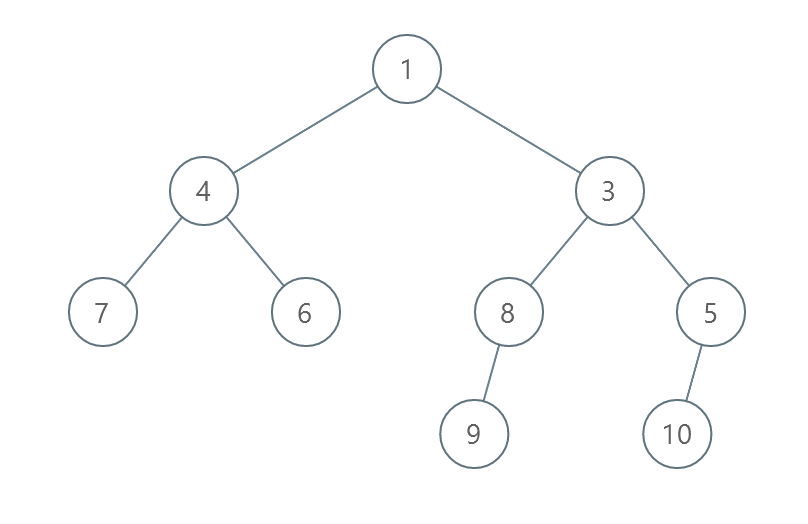

2471. Minimum Number of Operations to Sort a Binary Tree by Level

You are given the `root` of a binary tree with unique values.

In one operation, you can choose any two nodes at the same level and swap their values.

Return the minimum number of operations needed to make the values at each level sorted in a **strictly increasing order**.

The **level** of a node is the number of edges along the path between it and the root node.

 

**Example 1:**


```
Input: root = [1,4,3,7,6,8,5,null,null,null,null,9,null,10]
Output: 3
Explanation:
- Swap 4 and 3. The 2nd level becomes [3,4].
- Swap 7 and 5. The 3rd level becomes [5,6,8,7].
- Swap 8 and 7. The 3rd level becomes [5,6,7,8].
We used 3 operations so return 3.
It can be proven that 3 is the minimum number of operations needed.
```

**Example 2:**


```
Input: root = [1,3,2,7,6,5,4]
Output: 3
Explanation:
- Swap 3 and 2. The 2nd level becomes [2,3].
- Swap 7 and 4. The 3rd level becomes [4,6,5,7].
- Swap 6 and 5. The 3rd level becomes [4,5,6,7].
We used 3 operations so return 3.
It can be proven that 3 is the minimum number of operations needed.
```

**Example 3:**


```
Input: root = [1,2,3,4,5,6]
Output: 0
Explanation: Each level is already sorted in increasing order so return 0.
```

**Constraints:**

* The number of nodes in the tree is in the range `[1, 10^5]`.
* `1 <= Node.val <= 10^5`
* All the values of the tree are **unique**.

# Submissions
---
**Solution 1: (BFS)**
```
Runtime: 1743 ms
Memory: 54.3 MB
```
```python
# Definition for a binary tree node.
# class TreeNode:
#     def __init__(self, val=0, left=None, right=None):
#         self.val = val
#         self.left = left
#         self.right = right
class Solution:
    def minimumOperations(self, root: Optional[TreeNode]) -> int:
        count = 0
        nodes = [root]
        
        def perm(nodes):
            c = 0
            nn = [n.val for n in nodes]
            ns = {v : j for j,v in enumerate(nn)}
            
            for i,v in enumerate(sorted(nn)):
                j = ns[v]
                w = nn[i]
                if nn[i] != nn[j]:
                    c += 1
                    nn[i], nn[j] = nn[j], nn[i]
                    ns[v], ns[w] = i, j
            return c
            
        
        while True:
            if not nodes: break
            while nodes:
                count += perm(nodes)
                next_nodes = []
                for n in nodes:
                    if n.left  : next_nodes.append(n.left)
                    if n.right : next_nodes.append(n.right)
                nodes = next_nodes
        return count
```

**Solution 2: (BFS)**
```
Runtime: 818 ms
Memory: 134.6 MB
```
```c++
/**
 * Definition for a binary tree node.
 * struct TreeNode {
 *     int val;
 *     TreeNode *left;
 *     TreeNode *right;
 *     TreeNode() : val(0), left(nullptr), right(nullptr) {}
 *     TreeNode(int x) : val(x), left(nullptr), right(nullptr) {}
 *     TreeNode(int x, TreeNode *left, TreeNode *right) : val(x), left(left), right(right) {}
 * };
 */
class Solution {
public:
    int minimumOperations(TreeNode* root) {
        int res = 0;
        vector<TreeNode*> q{root};
        while(!q.empty()) {
            vector<TreeNode*> q1;
            vector<int> vals, ids(q.size());
            for (auto n : q) {
                vals.push_back(n->val);
                if (n->left != nullptr)
                    q1.push_back(n->left);
                if (n->right != nullptr)
                    q1.push_back(n->right);
            }
            iota(begin(ids), end(ids), 0);
            sort(begin(ids), end(ids), [&](int i, int j){ return vals[i] < vals[j]; });
            for (int i = 0; i < ids.size(); ++i)
                for (; ids[i] != i; ++res)
                    swap(ids[i], ids[ids[i]]);
            swap(q, q1);
        }
        return res;
    }
};
```
