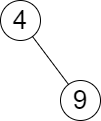

2476. Closest Nodes Queries in a Binary Search Tree

You are given the `root` of a binary search tree and an array `queries` of size n consisting of positive integers.

Find a **2D** array `answer` of size `n` where `answer[i] = [mini, maxi]`:

* `mini` is the largest value in the tree that is smaller than or equal to `queries[i]`. If a such value does not exist, add `-1` instead.
* `maxi` is the smallest value in the tree that is greater than or equal to `queries[i]`. If a such value does not exist, add `-1` instead.

Return the array `answer`.

 

**Example 1:**


```
Input: root = [6,2,13,1,4,9,15,null,null,null,null,null,null,14], queries = [2,5,16]
Output: [[2,2],[4,6],[15,-1]]
Explanation: We answer the queries in the following way:
- The largest number that is smaller or equal than 2 in the tree is 2, and the smallest number that is greater or equal than 2 is still 2. So the answer for the first query is [2,2].
- The largest number that is smaller or equal than 5 in the tree is 4, and the smallest number that is greater or equal than 5 is 6. So the answer for the second query is [4,6].
- The largest number that is smaller or equal than 16 in the tree is 15, and the smallest number that is greater or equal than 16 does not exist. So the answer for the third query is [15,-1].
```

**Example 2:**


```
Input: root = [4,null,9], queries = [3]
Output: [[-1,4]]
Explanation: The largest number that is smaller or equal to 3 in the tree does not exist, and the smallest number that is greater or equal to 3 is 4. So the answer for the query is [-1,4].
```

**Constraints:**

* The number of nodes in the tree is in the range `[2, 10^5]`.
* `1 <= Node.val <= 10^6`
* `n == queries.length`
* `1 <= n <= 10^5`
* `1 <= queries[i] <= 10^6`

# Submissions
---
**Solution 1: (Binary Search)**
```
Runtime: 1502 ms
Memory: 158 MB
```
```python
# Definition for a binary tree node.
# class TreeNode:
#     def __init__(self, val=0, left=None, right=None):
#         self.val = val
#         self.left = left
#         self.right = right
class Solution:
    def closestNodes(self, root: Optional[TreeNode], queries: List[int]) -> List[List[int]]:
        def dfs(n, v):                                                 # a recursive function for the
            if n: dfs(n.left, v), v.append(n.val), dfs(n.right, v)     # inorder traversal of BST
        
        nums = []                                                      # [1] collect values from BST  
        dfs(root, nums)                                                #     in sorted order
        
        results, n = [], len(nums)
        
        for q in queries:                                              # [2] make queries using the binary
            i = bisect_left(nums, q)                                   #     search, then consider several
            if i < n and nums[i] == q : results.append([q,q])          #     conditions on the returned 
            else:                                                      #     insertion position
                if   i == 0 : results.append([-1,nums[0]])
                elif i == n : results.append([nums[-1],-1])
                else        : results.append([nums[i-1], nums[i]])
                    
        return results
```

**Solution 2: (Binary Search)**
```
Runtime: 342 ms
Memory: 159.2 MB
```
```c++
/**
 * Definition for a binary tree node.
 * struct TreeNode {
 *     int val;
 *     TreeNode *left;
 *     TreeNode *right;
 *     TreeNode() : val(0), left(nullptr), right(nullptr) {}
 *     TreeNode(int x) : val(x), left(nullptr), right(nullptr) {}
 *     TreeNode(int x, TreeNode *left, TreeNode *right) : val(x), left(left), right(right) {}
 * };
 */
class Solution {
public:
    vector<vector<int>> closestNodes(TreeNode* root, vector<int>& queries) {
        function<void(TreeNode*, vector<int>&)> dfs;
        dfs = [&](TreeNode* n, vector<int>& v)
        {
            if (n) dfs(n->left, v), v.push_back(n->val), dfs(n->right, v);
        };
        
        vector<int> nums;
        dfs(root, nums);
        
        vector<vector<int>> results;
        int n = nums.size();
        
        for (int q : queries)
        {
            int i = lower_bound(nums.begin(), nums.end(), q) - nums.begin();
            if (i < n && nums[i] == q) results.push_back({q,q});
            else
                if      (i == 0) results.push_back({-1, nums[0]});
                else if (i == n) results.push_back({nums[n-1], -1});
                else             results.push_back({nums[i-1], nums[i]});
        }
        
        return results;
    }
};
```
