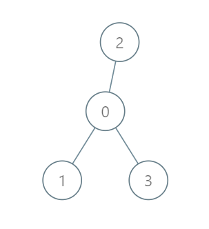

2477. Minimum Fuel Cost to Report to the Capital

There is a tree (i.e., a connected, undirected graph with no cycles) structure country network consisting of `n` cities numbered from `0` to `n - 1` and exactly `n - 1` roads. The capital city is city `0`. You are given a 2D integer array roads where `roads[i] = [ai, bi]` denotes that there exists a **bidirectional road** connecting cities `ai` and `bi`.

There is a meeting for the representatives of each city. The meeting is in the capital city.

There is a car in each city. You are given an integer `seats` that indicates the number of seats in each car.

A representative can use the car in their city to travel or change the car and ride with another representative. The cost of traveling between two cities is one liter of fuel.

Return the minimum number of liters of fuel to reach the capital city.

 

**Example 1:**


```
Input: roads = [[0,1],[0,2],[0,3]], seats = 5
Output: 3
Explanation: 
- Representative1 goes directly to the capital with 1 liter of fuel.
- Representative2 goes directly to the capital with 1 liter of fuel.
- Representative3 goes directly to the capital with 1 liter of fuel.
It costs 3 liters of fuel at minimum. 
It can be proven that 3 is the minimum number of liters of fuel needed.
```

**Example 2:**


```
Input: roads = [[3,1],[3,2],[1,0],[0,4],[0,5],[4,6]], seats = 2
Output: 7
Explanation: 
- Representative2 goes directly to city 3 with 1 liter of fuel.
- Representative2 and representative3 go together to city 1 with 1 liter of fuel.
- Representative2 and representative3 go together to the capital with 1 liter of fuel.
- Representative1 goes directly to the capital with 1 liter of fuel.
- Representative5 goes directly to the capital with 1 liter of fuel.
- Representative6 goes directly to city 4 with 1 liter of fuel.
- Representative4 and representative6 go together to the capital with 1 liter of fuel.
It costs 7 liters of fuel at minimum. 
It can be proven that 7 is the minimum number of liters of fuel needed.
```

**Example 3:**


```
Input: roads = [], seats = 1
Output: 0
Explanation: No representatives need to travel to the capital city.
```

**Constraints:**

* `1 <= n <= 10^5`
* `roads.length == n - 1`
* `roads[i].length == 2`
* `0 <= ai, bi < n`
* `ai != bi`
* `roads` represents a valid tree.
* `1 <= seats <= 10^5`

# Submissions
---
**Solution 1: (DFS, postorder)**
```
Runtime: 3017 ms
Memory: 161.1 MB
```
```python
class Solution:
    def minimumFuelCost(self, roads: List[List[int]], seats: int) -> int:
        graph = defaultdict(list)
        for x, y in roads:
            graph[x].append(y)
            graph[y].append(x)
        self.ans = 0
        
        def dfs(i, prev, people = 1):
            for x in graph[i]:
                if x == prev: continue
                people += dfs(x, i)
            self.ans += (int(ceil(people / seats)) if i else 0)
            return people
        
        dfs(0, 0)
        return self.ans
```

**Solution 2: (Topological Sort)**
```
Runtime: 2599 ms
Memory: 63.8 MB
```
```python
class Solution:
    def minimumFuelCost(self, roads: List[List[int]], seats: int) -> int:
        graph = defaultdict(list)
        incoming = Counter()
        size = Counter()

        for u, v in roads:
            graph[u].append(v)
            graph[v].append(u)
            incoming[u] += 1
            incoming[v] += 1
            size[u] = size[v] = 1

        q = deque([i for i in incoming if incoming[i] == 1])
        res = 0
        while q:
            curr = q.popleft()
            if curr == 0:
                continue

            for nxt in graph[curr]:
                d, r = divmod(size[curr], seats)
                res += d + 1 if r else d
                size[nxt] += size[curr]
                size[curr] = 0
                incoming[nxt] -= 1
                if incoming[nxt] == 1:
                    q.append(nxt)
                
        return res
```

**Solution 3: (DFS, postorder)**
```
Runtime: 600 ms
Memory: 191.6 MB
```
```c++
class Solution {
public:
    long long dfs(int u, int pre, long long &rst, int seats, vector<vector<int>> &g) {
        double people = 1;
        for (int v: g[u]) {
            if (v != pre) {
                people += dfs(v, u, rst, seats, g);
            }
        }
        if (u) {
            rst += ceil(people/seats);
        }
        return people;
    }
    long long minimumFuelCost(vector<vector<int>>& roads, int seats) {
        int N = roads.size()+1;
        vector<vector<int>> g(N);
        long long ans = 0;
        for (int i = 0; i < N-1; i ++) {
            g[roads[i][0]].push_back(roads[i][1]);
            g[roads[i][1]].push_back(roads[i][0]);
        }
        dfs(0, -1,  ans, seats, g);
        return ans;
    }
};
```

**Solution 4: (BFS)**
```
Runtime: 623 ms
Memory: 165.6 MB
```
```c++
class Solution {
public:
    long long bfs(int n, vector<vector<int>>& adj, vector<int>& degree, int& seats) {
        queue<int> q;
        for (int i = 1; i < n; i++) {
            if (degree[i] == 1) {
                q.push(i);
            }
        }

        vector<int> representatives(n, 1);
        long long fuel = 0;

        while (!q.empty()) {
            int node = q.front();
            q.pop();

            fuel += ceil((double)representatives[node] / seats);
            for (auto& neighbor : adj[node]) {
                degree[neighbor]--;
                representatives[neighbor] += representatives[node];
                if (degree[neighbor] == 1 && neighbor != 0) {
                    q.push(neighbor);
                }
            }
        }
        return fuel;
    }
    long long minimumFuelCost(vector<vector<int>>& roads, int seats) {
        int n = roads.size() + 1;
        vector<vector<int>> adj(n);
        vector<int> degree(n);

        for (auto& road : roads) {
            adj[road[0]].push_back(road[1]);
            adj[road[1]].push_back(road[0]);
            degree[road[0]]++;
            degree[road[1]]++;
        }

        return bfs(n, adj, degree, seats);
    }
};
```
