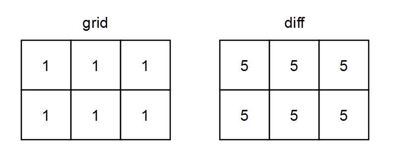

2482. Difference Between Ones and Zeros in Row and Column

You are given a **0-indexed** `m x n` binary matrix `grid`.

A **0-indexed** `m x n` difference matrix `diff` is created with the following procedure:

* Let the number of ones in the `i`th row be `onesRowi`.
* Let the number of ones in the `j`th column be `onesColj`.
* Let the number of zeros in the `i`th row be `zerosRowi`.
* Let the number of zeros in the `j`th column be `zerosColj`.
* `diff[i][j] = onesRowi + onesColj - zerosRowi - zerosColj`

Return the difference matrix `diff`.

 

**Example 1:**


```
Input: grid = [[0,1,1],[1,0,1],[0,0,1]]
Output: [[0,0,4],[0,0,4],[-2,-2,2]]
Explanation:
- diff[0][0] = onesRow0 + onesCol0 - zerosRow0 - zerosCol0 = 2 + 1 - 1 - 2 = 0 
- diff[0][1] = onesRow0 + onesCol1 - zerosRow0 - zerosCol1 = 2 + 1 - 1 - 2 = 0 
- diff[0][2] = onesRow0 + onesCol2 - zerosRow0 - zerosCol2 = 2 + 3 - 1 - 0 = 4 
- diff[1][0] = onesRow1 + onesCol0 - zerosRow1 - zerosCol0 = 2 + 1 - 1 - 2 = 0 
- diff[1][1] = onesRow1 + onesCol1 - zerosRow1 - zerosCol1 = 2 + 1 - 1 - 2 = 0 
- diff[1][2] = onesRow1 + onesCol2 - zerosRow1 - zerosCol2 = 2 + 3 - 1 - 0 = 4 
- diff[2][0] = onesRow2 + onesCol0 - zerosRow2 - zerosCol0 = 1 + 1 - 2 - 2 = -2
- diff[2][1] = onesRow2 + onesCol1 - zerosRow2 - zerosCol1 = 1 + 1 - 2 - 2 = -2
- diff[2][2] = onesRow2 + onesCol2 - zerosRow2 - zerosCol2 = 1 + 3 - 2 - 0 = 2
```

**Example 2:**


```
Input: grid = [[1,1,1],[1,1,1]]
Output: [[5,5,5],[5,5,5]]
Explanation:
- diff[0][0] = onesRow0 + onesCol0 - zerosRow0 - zerosCol0 = 3 + 2 - 0 - 0 = 5
- diff[0][1] = onesRow0 + onesCol1 - zerosRow0 - zerosCol1 = 3 + 2 - 0 - 0 = 5
- diff[0][2] = onesRow0 + onesCol2 - zerosRow0 - zerosCol2 = 3 + 2 - 0 - 0 = 5
- diff[1][0] = onesRow1 + onesCol0 - zerosRow1 - zerosCol0 = 3 + 2 - 0 - 0 = 5
- diff[1][1] = onesRow1 + onesCol1 - zerosRow1 - zerosCol1 = 3 + 2 - 0 - 0 = 5
- diff[1][2] = onesRow1 + onesCol2 - zerosRow1 - zerosCol2 = 3 + 2 - 0 - 0 = 5
```

**Constraints:**

* `m == grid.length`
* `n == grid[i].length`
* `1 <= m, n <= 10^5`
* `1 <= m * n <= 10^5`
* `grid[i][j]` is either `0` or `1`.

# Submissions
---
**Solution 1: (Array)**
```
Runtime: 1748 ms
Memory: 41 MB
```
```python
class Solution:
    def onesMinusZeros(self, grid: List[List[int]]) -> List[List[int]]:
        m, n = len(grid), len(grid[0])
        def count(nums) : return 2*sum(nums)-len(nums)       # [1] count score for a list of numbers
            
        rows = list(map(count, grid))                        # [2] count scores for rows
        cols = list(map(count, zip(*grid)))                  # [3] count scores for columns (transpose)

        for i,j in product(range(m), range(n)):              # [4] update the input matrix with
            grid[i][j] = rows[i] + cols[j]                   #     sums of precomputed scores
                
        return grid
```

**Solution 2: (Array)**
```
Runtime: 626 ms
Memory: 117.2 MB
```
```c++
class Solution {
public:
    vector<vector<int>> onesMinusZeros(vector<vector<int>>& grid) {
        vector<int> row(grid.size());
        vector<int> col(grid[0].size());
        for(int i = 0; i < grid.size(); ++i){
            for(int j = 0; j < grid[0].size(); ++j){
                row[i] += grid[i][j];
                col[j] += grid[i][j];
            }
        }
        vector<vector<int>> diff(grid.size(), vector<int> (grid[0].size()));
        for(int i = 0; i < grid.size(); ++i){
            for(int j = 0; j < grid[0].size(); ++j){
                diff[i][j] = 2*row[i] + 2*col[j] - grid.size() - grid[0].size();
            }
        }
        return diff;
    }
};
```
