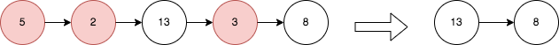

2487. Remove Nodes From Linked List

You are given the `head` of a linked list.

Remove every node which has a node with a **strictly greater** value anywhere to the right side of it.

Return the `head` of the modified linked list.

 

**Example 1:**


```
Input: head = [5,2,13,3,8]
Output: [13,8]
Explanation: The nodes that should be removed are 5, 2 and 3.
- Node 13 is to the right of node 5.
- Node 13 is to the right of node 2.
- Node 8 is to the right of node 3.
```

**Example 2:**
```
Input: head = [1,1,1,1]
Output: [1,1,1,1]
Explanation: Every node has value 1, so no nodes are removed.
```

**Constraints:**

* The number of the nodes in the given list is in the range `[1, 10^5]`.
* `1 <= Node.val <= 10^5`

# Submissions
---
**Solution 1: (DFS)**
```
Runtime: 2525 ms
Memory: 157.8 MB
```
```python
# Definition for singly-linked list.
# class ListNode:
#     def __init__(self, val=0, next=None):
#         self.val = val
#         self.next = next
class Solution:
    def removeNodes(self, head: Optional[ListNode]) -> Optional[ListNode]:
        if not head: return None
        head.next = self.removeNodes(head.next)
        if head.next and head.val < head.next.val:
            return head.next
        return head
```

**Solution 2: (Stack, mono stack)**
```
Runtime: 250 ms
Memory: 170.36 MB
```
```c++
/**
 * Definition for singly-linked list.
 * struct ListNode {
 *     int val;
 *     ListNode *next;
 *     ListNode() : val(0), next(nullptr) {}
 *     ListNode(int x) : val(x), next(nullptr) {}
 *     ListNode(int x, ListNode *next) : val(x), next(next) {}
 * };
 */
class Solution {
public:
    ListNode* removeNodes(ListNode* head) {
        vector<ListNode*> stk;
        ListNode *node = head;
        while (node) {
            while (stk.size() && stk.back()->val < node->val) {
                stk.pop_back();
            }
            if (stk.size()) {
                stk.back()->next = node;
            }
            stk.push_back(node);
            node = node->next;
        }
        if (stk.size()) {
            return stk[0];
        }
        return nullptr;
    }
};
```

**Solution 3: (DFS)**
```
Runtime: 1119 ms
Memory: 161 MB
```
```c++
/**
 * Definition for singly-linked list.
 * struct ListNode {
 *     int val;
 *     ListNode *next;
 *     ListNode() : val(0), next(nullptr) {}
 *     ListNode(int x) : val(x), next(nullptr) {}
 *     ListNode(int x, ListNode *next) : val(x), next(next) {}
 * };
 */
class Solution {
public:
    ListNode* removeNodes(ListNode* head) {
        if (!head) return NULL;
        head->next = removeNodes(head->next);
        return head->next && head->val < head->next->val ?  head->next : head;
    }
};
```
