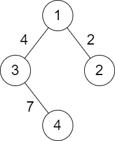

2492. Minimum Score of a Path Between Two Cities

You are given a positive integer `n` representing `n` cities numbered from `1` to `n`. You are also given a 2D array `roads` where `roads[i] = [ai, bi, distancei]` indicates that there is a bidirectional road between cities ai and bi with a distance equal to `distancei`. The cities graph is not necessarily connected.

The **score** of a path between two cities is defined as the **minimum** distance of a road in this path.

Return the **minimum** possible score of a path between cities `1` and `n`.

**Note:**

* A path is a sequence of roads between two cities.
* It is allowed for a path to contain the same road **multiple** times, and you can visit cities `1` and `n` multiple times along the path.
* The test cases are generated such that there is **at least** one path between `1` and `n`.
 

**Example 1:**


```
Input: n = 4, roads = [[1,2,9],[2,3,6],[2,4,5],[1,4,7]]
Output: 5
Explanation: The path from city 1 to 4 with the minimum score is: 1 -> 2 -> 4. The score of this path is min(9,5) = 5.
It can be shown that no other path has less score.
```

**Example 2:**


```
Input: n = 4, roads = [[1,2,2],[1,3,4],[3,4,7]]
Output: 2
Explanation: The path from city 1 to 4 with the minimum score is: 1 -> 2 -> 1 -> 3 -> 4. The score of this path is min(2,2,4,7) = 2.
```

**Constraints:**

* `2 <= n <= 10^5`
* `1 <= roads.length <= 10^5`
* `roads[i].length == 3`
* `1 <= ai, bi <= n`
* `ai != bi`
* `1 <= distancei <= 10^4`
* There are no repeated edges.
* There is at least one path between `1` and `n`.

# Submissions
---
**Solution 1: (DFS)**
```
Runtime: 5028 ms
Memory: 76 MB
```
```python
class Solution:
    def minScore(self, n: int, roads: List[List[int]]) -> int:
        g = collections.defaultdict(list)
        for a, b, d in roads:
            g[a] += [[b, d]]
            g[b] += [[a, d]]
        seen = set()
        ans = float('inf')
        def dfs(u):
            nonlocal ans
            seen.add(u)
            for v, d in g[u]:
                ans = min(ans, d)
                if not v in seen:
                    dfs(v)
            
        dfs(1)
        return ans
```

**Solution 2: (DFS)**
```
Runtime: 501 ms
Memory: 147.1 MB
```
```c++
class Solution {
    void dfs(int v, int &ans, unordered_set<int> &seen, unordered_map<int, vector<pair<int, int>>> &g) {
        seen.insert(v);
        for (auto &[nv, d]: g[v]) {
            ans = min(ans, d);
            if (!seen.count(nv)) {
                dfs(nv, ans, seen, g);
            }
        }
    }
public:
    int minScore(int n, vector<vector<int>>& roads) {
        unordered_map<int, vector<pair<int, int>>> g;
        for (int i = 0; i < roads.size(); i ++) {
            g[roads[i][0]].push_back({roads[i][1], roads[i][2]});
            g[roads[i][1]].push_back({roads[i][0], roads[i][2]});
        }
        unordered_set<int> seen;
        int ans = INT_MAX;
        dfs(1, ans, seen, g);
        return ans;
    }
};
```

**Solution 3: (Dijkstra)**
```
Runtime: 332 ms
Memory: 135.00 MB
```
```c++
class Solution {
public:
    int minScore(int n, vector<vector<int>>& roads) {
        vector<vector<pair<int, int>>> adj(n + 1);
        vector<int> dist(n + 1, INT_MAX);
        std::priority_queue<pair<int, int>, vector<pair<int, int>>, greater<pair<int, int>>> pq;
        for (int i = 0; i < roads.size(); ++i) {
            adj[roads[i][0]].push_back({roads[i][1], roads[i][2]});
            adj[roads[i][1]].push_back({roads[i][0], roads[i][2]});
        }
        pq.push({INT_MAX, 1});
        while(!pq.empty()) {
            auto [d, node] = pq.top();
            pq.pop();
            for (int i = 0; i < adj[node].size(); ++i) {
                d = min(d, adj[node][i].second);
                if (dist[adj[node][i].first] > d) {
                    dist[adj[node][i].first] = d;
                    pq.push({dist[adj[node][i].first], adj[node][i].first});
                }
            }
        }
        return dist[n];
    }
};
```

**Solution 4: (Dijkstra, connected component)**
```
Runtime: 103 ms, Beats 31.69%
Memory: 138.12 MB, Beats 43.18%
```
```c++
class Solution {
public:
    int minScore(int n, vector<vector<int>>& roads) {
        vector<vector<array<int, 2>>> g(n + 1);
        for (const auto &road: roads) {
            auto a = road[0];
            auto b = road[1];
            auto distance = road[2];
            g[a].push_back({b, distance});
            g[b].push_back({a, distance});
        }
        vector<int> dist(n + 1, INT_MAX);
        priority_queue<array<int, 2>, vector<array<int, 2>>, greater<>> pq;
        pq.push({INT_MAX, 1});
        while (!pq.empty()) {
            auto [w, u] = pq.top();
            pq.pop();
            if (w > dist[u]) {
                continue;
            }
            for (const auto &[v, dw]: g[u]) {
                int nw = min(w, dw);
                if (nw < dist[v]) {
                    dist[v] = nw;
                    pq.push({nw, v});
                }
            }
        }
        return dist[n];
    }
};
```

**Solution 5: (BFS, connected component)**
```
Runtime: 46 ms, Beats 88.95%
Memory: 132.69 MB, Beats 77.98%
```
```c++
class Solution {
public:
    int minScore(int n, vector<vector<int>>& roads) {
        vector<vector<array<int, 2>>> g(n + 1);
        for (const auto &road: roads) {
            auto a = road[0];
            auto b = road[1];
            auto distance = road[2];
            g[a].push_back({b, distance});
            g[b].push_back({a, distance});
        }
        vector<bool> visited(n + 1);
        queue<int> q;
        visited[1] = true;
        q.push(1);
        int ans = INT_MAX;
        while (!q.empty()) {
            auto u = q.front();
            q.pop();
            for (const auto &[v, w]: g[u]) {
                ans = min(ans, w);
                if (!visited[v]) {
                    visited[v] = true;
                    q.push(v);
                }
            }
        }
        return ans;
    }
};
```

**Solution 6: (Union Find)**
```
Runtime: 12 ms, Beats 94.90%
Memory: 107.25 MB, Beats 98.36%
```
```c++
class Solution {
    vector<int> p;
    vector<int> r;
    int find(int x) {
        if (x != p[x]) {
            p[x] = find(p[x]);
        }
        return p[x];
    }
    void uni(int x, int y) {
        int xr = find(x);
        int yr = find(y);
        if (xr != yr) {
            if (r[xr] > r[yr]) {
                p[yr] = xr;
            } else if (r[xr] < r[yr]) {
                p[xr] = yr;
            } else {
                p[yr] = xr;
                r[xr] += 1;
            }
        }
    }
public:
    int minScore(int n, vector<vector<int>>& roads) {
        p.resize(n + 1);
        r.resize(n + 1);
        for (int i = 0; i <= n; i ++) {
            p[i] = i;
        }
        for (const auto &road: roads) {
            auto a = road[0];
            auto b = road[1];
            uni(a, b);
        }
        int ans = INT_MAX;
        for (const auto &road: roads) {
            auto a = road[0];
            auto distance = road[2];
            if (find(a) == find(1)) {
                ans = min(ans, distance);
            }
        }
        return ans;
    }
};
```
