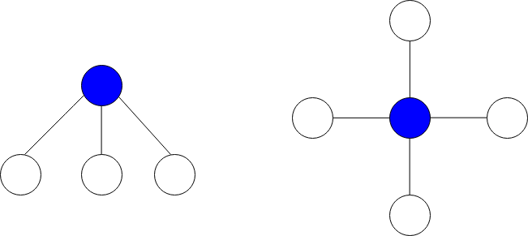
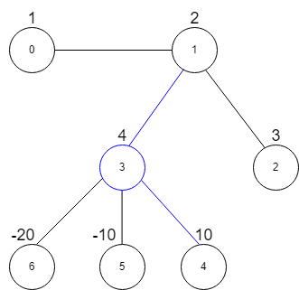

2497. Maximum Star Sum of a Graph

There is an undirected graph consisting of `n` nodes numbered from `0` to `n - 1`. You are given a **0-indexed** integer array `vals` of length `n` where `vals[i]` denotes the value of the `i`th node.

You are also given a 2D integer array `edges` where `edges[i] = [ai, bi]` denotes that there exists an undirected edge connecting nodes `ai` and `bi`.

A **star graph** is a subgraph of the given graph having a center node containing `0` or more neighbors. In other words, it is a subset of edges of the given graph such that there exists a common node for all edges.

The image below shows star graphs with 3 and 4 neighbors respectively, centered at the blue node.



The star sum is the sum of the values of all the nodes present in the star graph.

Given an integer `k`, return the maximum star sum of a star graph containing at most `k` edges.

 

**Example 1:**


```
Input: vals = [1,2,3,4,10,-10,-20], edges = [[0,1],[1,2],[1,3],[3,4],[3,5],[3,6]], k = 2
Output: 16
Explanation: The above diagram represents the input graph.
The star graph with the maximum star sum is denoted by blue. It is centered at 3 and includes its neighbors 1 and 4.
It can be shown it is not possible to get a star graph with a sum greater than 16.
```

**Example 2:**
```
Input: vals = [-5], edges = [], k = 0
Output: -5
Explanation: There is only one possible star graph, which is node 0 itself.
Hence, we return -5.
```

**Constraints:**

* `n == vals.length`
* `1 <= n <= 10^5`
* `-104 <= vals[i] <= 10^4`
* `0 <= edges.length <= min(n * (n - 1) / 2, 10^5)`
* `edges[i].length == 2`
* `0 <= ai, bi <= n - 1`
* `ai != bi`
* `0 <= k <= n - 1`

# Submissions
---
**Solution 1: (Heap)**
```
Runtime: 4423 ms
Memory: 53.7 MB
```
```python
class Solution:
    def maxStarSum(self, vals: List[int], edges: List[List[int]], k: int) -> int:
        d = collections.defaultdict(list)
        for u, v in edges:
            if vals[u] > 0:
                heapq.heappush(d[v], vals[u])
                if len(d[v]) > k:
                    heapq.heappop(d[v])
            if vals[v] > 0:
                heapq.heappush(d[u], vals[v])
                if len(d[u]) > k:
                    heapq.heappop(d[u])
        ans = float('-inf')
        for i, val in enumerate(vals):
            cur = val
            cur += sum(d[i])
            ans = max(ans, cur)
        return ans
```

**Solution 2: (Sort)**
```
Runtime: 1650 ms
Memory: 51.1 MB
```
```python
class Solution:
    def maxStarSum(self, vals: List[int], edges: List[List[int]], k: int) -> int:
        g = collections.defaultdict(list)
        for u, v in edges:
            if vals[v] > 0:
                g[u] += [vals[v]]
            if vals[u] > 0:
                g[v] += [vals[u]]
        ans = max(vals)
        for v, vs in g.items():
            ans = max(ans, vals[v] + sum(sorted(vs, reverse=True)[:k]))
        return ans
```
