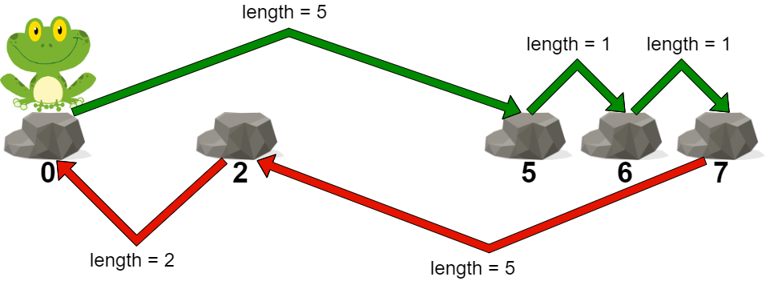
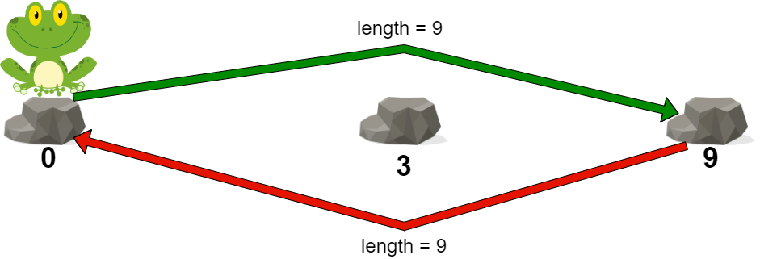

2498. Frog Jump II

You are given a **0-indexed** integer array `stones` sorted in **strictly increasing** order representing the positions of stones in a river.

A frog, initially on the first stone, wants to travel to the last stone and then return to the first stone. However, it can jump to any stone **at most once**.

The **length** of a jump is the absolute difference between the position of the stone the frog is currently on and the position of the stone to which the frog jumps.

More formally, if the frog is at `stones[i]` and is jumping to `stones[j]`, the length of the jump is `|stones[i] - stones[j]|`.
The cost of a path is the **maximum length of a jump** among all jumps in the path.

Return the minimum cost of a path for the frog.

 

**Example 1:**


```
Input: stones = [0,2,5,6,7]
Output: 5
Explanation: The above figure represents one of the optimal paths the frog can take.
The cost of this path is 5, which is the maximum length of a jump.
Since it is not possible to achieve a cost of less than 5, we return it.
```

**Example 2:**


```
Input: stones = [0,3,9]
Output: 9
Explanation: 
The frog can jump directly to the last stone and come back to the first stone. 
In this case, the length of each jump will be 9. The cost for the path will be max(9, 9) = 9.
It can be shown that this is the minimum achievable cost.
```

**Constraints:**

* `2 <= stones.length <= 10^5`
* `0 <= stones[i] <= 10^9`
* `stones[0] == 0`
* `stones` is sorted in a strictly increasing order.

# Submissions
---
**Solution 1: (Greedy, even and odd)**

Claim 1: It is optimal that we make use of all rocks: There is never a benefit of not including a rock in Path 1 or Path 2, it is always positive or neutral.
Claim 2: It is never optimal to choose two consecutive rocks: If we choose rock_i, and rock_i+1, then rock_i+2 will have to do (rock_i+2)-(rock_i) work to return. Because the array is strictly increasing, it holds that (rock_i+2)-(rock_i) > (rock_i+1-rock_i)
Therefore one path must lie on each even index and the other path must lie on each odd index. We iterate through them and find the maximum distance.

```
Runtime: 2074 ms
Memory: 28.9 MB
```
```python
class Solution:
    def maxJump(self, stones: List[int]) -> int:
        N = len(stones)
        res = stones[1]-stones[0];  # store max difference
        for i in range(3, N, 2):
            res = max(res, stones[i]-stones[i-2])  # odd path
        for i in range (2, N, 2):
            res = max(res, stones[i]-stones[i-2])  # even path
        return res
```
