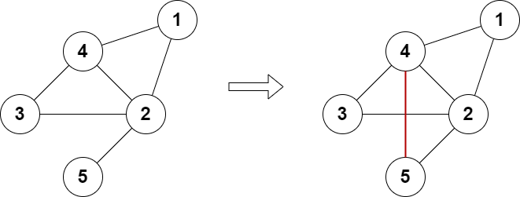

2508. Add Edges to Make Degrees of All Nodes Even

There is an **undirected** graph consisting of `n` nodes numbered from `1` to `n`. You are given the integer `n` and a 2D array `edges` where `edges[i] = [ai, bi]` indicates that there is an edge between nodes `ai` and `bi`. The graph can be disconnected.

You can add at most two additional edges (possibly none) to this graph so that there are no repeated edges and no self-loops.

Return `true` if it is possible to make the degree of each node in the graph even, otherwise return `false`.

The degree of a node is the number of edges connected to it.

 

**Example 1:**


```
Input: n = 5, edges = [[1,2],[2,3],[3,4],[4,2],[1,4],[2,5]]
Output: true
Explanation: The above diagram shows a valid way of adding an edge.
Every node in the resulting graph is connected to an even number of edges.
```

**Example 2:**


```
Input: n = 4, edges = [[1,2],[3,4]]
Output: true
Explanation: The above diagram shows a valid way of adding two edges.
```

**Example 3:**

```
Input: n = 4, edges = [[1,2],[1,3],[1,4]]
Output: false
Explanation: It is not possible to obtain a valid graph with adding at most 2 edges.
```

**Constraints:**

* `3 <= n <= 10^5`
* `2 <= edges.length <= 10^5`
* `edges[i].length == 2`
* `1 <= ai, bi <= n`
* `ai != bi`
* There are no repeated edges.

# Submissions
---
**Solution 1: (Find odd-degree nodes and try connecting them)**
```
Runtime: 1601 ms
Memory: 66 MB
```
```python
class Solution:
    def isPossible(self, n: int, edges: List[List[int]]) -> bool:
        g = [set() for _ in range(n)]
        for a, b in edges:
            g[a-1].add(b-1)
            g[b-1].add(a-1)
        cd = []  # odd-degree candidates
        for i in range(n):
            if len(g[i]) & 1:
                cd.append(i)
        if len(cd) == 0:
            return True
        if len(cd) & 1:
            return False
        if len(cd) > 4:
            return False
        if len(cd) == 2:
            a = cd[0]
            b = cd[1]
            if a not in g[b]:
                return True
            for i in range(n):
                if i in g[a] or i in g[b]:
                    continue
                return True
            return False
        
        # len(cd) == 4
        a = cd[0]
        b = cd[1]
        c = cd[2]
        d = cd[3]
        if a not in g[b] and c not in g[d]:
            return True
        if a not in g[c] and b not in g[d]:
            return True
        if a not in g[d] and b not in g[c]:
            return True
        return False
```
