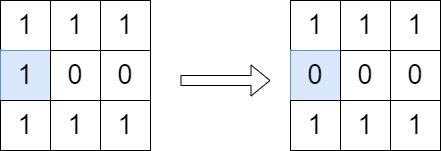

2556. Disconnect Path in a Binary Matrix by at Most One Flip

You are given a **0-indexed** `m x n` binary matrix `grid`. You can move from a cell `(row, col)` to any of the cells `(row + 1, col)` or `(row, col + 1)` that has the value `1`. The matrix is disconnected if there is no path from `(0, 0)` to `(m - 1, n - 1)`.

You can flip the value of at most one (possibly none) cell. You cannot flip the cells `(0, 0)` and `(m - 1, n - 1)`.

Return `true` if it is possible to make the matrix disconnect or `false` otherwise.

**Note** that flipping a cell changes its value from `0` to `1` or from `1` to `0`.

 

**Example 1:**


```
Input: grid = [[1,1,1],[1,0,0],[1,1,1]]
Output: true
Explanation: We can change the cell shown in the diagram above. There is no path from (0, 0) to (2, 2) in the resulting grid.
```

**Example 2:**


```
Input: grid = [[1,1,1],[1,0,1],[1,1,1]]
Output: false
Explanation: It is not possible to change at most one cell such that there is not path from (0, 0) to (2, 2).
```

**Constraints:**

* `m == grid.length`
* `n == grid[i].length`
* `1 <= m, n <= 1000`
* `1 <= m * n <= 10^5`
* `grid[i][j]` is either `0` or `1`.
* `grid[0][0] == grid[m - 1][n - 1] == 1`

# Submissions
---
**Solution 1: (left * right)**
```
Runtime: 1418 ms
Memory: 30.9 MB
```
```python
class Solution:
    def isPossibleToCutPath(self, grid: List[List[int]]) -> bool:
        M, N = len(grid), len(grid[0])
        a = [[0] * N for _ in range(M)]
        a[0][0] = 1
        for i in range(M):
            for j in range(N):
                if grid[i][j]:
                    a[i][j] += ((a[i - 1][j] if 0 <= i - 1 else 0) + (a[i][j - 1] if 0 <= j - 1 else 0))
        b = [[0] * N for _ in range(M)]
        b[M - 1][N - 1] = 1
        for i in range(M - 1, -1, -1):
            for j in range(N - 1, -1, -1):
                if grid[i][j]:
                    b[i][j] += ((b[i + 1][j] if i + 1 < M else 0) + (b[i][j + 1] if j + 1 < N else 0)) if grid[i][j] else 0
        return any(not (i == 0 and j == 0) and not (i == M - 1 and j == N - 1) and a[i][j] * b[i][j] == a[M - 1][N - 1] for j in range(N) for i in ran
```

**Solution 2: (Greedy)**

if any digonal have all zeroes of only one 1 then we will remove this one and grid becomes disconnected

```
Runtime: 90 ms
Memory: 37.4 MB
```
```c++
class Solution {
public:
    bool isPossibleToCutPath(vector<vector<int>>& grid) {
        int m = grid.size();
        int n = grid[0].size();
        vector<int>v(m+n-1,0);
        for (int i = 0; i < m; i ++) {
            for (int j = 0; j < n; j ++) {
                if (grid[i][j])
                    v[i+j]++;
            }
        }
        for(int i = 1; i < v.size() - 1; i ++) {
            if (v[i] <= 1) return true; 
        }
        return false;
    }
};
```

**Solution 3: (DFS)**

It's a naive idea without careful consideration.

There are three cases in this problem.

If there is not any path from [0,0] to [m-1, n-1], then the answer is True.
If there is only one path, then the answer is True.
If there are two or more path, then the answer is False.

Use DFS to find the first path and make all cells in first path (from [0, 0] to [m-1, n-1]) zero. Then, do the same DFS process again to check whether the second path exists or not.

The order of directions to do DFS is important (down, right > up, left), otherwise the process makes unnecessary cells zero.

```
Runtime: 951 ms
Memory: 20.6 MB
```
```python
class Solution:
    def isPossibleToCutPath(self, grid: List[List[int]]) -> bool:
        def dfs(i, j):
            if i == len(grid) - 1 and j == len(grid[0]) - 1:
                return True
            if i < 0 or i >= len(grid) or j < 0 or j >= len(grid[0]) or not grid[i][j]:
                return False
            grid[i][j] = 0
            return dfs(i + 1, j) or dfs(i, j + 1) or dfs(i - 1, j) or dfs(i, j - 1)
        if not dfs(0, 0):
            return True
        grid[0][0] = 1
        return not dfs(0, 0)
```
