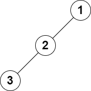

2583. Kth Largest Sum in a Binary Tree

You are given the `root` of a binary tree and a positive integer `k`.

The **level sum** in the tree is the sum of the values of the nodes that are on the **same level**.

Return the `k`th **largest** level sum in the tree (not necessarily distinct). If there are fewer than k levels in the tree, return `-1`.

**Note** that two nodes are on the same level if they have the same distance from the root.

 

**Example 1:**


```
Input: root = [5,8,9,2,1,3,7,4,6], k = 2
Output: 13
Explanation: The level sums are the following:
- Level 1: 5.
- Level 2: 8 + 9 = 17.
- Level 3: 2 + 1 + 3 + 7 = 13.
- Level 4: 4 + 6 = 10.
The 2nd largest level sum is 13.
```

**Example 2:**


```
Input: root = [1,2,null,3], k = 1
Output: 3
Explanation: The largest level sum is 3.
```

**Constraints:**

* The number of nodes in the tree is `n`.
* `2 <= n <= 10^5`
* `1 <= Node.val <= 10^6`
* `1 <= k <= n`

# Submissions
---
**Solution 1: (BFS, sort)**
```
Runtime: 226 ms
Memory: 98.2 MB
```
```c++
/**
 * Definition for a binary tree node.
 * struct TreeNode {
 *     int val;
 *     TreeNode *left;
 *     TreeNode *right;
 *     TreeNode() : val(0), left(nullptr), right(nullptr) {}
 *     TreeNode(int x) : val(x), left(nullptr), right(nullptr) {}
 *     TreeNode(int x, TreeNode *left, TreeNode *right) : val(x), left(left), right(right) {}
 * };
 */
class Solution {
public:
    long long kthLargestLevelSum(TreeNode* root, int k) {
        queue<TreeNode*>q;
        q.push(root);
        
        vector<long long>ans;
        while(!q.empty()){
            int size=q.size();
            long long sum=0;
            for(int i=0;i<size;i++){
                TreeNode* temp=q.front();
                q.pop();
                sum+=temp->val;
                if(temp->left) q.push(temp->left);
                if(temp->right) q.push(temp->right);
            }
            ans.push_back(sum);
            
        }
        if(k>ans.size()) return -1;
        sort(ans.begin(),ans.end());
        return ans[ans.size()-k];
    }
};
```
