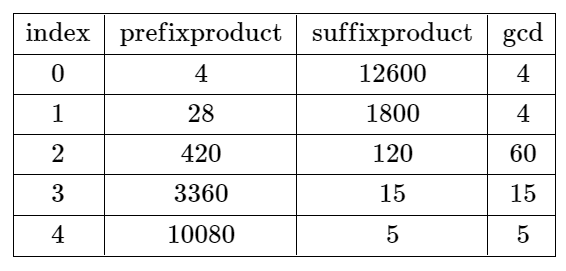

2584. Split the Array to Make Coprime Products

You are given a **0-indexed** integer array `nums` of length `n`.

A **split** at an index `i` where `0 <= i <= n - 2` is called **valid** if the product of the first `i + 1` elements and the product of the remaining elements are coprime.

* For example, if `nums = [2, 3, 3]`, then a split at the index `i = 0` is valid because `2` and `9` are coprime, while a split at the index `i = 1` is not valid because `6` and `3` are not coprime. A split at the index `i = 2` is not valid because `i == n - 1`.

Return the smallest index `i` at which the array can be split validly or `-1` if there is no such split.

Two values `val1` and `val2` are coprime if `gcd(val1, val2) == 1` where `gcd(val1, val2)` is the greatest common divisor of `val1` and `val2`.

 

**Example 1:**


```
Input: nums = [4,7,8,15,3,5]
Output: 2
Explanation: The table above shows the values of the product of the first i + 1 elements, the remaining elements, and their gcd at each index i.
The only valid split is at index 2.
```

**Example 2:**


```
Input: nums = [4,7,15,8,3,5]
Output: -1
Explanation: The table above shows the values of the product of the first i + 1 elements, the remaining elements, and their gcd at each index i.
There is no valid split.
```

**Constraints:**

* `n == nums.length`
* `1 <= n <= 10^4`
* `1 <= nums[i] <= 10^6`

# Submissions
---
**Solution 1: (Prefix Sum)**
```
Runtime: 2134 ms
Memory: 16.4 MB
```
```python
class Solution:
    def findValidSplit(self, nums: List[int]) -> int:
        
        @functools.lru_cache(None)
        def prime(n):
            divisor = 2
            factors = []
            while divisor * divisor <= n:
                if n % divisor:
                    divisor += 1
                else:
                    n //= divisor
                    factors.append(divisor)
            
            if n > 1:
                factors.append(n)
            return factors
        
        total = Counter()
        for num in nums:
            for f in prime(num):
                total[f] += 1
        prefix = Counter()
        for i, num in enumerate(nums):
            if i == len(nums) - 1: return -1
            for f in prime(num):
                prefix[f] += 1
                total[f] -= 1
                if total[f] == 0:
                    del prefix[f]
            if len(prefix) == 0:
                return i
```
