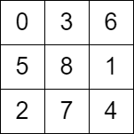

2596. Check Knight Tour Configuration

There is a knight on an `n x n` chessboard. In a valid configuration, the knight starts **at the top-left cell** of the board and visits every cell on the board **exactly once**.

You are given an `n x n` integer matrix `grid` consisting of distinct integers from the range `[0, n * n - 1]` where `grid[row][col]` indicates that the cell `(row, col)` is the `grid[row][col]`th cell that the knight visited. The moves are **0-indexed**.

Return `true` if `grid` represents a valid configuration of the knight's movements or `false` otherwise.

**Note** that a valid knight move consists of moving two squares vertically and one square horizontally, or two squares horizontally and one square vertically. The figure below illustrates all the possible eight moves of a knight from some cell.


 

**Example 1:**


```
Input: grid = [[0,11,16,5,20],[17,4,19,10,15],[12,1,8,21,6],[3,18,23,14,9],[24,13,2,7,22]]
Output: true
Explanation: The above diagram represents the grid. It can be shown that it is a valid configuration.
```

**Example 2:**


```
Input: grid = [[0,3,6],[5,8,1],[2,7,4]]
Output: false
Explanation: The above diagram represents the grid. The 8th move of the knight is not valid considering its position after the 7th move.
```

**Constraints:**

* `n == grid.length == grid[i].length`
* `3 <= n <= 7`
* `0 <= grid[row][col] < n * n`
* All integers in `grid` are **unique**.

# Submissions
---
**Solution 1: (DFS)**
```
Runtime: 64 ms
Memory: 13.9 MB
```
```python
class Solution:
    def checkValidGrid(self, grid: List[List[int]]) -> bool:
        N = len(grid)
        
        def dfs(r, c, n):
            if n == N**2-1:
                return True
            for nr, nc in [(r-2, c+1), (r-1, c+2), (r+1, c+2), (r+2, c+1), (r+2, c-1), (r+1, c-2), (r-1, c-2), (r-2, c-1)]:
                if 0 <= nr < N and 0 <= nc < N:
                    if grid[nr][nc] == n+1:
                        return dfs(nr, nc, n+1)
            return False            
        
        return dfs(0, 0, 0)
```

**Solution 2: (DFS)**
```
Runtime: 16 ms
Memory: 28 MB
```
```c++
class Solution {
    int dr[8] = {2, 2, 1, 1, -1, -1, -2, -2};
    int dc[8] = {1, -1, 2, -2, 2, -2, 1, -1};
    bool dfs(vector<vector<int>>& grid, int i, int j, int start, int n) {
        if (i >= n or j >= n or i < 0 or j < 0 or grid[i][j] != start) {
            return false;
        }
        if (start == (n*n)-1) {
            return true;
        }
        for (int k = 0; k < 8; k++) {
            int nr = dr[k] + i, nc = dc[k] + j;
            if (dfs(grid, nr, nc, start+1, n)) {
                return true;
            }
        }
        return false;
    }
public:
    bool checkValidGrid(vector<vector<int>>& grid) {
        int n = size(grid);
        
        return dfs(grid, 0, 0, 0, n);
    }
};
```
