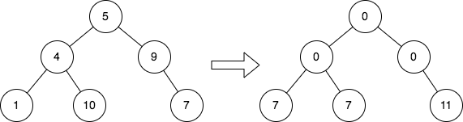
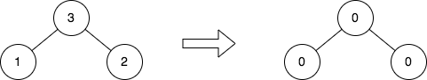

2641. Cousins in Binary Tree II

Given the root of a binary tree, replace the value of each node in the tree with the **sum of all its cousins' values**.

Two nodes of a binary tree are cousins if they have the same depth with different parents.

Return the root of the modified tree.

**Note** that the depth of a node is the number of edges in the path from the root node to it.

 

**Example 1:**


```
Input: root = [5,4,9,1,10,null,7]
Output: [0,0,0,7,7,null,11]
Explanation: The diagram above shows the initial binary tree and the binary tree after changing the value of each node.
- Node with value 5 does not have any cousins so its sum is 0.
- Node with value 4 does not have any cousins so its sum is 0.
- Node with value 9 does not have any cousins so its sum is 0.
- Node with value 1 has a cousin with value 7 so its sum is 7.
- Node with value 10 has a cousin with value 7 so its sum is 7.
- Node with value 7 has cousins with values 1 and 10 so its sum is 11.
```

**Example 2:**


```
Input: root = [3,1,2]
Output: [0,0,0]
Explanation: The diagram above shows the initial binary tree and the binary tree after changing the value of each node.
- Node with value 3 does not have any cousins so its sum is 0.
- Node with value 1 does not have any cousins so its sum is 0.
- Node with value 2 does not have any cousins so its sum is 0.
```

**Constraints:**

* The number of nodes in the tree is in the range `[1, 105]`.
* `1 <= Node.val <= 10^4`

# Submissions
---
**Solution 1: (BFS)**
```
Runtime: 1419 ms
Memory: 162.3 MB
```
```python
# Definition for a binary tree node.
# class TreeNode:
#     def __init__(self, val=0, left=None, right=None):
#         self.val = val
#         self.left = left
#         self.right = right
class Solution:
    def replaceValueInTree(self, root: Optional[TreeNode]) -> Optional[TreeNode]:
        root.val = 0
        q = [root]
        while q:
            total = sum([c.val for node in q for c in [node.left, node.right] if c])
            nq = []
            for node in q:
                cur = sum([c.val for c in [node.left, node.right] if c])
                if node.left:
                    node.left.val = total - cur
                    nq += [node.left]
                if node.right:
                    node.right.val = total - cur
                    nq += [node.right]
            q = nq
        return root
```

**Solution 2: (BFS, two pass)**
```
Runtime: 14 ms
Memory: 321.91 MB
```
```c++
/**
 * Definition for a binary tree node.
 * struct TreeNode {
 *     int val;
 *     TreeNode *left;
 *     TreeNode *right;
 *     TreeNode() : val(0), left(nullptr), right(nullptr) {}
 *     TreeNode(int x) : val(x), left(nullptr), right(nullptr) {}
 *     TreeNode(int x, TreeNode *left, TreeNode *right) : val(x), left(left), right(right) {}
 * };
 */
class Solution {
public:
    TreeNode* replaceValueInTree(TreeNode* root) {
        queue<TreeNode*> q;
        root->val = 0;
        q.push(root);
        int sz, level, cur, i;
        while (q.size()) {
            sz = q.size(), level = 0;
            for (i = 0; i < sz; i ++) {
                auto node = q.front();
                if (node->left) {
                    level += node->left->val;
                }
                if (node->right) {
                    level += node->right->val;
                }
                q.push(q.front());
                q.pop();
            }
            for (i = 0; i < sz; i ++) {
                auto node = q.front();
                cur = 0;
                if (node->left) {
                    cur += node->left->val;
                }
                if (node->right) {
                    cur += node->right->val;
                }
                if (node->left) {
                    node->left->val = level - cur;
                    q.push(node->left);
                }
                if (node->right) {
                    node->right->val = level - cur;
                    q.push(node->right);
                }
                q.pop();
            }
        }
        return root;
    }
};
```

**Solution 3: (BFS, one pass)**
```
Runtime: 7 ms
Memory: 317.21 MB
```
```c++
/**
 * Definition for a binary tree node.
 * struct TreeNode {
 *     int val;
 *     TreeNode *left;
 *     TreeNode *right;
 *     TreeNode() : val(0), left(nullptr), right(nullptr) {}
 *     TreeNode(int x) : val(x), left(nullptr), right(nullptr) {}
 *     TreeNode(int x, TreeNode *left, TreeNode *right) : val(x), left(left), right(right) {}
 * };
 */
class Solution {
public:
    TreeNode* replaceValueInTree(TreeNode* root) {
        queue<TreeNode*> q;
        root->val = 0;
        q.push(root);
        int sz, pre = 0, cur, i;
        while (q.size()) {
            sz = q.size(), cur = 0;
            for (i = 0; i < sz; i ++) {
                auto node = q.front();
                node->val = pre - node->val;
                if (node->left) {
                    cur += node->left->val;
                    if (node->right) {
                        node->left->val += node->right->val;
                    }
                    q.push(node->left);
                }
                if (node->right) {
                    cur += node->right->val;
                    if (node->left) {
                        node->right->val = node->left->val;
                    }
                    q.push(node->right);
                }
                q.pop();
            }
            pre = cur;
        }
        return root;
    }
};
```
