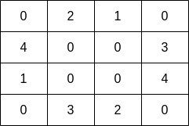
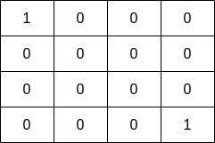

2658. Maximum Number of Fish in a Grid

You are given a **0-indexed** 2D matrix `grid` of size `m x n`, where `(r, c)` represents:

* A **land** cell if `grid[r][c] = 0`, or
* A **water** cell containing `grid[r][c]` fish, if `grid[r][c] > 0`.

A fisher can start at any water cell `(r, c)` and can do the following operations any number of times:

* Catch all the fish at cell `(r, c)`, or
* Move to any adjacent **water** cell.

Return the **maximum** number of fish the fisher can catch if he chooses his starting cell optimally, or `0` if no water cell exists.

An **adjacent** cell of the cell `(r, c)`, is one of the cells `(r, c + 1)`, `(r, c - 1)`, `(r + 1, c)` or `(r - 1, c)` if it exists.

 

**Example 1:**


```
Input: grid = [[0,2,1,0],[4,0,0,3],[1,0,0,4],[0,3,2,0]]
Output: 7
Explanation: The fisher can start at cell (1,3) and collect 3 fish, then move to cell (2,3) and collect 4 fish.
```

**Example 2:**


```
Input: grid = [[1,0,0,0],[0,0,0,0],[0,0,0,0],[0,0,0,1]]
Output: 1
Explanation: The fisher can start at cells (0,0) or (3,3) and collect a single fish. 
```

**Constraints:**

* `m == grid.length`
* `n == grid[i].length`
* `1 <= m, n <= 10`
* `0 <= grid[i][j] <= 10`

# Submissions
---
**Solution 1: (DFS)**
```
Runtime: 270 ms
Memory: 16.6 MB
```
```python
class Solution:
    def findMaxFish(self, grid: List[List[int]]) -> int:
        R, C = len(grid), len(grid[0])
        ans = 0
        
        def dfs(r, c):
            rst = grid[r][c]
            grid[r][c] = -1
            for nr, nc in [(r+1, c), (r-1, c), (r, c+1), (r, c-1)]:
                if 0 <= nr < R and 0 <= nc < C and grid[nr][nc] > 0:
                    rst += dfs(nr, nc)
            return rst
            
        for r in range(R):
            for c in range(C):
                if grid[r][c] > 0:
                    ans = max(ans, dfs(r, c))
        return ans
```

**Solution 2: (DFS)**
```
Runtime: 88 ms
Memory: 91.3 MB
```
```c++
class Solution {
public:
    int findMaxFish(vector<vector<int>>& grid) {
        int m = grid.size(), n = grid[0].size(), dir[5] = {0, 1, 0, -1, 0};
        vector<vector<bool>> seen(m, vector<bool>(n, false));
        
        function<int(int, int)> dfs = [&](int i, int j) {
            seen[i][j] = true;
            int ans = grid[i][j];
            for(int d = 0; d < 4; d++) {
                int x = i + dir[d], y = j + dir[d+1];
                if(min(x, y) >= 0 && x < m && y < n && grid[x][y] && !seen[x][y]) 
                    ans += dfs(x, y);
            }
            return ans;
        };
        
        int ans = 0;
        for(int i = 0; i < m; i++) 
            for(int j = 0; j < n; j++) 
                if(grid[i][j] != 0 && !seen[i][j]) 
                    ans = max(ans, dfs(i, j));
        
        return ans;
    }
};
```

**Solution 3: (Union Find)**
```
Runtime: 7 ms, Beats 66.73%
Memory: 97.20 MB, Beats 39.05%
```
```c++
class Solution {
    // Helper function to find the root of a component
    int findParent(vector<int>& parent, int cellIndex) {
        if (parent[cellIndex] == cellIndex) {
            return cellIndex;
        }
        return parent[cellIndex] =
                   findParent(parent, parent[cellIndex]);  // Path compression
    }

    // Helper function to union two components
    void unionComponents(vector<int>& parent, vector<int>& componentSize,
                         vector<int>& totalFish, int cellIndex1,
                         int cellIndex2) {
        int root1 = findParent(parent, cellIndex1);
        int root2 = findParent(parent, cellIndex2);

        if (root1 != root2) {
            // Union by size to optimize tree height
            if (componentSize[root1] < componentSize[root2]) {
                swap(root1, root2);
            }
            parent[root2] = root1;
            componentSize[root1] += componentSize[root2];
            totalFish[root1] += totalFish[root2];
        }
    }

public:
    int findMaxFish(vector<vector<int>>& grid) {
        int rowCount = grid.size(), columnCount = grid[0].size();
        int totalCells = rowCount * columnCount;

        // Initialize Union-Find structures
        vector<int> parent(totalCells);
        vector<int> componentSize(totalCells, 1);
        vector<int> totalFish(totalCells);

        // Set initial parent and fish count for each cell
        iota(parent.begin(), parent.end(), 0);
        for (int row = 0; row < rowCount; row++) {
            for (int column = 0; column < columnCount; column++) {
                int cellIndex = row * columnCount + column;
                totalFish[cellIndex] = grid[row][column];
            }
        }

        // Direction vectors for neighbors (right, left, down, up)
        vector<int> deltaRow{0, 0, 1, -1}, deltaColumn{1, -1, 0, 0};

        // Merge connected components
        for (int row = 0; row < rowCount; row++) {
            for (int column = 0; column < columnCount; column++) {
                if (grid[row][column] >
                    0) {  // Process only water cells with fish
                    int cellIndex = row * columnCount + column;
                    for (int direction = 0; direction < 4; direction++) {
                        int neighborRow = row + deltaRow[direction];
                        int neighborColumn = column + deltaColumn[direction];
                        if (neighborRow >= 0 && neighborRow < rowCount &&
                            neighborColumn >= 0 &&
                            neighborColumn < columnCount &&
                            grid[neighborRow][neighborColumn] > 0) {
                            int neighborIndex =
                                neighborRow * columnCount + neighborColumn;
                            unionComponents(parent, componentSize, totalFish,
                                            cellIndex, neighborIndex);
                        }
                    }
                }
            }
        }

        // Find the maximum fish in any component
        int maxFish = 0;
        for (int cellIndex = 0; cellIndex < totalCells; cellIndex++) {
            if (findParent(parent, cellIndex) ==
                cellIndex) {  // Check if cellIndex is a root
                maxFish = max(maxFish, totalFish[cellIndex]);
            }
        }
        return maxFish;
    }
};
```

**Solution 4: (BFS)**
```
Runtime: 10 ms, Beats 52.71%
Memory: 99.86 MB, Beats 30.47%
```
```c++
class Solution {
    int dd[5] = {0, 1, 0, -1, 0};
public:
    int findMaxFish(vector<vector<int>>& grid) {
        int m = grid.size(), n = grid[0].size(), i, j, d, ni, nj, cur, ans = 0;
        vector<vector<bool>> visited(m, vector<bool>(n));
        queue<pair<int, int>> q;
        for (i = 0; i < m; i ++) {
            for (j = 0; j < n; j ++) {
                if (grid[i][j] && !visited[i][j]) {
                    q.push({i, j});
                    visited[i][j] = true;
                    cur = 0;
                    while (q.size()) {
                        auto [ci, cj] = q.front();
                        q.pop();
                        cur += grid[ci][cj];
                        for (d = 0; d < 4; d ++) {
                            ni = ci + dd[d];
                            nj = cj + dd[d+1];
                            if (0 <= ni && ni < m && 0 <= nj && nj < n && grid[ni][nj] && !visited[ni][nj]) {
                                q.push({ni, nj});
                                visited[ni][nj] = true;
                            }
                        }
                    }
                    ans = max(ans, cur);
                }
            }
        }
        return ans;
    }
};
```
