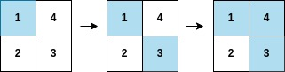
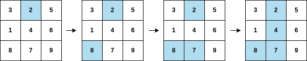

2661. First Completely Painted Row or Column

You are given a **0-indexed** integer array `arr`, and an `m x n` integer matrix `mat`. `arr` and `mat` both contain all the integers in the range `[1, m * n]`.

Go through each index `i` in `arr` starting from index `0` and paint the cell in mat containing the integer `arr[i]`.

Return the smallest index `i` at which either a row or a column will be completely painted in `mat`.

 

**Example 1:**


```
Input: arr = [1,3,4,2], mat = [[1,4],[2,3]]
Output: 2
Explanation: The moves are shown in order, and both the first row and second column of the matrix become fully painted at arr[2].
```

**Example 2:**


```
Input: arr = [2,8,7,4,1,3,5,6,9], mat = [[3,2,5],[1,4,6],[8,7,9]]
Output: 3
Explanation: The second column becomes fully painted at arr[3].
```

**Constraints:**

* `m == mat.length`
* `n = mat[i].length`
* `arr.length == m * n`
* `1 <= m, n <= 10^5`
* `1 <= m * n <= 10^5`
* `1 <= arr[i], mat[r][c] <= m * n`
* All the integers of `arr` are unique.
* All the integers of `mat` are unique.

# Submissions
---
**Solution 1: (Counter)**
```
Runtime: 1255 ms
Memory: 53.6 MB
```
```python
class Solution:
    def firstCompleteIndex(self, arr: List[int], mat: List[List[int]]) -> int:
        R, C = len(mat), len(mat[0])
        g = {}
        for r in range(R):
            for c in range(C):
                g[mat[r][c]] = (r, c)
        cr, cc = [0]*R, [0]*C
        for i, a in enumerate(arr):
            cr[g[a][0]] += 1
            cc[g[a][1]] += 1
            if cr[g[a][0]] == C or cc[g[a][1]] == R:
                return i
```

**Solution 2: (Reverse Mapping)**
```
Runtime: 101 ms
Memory: 161.54 MB
```
```c++
class Solution {
public:
    int firstCompleteIndex(vector<int>& arr, vector<vector<int>>& mat) {
        // Map to store the index of each number in the arr
        unordered_map<int, int> numToIndex;
        for (int i = 0; i < arr.size(); i++) {
            numToIndex[arr[i]] = i;
        }

        int result = INT_MAX;
        int numRows = mat.size();
        int numCols = mat[0].size();

        // Check for the earliest row to be completely painted
        for (int row = 0; row < numRows; row++) {
            // Tracks the greatest index in this column
            int lastElementIndex = INT_MIN;
            for (int col = 0; col < numCols; col++) {
                int indexVal = numToIndex[mat[row][col]];
                lastElementIndex = max(lastElementIndex, indexVal);
            }
            // Update result with the minimum index where this row is fully
            // painted
            result = min(result, lastElementIndex);
        }

        // Check for the earliest column to be completely painted
        for (int col = 0; col < numCols; col++) {
            // Tracks the greatest index in this column
            int lastElementIndex = INT_MIN;
            for (int row = 0; row < numRows; row++) {
                int indexVal = numToIndex[mat[row][col]];
                lastElementIndex = max(lastElementIndex, indexVal);
            }
            // Update result with the minimum index where this column is fully
            // painted
            result = min(result, lastElementIndex);
        }

        return result;
    }
};
```

**Solution 3: (Counter)**
```
Runtime: 9 ms
Memory: 133.96 MB
```
```c++
class Solution {
public:
    int firstCompleteIndex(vector<int>& arr, vector<vector<int>>& mat) {
        int m = mat.size(), n = mat[0].size(), i, j;
        vector<pair<int,int>> dp(m*n+1);
        vector<int> row(m), col(n);
        for (i = 0; i < m; i ++) {
            for (j = 0; j < n; j ++) {
                dp[mat[i][j]] = {i, j};
            }
        }
        for (i = 0; i < arr.size(); i ++) {
            auto [r, c] = dp[arr[i]];
            row[r] += 1;
            col[c] += 1;
            if (row[r] == n || col[c] == m) {
                return i;
            }
        }
        return -1;
    }
};
```
