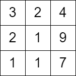

2684. Maximum Number of Moves in a Grid

You are given a **0-indexed** `m x n` matrix `grid` consisting of positive integers.

You can start at any cell in the first column of the matrix, and traverse the `grid` in the following way:

* From a cell `(row, col)`, you can move to any of the cells: `(row - 1, col + 1)`, `(row, col + 1)` and `(row + 1, col + 1)` such that the value of the cell you move to, should be **strictly bigger** than the value of the current cell.

Return the maximum number of **moves** that you can perform.

 

**Example 1:**


```
Input: grid = [[2,4,3,5],[5,4,9,3],[3,4,2,11],[10,9,13,15]]
Output: 3
Explanation: We can start at the cell (0, 0) and make the following moves:
- (0, 0) -> (0, 1).
- (0, 1) -> (1, 2).
- (1, 2) -> (2, 3).
It can be shown that it is the maximum number of moves that can be made.
```

**Example 2:**


```
Input: grid = [[3,2,4],[2,1,9],[1,1,7]]
Output: 0
Explanation: Starting from any cell in the first column we cannot perform any moves.
```

**Constraints:**

* `m == grid.length`
* `n == grid[i].length`
* `2 <= m, n <= 1000`
* `4 <= m * n <= 10^5`
* `1 <= grid[i][j] <= 10^6`

# Submissions
---
**Solution 1: (DP Bottom-Up)**
```
Runtime: 1228 ms
Memory: 26.6 MB
```
```python
class Solution:
    def maxMoves(self, grid: List[List[int]]) -> int:
        M, N = len(grid), len(grid[0])
        dp = [[0]*N for _ in range(M)]
        for r in range(M):
            dp[r][0] = 1
        ans = 0
        for c in range(1, N):
            flag = False
            for r in range(M):
                for pr in [r-1, r, r+1]:
                    if 0 <= pr < M:
                        if dp[pr][c-1] and grid[pr][c-1] < grid[r][c]:
                            dp[r][c] = 1
                            flag = True
                            break
            if flag == False:
                break
            ans += 1
        return ans
```

**Solution 2: (DP Top-Down)**
```
Runtime: 246 ms
Memory: 69.7 MB
```
```c++
class Solution {
public:
    int maxMoves(vector<vector<int>>& grid) {
        int m = grid.size(), n = grid[0].size();
        vector<pair<int, int>> dirs = {{0, 1}, {1, 1}, {-1, 1}};
        vector<vector<int>> cache(m, vector<int>(n, -1));

        function<int(int, int)> dp = [&](int i, int j) {
            if (cache[i][j] != -1) return cache[i][j];
            int ans = 0;
            for (auto [x, y] : dirs) {
                int ni = i + x, nj = j + y;
                if (ni >= 0 && ni < m && nj < n && grid[i][j] < grid[ni][nj])
                    ans = max(ans, 1 + dp(ni, nj));
            }
            return cache[i][j] = ans;
        };

        int res = 0;
        for (int i = 0; i < m; i++)
            res = max(res, dp(i, 0));
        return res;
    }
};
```

**Solution 3: (DP Bottom-Up)**
```
Runtime: 49 ms
Memory: 74.39 MB
```
```c++
class Solution {
public:
    int maxMoves(vector<vector<int>>& grid) {
        int m = grid.size(), n = grid[0].size(), ans = 0;
        vector<vector<int>> dp(m, vector<int>(n));
        bool flag;
        for (int j = 1; j < n; j ++) {
            for (int i = 0; i < m; i ++) {
                flag = false;
                if (i && j && grid[i-1][j-1] < grid[i][j] && dp[i-1][j-1] != INT_MAX) {
                    dp[i][j] = max(dp[i][j], dp[i-1][j-1] + 1);
                    flag = true;
                }
                if (i < m-1 && j && grid[i+1][j-1] < grid[i][j] && dp[i+1][j-1] != INT_MAX) {
                    dp[i][j] = max(dp[i][j], dp[i+1][j-1] + 1);
                    flag = true;
                }
                if (grid[i][j-1] < grid[i][j] && dp[i][j-1] != INT_MAX) {
                    dp[i][j] = max(dp[i][j], dp[i][j-1] + 1);
                    flag = true;
                }
                if (!flag) {
                    dp[i][j] = INT_MAX;
                } else {
                    ans = max(ans, dp[i][j]);
                }
            }
        }
        return ans;
    }
};
```

**Solution 4: (DP Bottom-UP, 1-D)**
```
Runtime: 15 ms
Memory: 67.63 MB
```
```c++
class Solution {
public:
    int maxMoves(vector<vector<int>>& grid) {
        int m = grid.size(), n = grid[0].size(), ans = 0;
        vector<int> pre(m), dp(m);
        bool flag;
        for (int j = 1; j < n; j ++) {
            for (int i = 0; i < m; i ++) {
                flag = false;
                if (i && j && grid[i-1][j-1] < grid[i][j] && pre[i-1] != INT_MAX) {
                    dp[i] = max(dp[i], pre[i-1] + 1);
                    flag = true;
                }
                if (i < m-1 && j && grid[i+1][j-1] < grid[i][j] && pre[i+1] != INT_MAX) {
                    dp[i] = max(dp[i], pre[i+1] + 1);
                    flag = true;
                }
                if (grid[i][j-1] < grid[i][j] && pre[i] != INT_MAX) {
                    dp[i] = max(dp[i], pre[i] + 1);
                    flag = true;
                }
                if (!flag) {
                    dp[i] = INT_MAX;
                } else {
                    ans = max(ans, dp[i]);
                }
            }
            pre = dp;
            fill(dp.begin(), dp.end(), 0);
        }
        return ans;
    }
};
```

**Solution 5: (Space-Optimized Bottom-up Dynamic Programming)**
```
Runtime: 26 ms
Memory: 69.12 MB
```
```c++
class Solution {
public:
    int maxMoves(vector<vector<int>>& grid) {
        int M = grid.size(), N = grid[0].size();

        vector<vector<int>> dp(M, vector<int>(2, 0));

        for (int i = 0; i < M; i++) {
            dp[i][0] = 1;
        }

        int maxMoves = 0;
        for (int j = 1; j < N; j++) {
            for (int i = 0; i < M; i++) {
                if (grid[i][j] > grid[i][j - 1] && dp[i][0] > 0) {
                    dp[i][1] = max(dp[i][1], dp[i][0] + 1);
                }
                if (i - 1 >= 0 && grid[i][j] > grid[i - 1][j - 1] &&
                    dp[i - 1][0] > 0) {
                    dp[i][1] = max(dp[i][1], dp[i - 1][0] + 1);
                }
                if (i + 1 < M && grid[i][j] > grid[i + 1][j - 1] &&
                    dp[i + 1][0] > 0) {
                    dp[i][1] = max(dp[i][1], dp[i + 1][0] + 1);
                }

                maxMoves = max(maxMoves, dp[i][1] - 1);
            }

            for (int k = 0; k < M; k++) {
                dp[k][0] = dp[k][1];
                dp[k][1] = 0;
            }
        }

        return maxMoves;
    }
};
```
