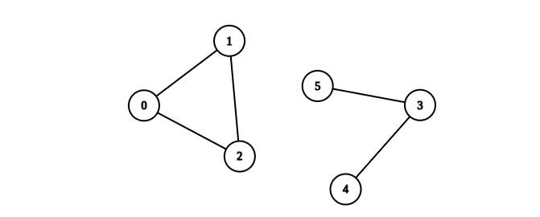

2685. Count the Number of Complete Components

You are given an integer `n`. There is an **undirected** graph with `n` vertices, numbered from `0` to `n - 1`. You are given a 2D integer array `edges` where `edges[i] = [ai, bi]` denotes that there exists an **undirected edge** connecting vertices `ai` and `bi`.

Return the number of **complete connected components** of the graph.

A **connected component** is a subgraph of a graph in which there exists a path between any two vertices, and no vertex of the subgraph shares an edge with a vertex outside of the subgraph.

A connected component is said to be **complete** if there exists an edge between every pair of its vertices.

 

**Example 1:**


```
Input: n = 6, edges = [[0,1],[0,2],[1,2],[3,4]]
Output: 3
Explanation: From the picture above, one can see that all of the components of this graph are complete.
```

**Example 2:**


```
Input: n = 6, edges = [[0,1],[0,2],[1,2],[3,4],[3,5]]
Output: 1
Explanation: The component containing vertices 0, 1, and 2 is complete since there is an edge between every pair of two vertices. On the other hand, the component containing vertices 3, 4, and 5 is not complete since there is no edge between vertices 4 and 5. Thus, the number of complete components in this graph is 1.
```

**Constraints:**

* `1 <= n <= 50`
* `0 <= edges.length <= n * (n - 1) / 2`
* `edges[i].length == 2`
* `0 <= ai, bi <= n - 1`
* `ai != bi`
* There are no repeated edges.

# Submissions
---
**Solution 1: (DFS)**
```
Runtime: 863 ms
Memory: 18.2 MB
```
```python
class Solution:
    def countCompleteComponents(self, n: int, edges: List[List[int]]) -> int:
        g = collections.defaultdict(list)
        for u, v in edges:
            g[u] += [v]
            g[v] += [u]
        seen = [0]*n
        seen_edge = [[0]*n for _ in range(n)]
        
        def dfs(v):
            vs = es = 0
            if seen[v] == 0:
                vs += 1
                seen[v] = 1
            for nv in g[v]:
                if seen_edge[v][nv] == 0:
                    seen_edge[v][nv] = 1
                    seen_edge[nv][v] = 1
                    es += 1
                    nvs, nes = dfs(nv)
                    vs += nvs
                    es += nes
            return [vs, es] 
            
        ans = 0
        for i in range(n):
            if seen[i] == 0:
                vs, es = dfs(i)
                if es == vs*(vs-1)//2:
                    ans += 1
        return ans
```

**Solution 2: (DFS)**
```
Runtime: 66 ms, Beats 40.94%
Memory: 135.20 MB, Beats 45.25%
```
```c++
class Solution {
    void dfs(int u, pair<int,int> &dp, vector<int> &visited, vector<vector<int>> &g) {
        visited[u] = 1;
        dp.first += 1;
        for (auto v: g[u]) {
            dp.second += 1;
            if (!visited[v]) {
                dfs(v, dp, visited, g);
            }
        }
    }
public:
    int countCompleteComponents(int n, vector<vector<int>>& edges) {
        int i, ans = 0;
        vector<vector<int>> g(n);
        vector<int> visited(n);
        for (auto e: edges) {
            g[e[0]].push_back(e[1]);
            g[e[1]].push_back(e[0]);
        }
        for (i = 0; i < n; i ++) {
            if (!visited[i]) {
                pair<int,int> dp;
                dfs(i, dp, visited, g);
                auto [v, e] = dp;
                if (v == 1 || e == v*(v-1)) {
                    ans += 1;
                }
            }
        }
        return ans;
    }
};
```

**Solution 3: (Union Find, size, rank not compress)**
```
Runtime: 42 ms, Beats 71.05%
Memory: 130.90 MB, Beats 59.92%
```
```c++
class Solution {
    vector<int> p;
    vector<int> sz;
    int find(int x) {
        if (p[x] == -1) {
            return x;
        }
        if (x != p[x]) {
            p[x] = find(p[x]);
        }
        return p[x];
    }
    void uni(int x, int y) {
        int xr = find(x), yr = find(y);
        if (xr == yr) {
            return;
        }
        if (sz[xr] < sz[yr]) {
            p[xr] = yr;
            sz[yr] += sz[xr];
        } else {
            p[yr] = xr;
            sz[xr] += sz[yr];
        }
    }
public:
    int countCompleteComponents(int n, vector<vector<int>>& edges) {
        int i, ans = 0;
        vector<int> cnt(n);
        p.resize(n, -1);
        sz.resize(n, 1);
        for (auto e: edges) {
            uni(e[0], e[1]);
        }
        for (auto e: edges) {
            cnt[find(e[0])] += 1;
        }
        for (i = 0; i < n; i ++) {
            if (i == find(i)) {
                if (sz[i]*(sz[i]-1)/2 == cnt[i]) {
                    ans += 1;
                }
            }
        }
        return ans;
    }
};
```
