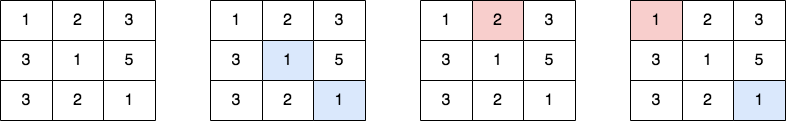

2711. Difference of Number of Distinct Values on Diagonals

Given a **0-indexed** 2D `grid` of size `m x n`, you should find the matrix `answer` of size `m x n`.

The value of each cell `(r, c)` of the matrix `answer` is calculated in the following way:

* Let `topLeft[r][c]` be the number of distinct values in the top-left diagonal of the cell `(r, c)` in the matrix grid.
* Let `bottomRight[r][c]` be the number of distinct values in the bottom-right diagonal of the cell `(r, c)` in the matrix grid.
* Then `answer[r][c] = |topLeft[r][c] - bottomRight[r][c]|`.

Return the matrix `answer`.

A **matrix diagonal** is a diagonal line of cells starting from some cell in either the topmost row or leftmost column and going in the bottom-right direction until reaching the matrix's end.

A cell `(r1, c1)` belongs to the top-left diagonal of the cell `(r, c)`, if both belong to the same diagonal and `r1 < r`. Similarly is defined bottom-right diagonal.

 

**Example 1:**


```
Input: grid = [[1,2,3],[3,1,5],[3,2,1]]
Output: [[1,1,0],[1,0,1],[0,1,1]]
Explanation: The 1st diagram denotes the initial grid. 
The 2nd diagram denotes a grid for cell (0,0), where blue-colored cells are cells on its bottom-right diagonal.
The 3rd diagram denotes a grid for cell (1,2), where red-colored cells are cells on its top-left diagonal.
The 4th diagram denotes a grid for cell (1,1), where blue-colored cells are cells on its bottom-right diagonal and red-colored cells are cells on its top-left diagonal.
- The cell (0,0) contains [1,1] on its bottom-right diagonal and [] on its top-left diagonal. The answer is |1 - 0| = 1.
- The cell (1,2) contains [] on its bottom-right diagonal and [2] on its top-left diagonal. The answer is |0 - 1| = 1.
- The cell (1,1) contains [1] on its bottom-right diagonal and [1] on its top-left diagonal. The answer is |1 - 1| = 0.
The answers of other cells are similarly calculated.
```

**Example 2:**
```
Input: grid = [[1]]
Output: [[0]]
Explanation: - The cell (0,0) contains [] on its bottom-right diagonal and [] on its top-left diagonal. The answer is |0 - 0| = 0.
```

**Constraints:**

* `m == grid.length`
* `n == grid[i].length`
* `1 <= m, n, grid[i][j] <= 50`

# Submissions
---
**Solution 1: (prefix sum)**
```
Runtime: 264 ms
Memory: 16.7 MB
```
```python
class Solution:
    def differenceOfDistinctValues(self, grid: List[List[int]]) -> List[List[int]]:
        R, C = len(grid), len(grid[0])
        d2 = collections.defaultdict(collections.Counter)
        for r in range(R):
            for c in range(C):
                d2[r-c][grid[r][c]] += 1
        d1 = collections.defaultdict(collections.Counter)
        ans = [[0]*C for _ in range(R)]
        for r in range(R):
            for c in range(C):
                d2[r-c][grid[r][c]] -= 1
                if d2[r-c][grid[r][c]] == 0:
                    del d2[r-c][grid[r][c]]
                ans[r][c] = abs(len(d1[r-c].keys()) - len(d2[r-c].keys()))
                d1[r-c][grid[r][c]] += 1
        return ans
```

**Solution 2: (Brute Force, set)**
```
Runtime: 252 ms
Memory: 76.2 MB
```
```c++
class Solution {
public:
    vector<vector<int>> differenceOfDistinctValues(vector<vector<int>>& grid) {
        int row=grid.size();
        int column=grid[0].size();
        // vector<vector<int>>ans;
        vector<vector<int>>ans(row,vector<int>(column,0));
        for(int i=0;i<row;i++){
            for(int j=0;j<column;j++){
            set<int>left;
            set<int>right;
            int n=i+1;int m=j+1;
            while(n<row&&m<column)
                right.insert(grid[n++][m++]);
            n=i-1,m=j-1;
            while(n>=0&&m>=0)
                left.insert(grid[n--][m--]);
            int a=right.size();
            int b=left.size();
            ans[i][j]=abs(a-b);
            }
        }
        return ans;
    }
};
```
