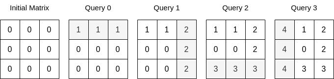
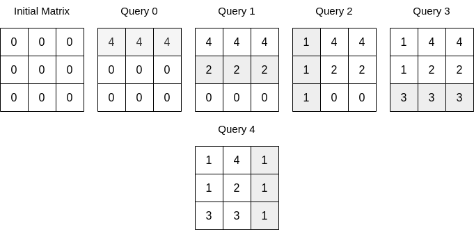

2718. Sum of Matrix After Queries


You are given an integer `n` and a **0-indexed 2D array** `queries` where `queries[i] = [typei, indexi, vali]`.

Initially, there is a **0-indexed** `n x n` matrix filled with `0`'s. For each query, you must apply one of the following changes:

* if `typei == 0`, set the values in the row with `indexi` to `vali`, overwriting any previous values.
* if `typei == 1`, set the values in the column with `indexi` to `vali`, overwriting any previous values.

Return the sum of integers in the matrix after all queries are applied.

 

**Example 1:**


```
Input: n = 3, queries = [[0,0,1],[1,2,2],[0,2,3],[1,0,4]]
Output: 23
Explanation: The image above describes the matrix after each query. The sum of the matrix after all queries are applied is 23. 
```

**Example 2:**


```
Input: n = 3, queries = [[0,0,4],[0,1,2],[1,0,1],[0,2,3],[1,2,1]]
Output: 17
Explanation: The image above describes the matrix after each query. The sum of the matrix after all queries are applied is 17.
```

**Constraints:**

* `1 <= n <= 10^4`
* `1 <= queries.length <= 5 * 10^4`
* `queries[i].length == 3`
* `0 <= typei <= 1`
* `0 <= indexi < n`
* `0 <= vali <= 10^5`

# Submissions
---
**Solution 1: (Last Query Wins, forward)**
```
Runtime: 1995 ms
Memory: 39.3 MB
```
```python
class Solution:
    def matrixSumQueries(self, n: int, queries: List[List[int]]) -> int:
        dp = [{}, {}]
        ans = 0
        for typ, index, val in queries[::-1]:
            if not index in dp[typ]: 
                ans += (n-len(dp[typ^1]))*val
                dp[typ][index] = val

        return ans
```

**Solution 2: (Last Query Wins, backward)**
```
Runtime: 584 ms
Memory: 190.4 MB
```
```c++
class Solution {
public:
    long long matrixSumQueries(int n, vector<vector<int>>& queries) {
        long long res = 0, cnt[2] = {n, n};
        bool seen[2][10001] = {};
        for (int i = queries.size() - 1; i >= 0; --i) {
            int type = queries[i][0], id = queries[i][1], v = queries[i][2];
            if (!seen[type][id]) {
                seen[type][id] = true;
                res += v * cnt[!type];
                --cnt[type];
            }
        }
        return res;
    }
};
```
