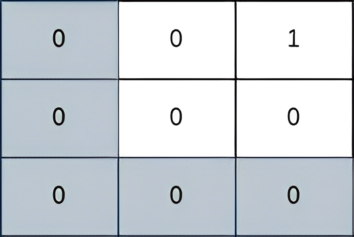

2812. Find the Safest Path in a Grid

You are given a **0-indexed** 2D matrix `grid` of size `n x n`, where `(r, c)` represents:

* A cell containing a thief if `grid[r][c] = 1`
* An empty cell if `grid[r][c] = 0`

You are initially positioned at cell `(0, 0)`. In one move, you can move to any adjacent cell in the `grid`, including cells containing thieves.

The **safeness factor** of a path on the `grid` is defined as the **minimum** manhattan distance from any cell in the path to any thief in the `grid`.

Return the **maximum safeness** factor of all paths leading to cell `(n - 1, n - 1)`.

An adjacent cell of cell `(r, c)`, is one of the cells `(r, c + 1)`, `(r, c - 1)`, `(r + 1, c)` and `(r - 1, c)` if it exists.

The **Manhattan distance** between two cells `(a, b)` and `(x, y)` is equal to `|a - x| + |b - y|`, where `|val|` denotes the absolute value of val.

 

**Example 1:**


```
Input: grid = [[1,0,0],[0,0,0],[0,0,1]]
Output: 0
Explanation: All paths from (0, 0) to (n - 1, n - 1) go through the thieves in cells (0, 0) and (n - 1, n - 1).
```

**Example 2:**


```
Input: grid = [[0,0,1],[0,0,0],[0,0,0]]
Output: 2
Explanation: The path depicted in the picture above has a safeness factor of 2 since:
- The closest cell of the path to the thief at cell (0, 2) is cell (0, 0). The distance between them is | 0 - 0 | + | 0 - 2 | = 2.
It can be shown that there are no other paths with a higher safeness factor.
```

**Example 3:**


```
Input: grid = [[0,0,0,1],[0,0,0,0],[0,0,0,0],[1,0,0,0]]
Output: 2
Explanation: The path depicted in the picture above has a safeness factor of 2 since:
- The closest cell of the path to the thief at cell (0, 3) is cell (1, 2). The distance between them is | 0 - 1 | + | 3 - 2 | = 2.
- The closest cell of the path to the thief at cell (3, 0) is cell (3, 2). The distance between them is | 3 - 3 | + | 0 - 2 | = 2.
It can be shown that there are no other paths with a higher safeness factor.
```

**Constraints:**

* `1 <= grid.length == n <= 400`
* `grid[i].length == n`
* `grid[i][j] is either 0 or 1`.
* There is at least one thief in the `grid`.

# Submissions
---
**Solution 1: (BFS + Dijkstra)**
```
Runtime: 439 ms
Memory: 102.5 MB
```
```c++
class Solution {
public:
    int maximumSafenessFactor(vector<vector<int>>& grid) {
        queue<array<int, 2>> q;
        int dir[5] = {1, 0, -1, 0, 1}, n = grid.size();
        for (int i = 0; i < n; ++i)
            for (int j = 0; j < n; ++j)
                if (grid[i][j])
                    q.push({i, j});
        while (!q.empty()) {
            auto [i, j] = q.front(); q.pop();
            for (int d = 0; d < 4; ++d) {
                int x = i + dir[d], y = j + dir[d + 1];
                if (min(x, y) >= 0 && max(x, y) < n && (grid[x][y] == 0 ||  grid[x][y] > grid[i][j] + 1)) {
                    grid[x][y] = grid[i][j] + 1;
                    q.push({x, y});
                }
            }
        }
        priority_queue<array<int, 3>> pq;
        pq.push({grid[0][0], 0, 0});
        while (pq.top()[1] < n - 1 || pq.top()[2] < n - 1) {
            auto [sf, i, j] = pq.top(); pq.pop();
            for (int d = 0; d < 4; ++d) {
                int x = i + dir[d], y = j + dir[d + 1];
                if (min(x, y) >= 0 && max(x, y) < n && grid[x][y] != -1) {
                    pq.push({min(sf, grid[x][y]), x, y});
                    grid[x][y] = -1; 
                }
            }
        }
        return pq.top()[0] - 1;
    }
};
```
