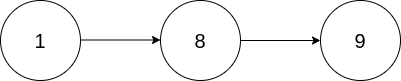
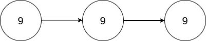

2816. Double a Number Represented as a Linked List

You are given the head of a **non-empty** linked list representing a non-negative integer without leading zeroes.

Return the `head` of the linked list after **doubling** it.

 

**Example 1:**


```
Input: head = [1,8,9]
Output: [3,7,8]
Explanation: The figure above corresponds to the given linked list which represents the number 189. Hence, the returned linked list represents the number 189 * 2 = 378.
```

**Example 2:**


```
Input: head = [9,9,9]
Output: [1,9,9,8]
Explanation: The figure above corresponds to the given linked list which represents the number 999. Hence, the returned linked list reprersents the number 999 * 2 = 1998. 
```

**Constraints:**

* The number of nodes in the list is in the range `[1, 10^4]`
* `0 <= Node.val <= 9`
* The input is generated such that the list represents a number that does not have leading zeros, except the number `0` itself.

# Submissions
---
**Solution 1: (Linked List, DFS, reverse 2 times)**
```
Runtime: 167 ms
Memory: 120.71 MB
```
```c++
/**
 * Definition for singly-linked list.
 * struct ListNode {
 *     int val;
 *     ListNode *next;
 *     ListNode() : val(0), next(nullptr) {}
 *     ListNode(int x) : val(x), next(nullptr) {}
 *     ListNode(int x, ListNode *next) : val(x), next(next) {}
 * };
 */
class Solution {
    ListNode *rev(ListNode *cur, ListNode *pre) {
        if (!cur) {
            return pre;
        }
        ListNode *node = cur->next;
        cur->next = pre;
        pre = cur;
        return rev(node, cur);
    }
public:
    ListNode* doubleIt(ListNode* head) {
        ListNode *pre, *node;
        int c, v;
        node = rev(head, nullptr);
        head = node;
        c = 0;
        while (node) {
            v = node->val*2 + c;
            node->val = v % 10;
            c = v / 10;
            pre = node;
            node = node->next;
        }
        if (c) {
            node = new ListNode(c);
            pre->next = node;
        }
        return rev(head, nullptr);
    }
};
```

**Solution 1: (Linked List, 1 loop)**
```
Runtime: 240 ms
Memory: 116.1 MB
```
```c++
/**
 * Definition for singly-linked list.
 * struct ListNode {
 *     int val;
 *     ListNode *next;
 *     ListNode() : val(0), next(nullptr) {}
 *     ListNode(int x) : val(x), next(nullptr) {}
 *     ListNode(int x, ListNode *next) : val(x), next(next) {}
 * };
 */
class Solution {
public:
    ListNode* doubleIt(ListNode* head) {
        if (head->val > 4)
            head = new ListNode(0, head);
        for(ListNode* node = head; node; node = node->next) {
            node->val = (node->val * 2) % 10;
            if (node->next && node->next->val > 4)
                node->val++;
        }
        return head;
    }
};
```
