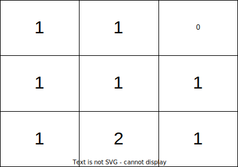

2850. Minimum Moves to Spread Stones Over Grid

You are given a **0-indexed** 2D integer matrix `grid` of size `3 * 3`, representing the number of stones in each cell. The `grid` contains exactly `9` stones, and there can be multiple stones in a single cell.

In one move, you can move a single stone from its current cell to any other cell if the two cells share a side.

Return the **minimum number** of moves required to place one stone in each cell.

 

**Example 1:**


```
Input: grid = [[1,1,0],[1,1,1],[1,2,1]]
Output: 3
Explanation: One possible sequence of moves to place one stone in each cell is: 
1- Move one stone from cell (2,1) to cell (2,2).
2- Move one stone from cell (2,2) to cell (1,2).
3- Move one stone from cell (1,2) to cell (0,2).
In total, it takes 3 moves to place one stone in each cell of the grid.
It can be shown that 3 is the minimum number of moves required to place one stone in each cell.
```

**Example 2:**


```
Input: grid = [[1,3,0],[1,0,0],[1,0,3]]
Output: 4
Explanation: One possible sequence of moves to place one stone in each cell is:
1- Move one stone from cell (0,1) to cell (0,2).
2- Move one stone from cell (0,1) to cell (1,1).
3- Move one stone from cell (2,2) to cell (1,2).
4- Move one stone from cell (2,2) to cell (2,1).
In total, it takes 4 moves to place one stone in each cell of the grid.
It can be shown that 4 is the minimum number of moves required to place one stone in each cell.
```

**Constraints:**

* `grid.length == grid[i].length == 3`
* `0 <= grid[i][j] <= 9`
* Sum of `grid` is equal to `9`.

# Submissions
---
**Solution 1: (Backtracking)**
```
Runtime: 874 ms
Memory: 18.7 MB
```
```c++
class Solution {
public:
    int minimumMoves(vector<vector<int>>& grid) {
        // Base Case
        int t = 0;
        for (int i = 0; i < 3; ++i)
            for (int j = 0; j < 3; ++j)
                if (grid[i][j] == 0)
                    t++;
        if (t == 0)
            return 0;
        
        int ans = INT_MAX;
        for (int i = 0; i < 3; ++i)
        {
            for (int j = 0; j < 3; ++j)
            {
                if (grid[i][j] == 0)
                {
                    for (int ni = 0; ni < 3; ++ni)
                    {
                        for (int nj = 0; nj < 3; ++nj)
                        {
                            int d = abs(ni - i) + abs(nj - j);
                            if (grid[ni][nj] > 1)
                            {
                                grid[ni][nj]--;
                                grid[i][j]++;
                                ans = min(ans, d + minimumMoves(grid));
                                grid[ni][nj]++;
                                grid[i][j]--;
                            }
                        }
                    }
                }
            }
        }
        return ans;
    }
};
```
