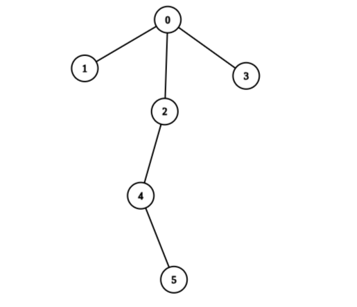
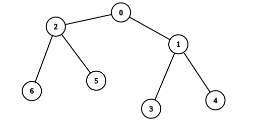

2925. Maximum Score After Applying Operations on a Tree

There is an undirected tree with `n` nodes labeled from `0` to `n - 1`, and rooted at node `0`. You are given a 2D integer array `edges` of length `n - 1`, where `edges[i] = [ai, bi]` indicates that there is an edge between nodes `ai` and `bi` in the tree.

You are also given a **0-indexed** integer array values of length `n`, where `values[i]` is the value associated with the `i`th node.

You start with a score of `0`. In one operation, you can:

* Pick any node `i`.
* Add `values[i]` to your score.
* Set `values[i]` to `0`.

A tree is **healthy** if the sum of values on the path from the root to any leaf node is different than zero.

Return the **maximum score** you can obtain after performing these operations on the tree any number of times so that it remains **healthy**.

 

**Example 1:**


```
Input: edges = [[0,1],[0,2],[0,3],[2,4],[4,5]], values = [5,2,5,2,1,1]
Output: 11
Explanation: We can choose nodes 1, 2, 3, 4, and 5. The value of the root is non-zero. Hence, the sum of values on the path from the root to any leaf is different than zero. Therefore, the tree is healthy and the score is values[1] + values[2] + values[3] + values[4] + values[5] = 11.
It can be shown that 11 is the maximum score obtainable after any number of operations on the tree.
```

**Example 2:**


```
Input: edges = [[0,1],[0,2],[1,3],[1,4],[2,5],[2,6]], values = [20,10,9,7,4,3,5]
Output: 40
Explanation: We can choose nodes 0, 2, 3, and 4.
- The sum of values on the path from 0 to 4 is equal to 10.
- The sum of values on the path from 0 to 3 is equal to 10.
- The sum of values on the path from 0 to 5 is equal to 3.
- The sum of values on the path from 0 to 6 is equal to 5.
Therefore, the tree is healthy and the score is values[0] + values[2] + values[3] + values[4] = 40.
It can be shown that 40 is the maximum score obtainable after any number of operations on the tree.
```

**Constraints:**

* `2 <= n <= 2 * 10^4`
* `edges.length == n - 1`
* `edges[i].length == 2`
* `0 <= ai, bi < n`
* `values.length == n`
* `1 <= values[i] <= 109`
* The input is generated such that `edges` represents a valid tree.

# Submissions
---
**Solution 1: (DFS, post order, all or healthy)**
```
Runtime: 379 ms
Memory: 184.2 MB
```
```c++
class Solution {
    pair<long,long> dfs(int pre, int cur, unordered_map<int,vector<int>> &m, vector<int> &values) {
        long long all = 0, healthy = -values[cur];
        for (auto ncur: m[cur]) {
            if (ncur == pre) {
                continue;
            }
            auto [all_ncur, healthy_ncur] = dfs(cur, ncur, m, values);
            all += all_ncur;
            healthy = max(0LL, healthy) + healthy_ncur;
        }
        return {all + values[cur], max(all, healthy + values[cur]) };
    }
public:
    long long maximumScoreAfterOperations(vector<vector<int>>& edges, vector<int>& values) {
        unordered_map<int, vector<int>> m;
        for (vector<int> edge: edges) {
            m[edge[0]].push_back(edge[1]);
            m[edge[1]].push_back(edge[0]);
        }
        return dfs(-1, 0, m, values).second;
    }
};
```
