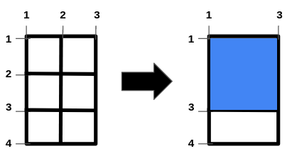
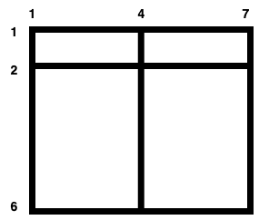

2975. Maximum Square Area by Removing Fences From a Field

There is a large `(m - 1) x (n - 1)` rectangular field with corners at `(1, 1)` and `(m, n)` containing some horizontal and vertical fences given in arrays `hFences` and `vFences` respectively.

Horizontal fences are from the coordinates `(hFences[i], 1)` to `(hFences[i], n)` and vertical fences are from the coordinates `(1, vFences[i])` to `(m, vFences[i])`.

Return the **maximum** area of a **square** field that can be formed by removing some fences (**possibly none**) or `-1` if it is impossible to make a square field.

Since the answer may be large, return it **modulo** `10^9 + 7`.

**Note:** The field is surrounded by two horizontal fences from the coordinates `(1, 1)` to `(1, n)` and `(m, 1)` to `(m, n)` and two vertical fences from the coordinates `(1, 1)` to `(m, 1)` and `(1, n)` to `(m, n)`. These fences cannot be removed.

 

**Example 1:**


```
Input: m = 4, n = 3, hFences = [2,3], vFences = [2]
Output: 4
Explanation: Removing the horizontal fence at 2 and the vertical fence at 2 will give a square field of area 4.
```

**Example 2:**


```
Input: m = 6, n = 7, hFences = [2], vFences = [4]
Output: -1
Explanation: It can be proved that there is no way to create a square field by removing fences.
```

**Constraints:**

* `3 <= m, n <= 109`
* `1 <= hFences.length, vFences.length <= 600`
* `1 < hFences[i] < m`
* `1 < vFences[i] < n`
* `hFences` and `vFences` are unique.

# Submissions
---
**Solution 1: (Brute Force, Enumerate All Sizes)**
```
Runtime: 1173 ms
Memory: 262.8 MB
```
```c++
class Solution {
    long long enumSizes(vector<int>& f, int sz, unordered_set<long long> &s) {
        long long res = -1;
        bool verify = !s.empty();
        f.push_back(1);
        f.push_back(sz);
        for (int i = 0; i < f.size(); ++i) {
            for (int j = i + 1; j < f.size(); ++j)
                if (verify) {
                    if (s.count(abs(f[j] - f[i])))
                        res = max(res, ((long long)f[j] - f[i]) * (f[j] - f[i]));
                }
                else
                    s.insert(abs(f[j] - f[i]));
        }
        return res;
    }
public:
    int maximizeSquareArea(int m, int n, vector<int>& hFences, vector<int>& vFences) {
        long long res = -1;
        unordered_set<long long> s;
        enumSizes(hFences, m, s);
        return enumSizes(vFences, n, s) % 1000000007;
    }
};
```

**Solution 2: (max common difference)**

    m = 6, n = 7, hFences = [2], vFences = [4]

    1 2 3 4 5 6 7  diff
1   x-----x-----x
2   x-----x-----x   1
3   |     |     |
4   |     |     |
5   |     |     |
6   x-----x-----x   4 5
diff      3     3
                6

```
Runtime: 944 ms, Beats 88.35%
Memory: 267.17 MB, Beats 55.34%
```
```c++
class Solution {
public:
    int maximizeSquareArea(int m, int n, vector<int>& hFences, vector<int>& vFences) {
        hFences.push_back(1);
        hFences.push_back(m);
        vFences.push_back(1);
        vFences.push_back(n);
        sort(begin(hFences), end(hFences));
        sort(begin(vFences), end(vFences));
        int i, j, d, mx = 0, MOD = 1e9 + 7;
        unordered_set<int> st;
        for (j = 1; j < hFences.size(); j ++) {
            for (i = j - 1; i >= 0; i --) {
                st.insert(hFences[j] - hFences[i]);
            }
        }
        for (j = 1; j < vFences.size(); j ++) {
            for (i = j - 1; i >= 0; i --) {
                d = vFences[j] - vFences[i];
                if (st.count(d)) {
                    mx = max(mx, d);
                }
            }
        }
        if (mx == 0) {
            return -1;
        }
        return (1LL * mx * mx) % MOD;
    }
};
```
