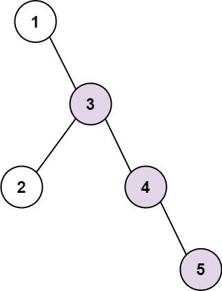

298. Binary Tree Longest Consecutive Sequence

Given the `root` of a binary tree, return the length of the longest consecutive sequence path.

The path refers to any sequence of nodes from some starting node to any node in the tree along the parent-child connections. The longest consecutive path needs to be from parent to child (cannot be the reverse).

 

**Example 1:**


```
Input: root = [1,null,3,2,4,null,null,null,5]
Output: 3
Explanation: Longest consecutive sequence path is 3-4-5, so return 3.
```

**Example 2:**


```
Input: root = [2,null,3,2,null,1]
Output: 2
Explanation: Longest consecutive sequence path is 2-3, not 3-2-1, so return 2.
```

**Constraints:**

* The number of nodes in the tree is in the range `[1, 3 * 104]`.
* `-3 * 10^4 <= Node.val <= 3 * 10^4`

# Submissions
---
**Solution 1: (DFS)**
```
Runtime: 112 ms
Memory Usage: 22 MB
```
```python
# Definition for a binary tree node.
# class TreeNode:
#     def __init__(self, val=0, left=None, right=None):
#         self.val = val
#         self.left = left
#         self.right = right
class Solution:
    def longestConsecutive(self, root: TreeNode) -> int:
        ans = 1
        
        def dfs(node, p, m):
            nonlocal ans
            if node:
                m = m+1 if p and p.val + 1 == node.val else 1
                ans = max(ans, m)
                dfs(node.left, node, m)
                dfs(node.right, node, m)
                    
        dfs(root, None, 0)
        return ans
```

**SOlution 2: (DFS)**
```
Runtime: 100 ms
Memory Usage: 21.7 MB
```
```python
# Definition for a binary tree node.
# class TreeNode:
#     def __init__(self, val=0, left=None, right=None):
#         self.val = val
#         self.left = left
#         self.right = right
class Solution:
    def longestConsecutive(self, root: TreeNode) -> int:
        ans = 1
        
        def dfs(node, m):
            nonlocal ans
            if node:
                ans = max(ans, m)
                if node.left:
                    if node.left.val == node.val+1:
                        dfs(node.left, m+1)
                    else:
                        dfs(node.left, 1)
                if node.right:
                    if node.right.val == node.val+1:
                        dfs(node.right, m+1)
                    else:
                        dfs(node.right, 1)
                    
        dfs(root, 1)
        return ans
```

**Solution 3: (DFS)**
```
Runtime: 0 ms, Beats 100.00%
Memory: 32.95 MB, Beats 50.48%
```
```c++
/**
 * Definition for a binary tree node.
 * struct TreeNode {
 *     int val;
 *     TreeNode *left;
 *     TreeNode *right;
 *     TreeNode() : val(0), left(nullptr), right(nullptr) {}
 *     TreeNode(int x) : val(x), left(nullptr), right(nullptr) {}
 *     TreeNode(int x, TreeNode *left, TreeNode *right) : val(x), left(left), right(right) {}
 * };
 */
class Solution {
    int dfs(TreeNode *node, int &ans) {
        int rst = 1, left, right;
        if (node->left) {
            left = dfs(node->left, ans);
            if (node->val == node->left->val - 1) {
                rst = max(rst, 1 + left);
            }
        }
        if (node->right) {
            right = dfs(node->right, ans);
            if (node->val == node->right->val - 1) {
                rst = max(rst, 1 + right);
            }
        }
        ans = max(ans, rst);
        return rst;
    }
public:
    int longestConsecutive(TreeNode* root) {
        int ans = 0;
        dfs(root, ans);
        return ans;
    }
};
```
