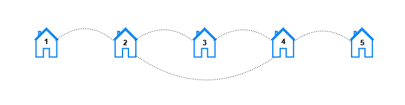

3015. Count the Number of Houses at a Certain Distance I

You are given three **positive** integers `n`, `x`, and `y`.

In a city, there exist houses numbered `1` to `n` connected by `n` streets. There is a street connecting the house numbered `i` with the house numbered `i + 1` for all `1 <= i <= n - 1` . An additional street connects the house numbered x with the house numbered `y`.

For each `k`, such that `1 <= k <= n`, you need to find the number of **pairs of houses** `(house1, house2)` such that the **minimum** number of streets that need to be traveled to reach `house2` from `house1` is `k`.

Return a **1-indexed** array `result` of length `n` where `result[k]` represents the **total** number of pairs of houses such that the **minimum** streets required to reach one house from the other is `k`.

**Note** that `x` and `y` can be **equal**.

 

**Example 1:**


```
Input: n = 3, x = 1, y = 3
Output: [6,0,0]
Explanation: Let's look at each pair of houses:
- For the pair (1, 2), we can go from house 1 to house 2 directly.
- For the pair (2, 1), we can go from house 2 to house 1 directly.
- For the pair (1, 3), we can go from house 1 to house 3 directly.
- For the pair (3, 1), we can go from house 3 to house 1 directly.
- For the pair (2, 3), we can go from house 2 to house 3 directly.
- For the pair (3, 2), we can go from house 3 to house 2 directly.
```

**Example 2:**


```
Input: n = 5, x = 2, y = 4
Output: [10,8,2,0,0]
Explanation: For each distance k the pairs are:
- For k == 1, the pairs are (1, 2), (2, 1), (2, 3), (3, 2), (2, 4), (4, 2), (3, 4), (4, 3), (4, 5), and (5, 4).
- For k == 2, the pairs are (1, 3), (3, 1), (1, 4), (4, 1), (2, 5), (5, 2), (3, 5), and (5, 3).
- For k == 3, the pairs are (1, 5), and (5, 1).
- For k == 4 and k == 5, there are no pairs.
```

**Example 3:**


```
Input: n = 4, x = 1, y = 1
Output: [6,4,2,0]
Explanation: For each distance k the pairs are:
- For k == 1, the pairs are (1, 2), (2, 1), (2, 3), (3, 2), (3, 4), and (4, 3).
- For k == 2, the pairs are (1, 3), (3, 1), (2, 4), and (4, 2).
- For k == 3, the pairs are (1, 4), and (4, 1).
- For k == 4, there are no pairs.
```

**Constraints:**

* `2 <= n <= 100`
* `1 <= x, y <= n`

# Submissions
---
**Solution 1: (Brute Force, only 2 case)**
```
Runtime: 0 ms
Memory: 9.21 MB
```
```c++
class Solution {
public:
    vector<int> countOfPairs(int n, int x, int y) {
        // to make sure that x<=y in every case
        if(x>y)
            return countOfPairs(n, y, x);
        
        vector<int> res(n, 0);
        
        for(int i=1;i<=n;i++){
            for(int j=1;j<i;j++){
                int idx = i-j;  // case 1        
                idx = min(idx, abs(j-x) + 1 + abs(i-y));  // case 2
                if(idx>=1)
                    res[idx-1]+=2;  // add 2 as we can go from j->i and i->j
            }
        }
        return res;
    }
};
```
