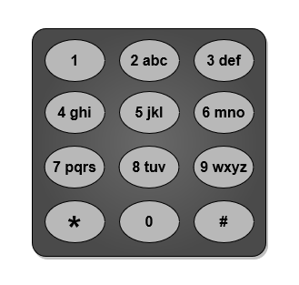
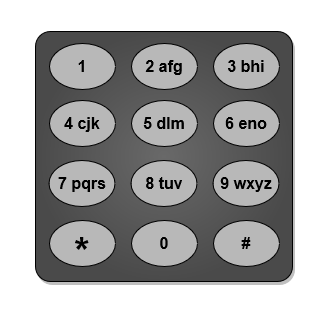

3016. Minimum Number of Pushes to Type Word II

You are given a string `word` containing lowercase English letters.

Telephone keypads have keys mapped with **distinct** collections of lowercase English letters, which can be used to form words by pushing them. For example, the key `2` is mapped with `["a","b","c"]`, we need to push the key one time to type `"a"`, two times to type `"b"`, and three times to type `"c"` .

It is allowed to remap the keys numbered `2` to `9` to **distinct** collections of letters. The keys can be remapped to any amount of letters, but each letter must be mapped to exactly one key. You need to find the **minimum** number of times the keys will be pushed to type the string `word`.

Return the **minimum** number of pushes needed to type `word` after remapping the keys.

An example mapping of letters to keys on a telephone keypad is given below. Note that `1`, `*`, `#`, and `0` do not map to any letters.


 

**Example 1:**


```
Input: word = "abcde"
Output: 5
Explanation: The remapped keypad given in the image provides the minimum cost.
"a" -> one push on key 2
"b" -> one push on key 3
"c" -> one push on key 4
"d" -> one push on key 5
"e" -> one push on key 6
Total cost is 1 + 1 + 1 + 1 + 1 = 5.
It can be shown that no other mapping can provide a lower cost.
```

**Example 2:**


```
Input: word = "xyzxyzxyzxyz"
Output: 12
Explanation: The remapped keypad given in the image provides the minimum cost.
"x" -> one push on key 2
"y" -> one push on key 3
"z" -> one push on key 4
Total cost is 1 * 4 + 1 * 4 + 1 * 4 = 12
It can be shown that no other mapping can provide a lower cost.
Note that the key 9 is not mapped to any letter: it is not necessary to map letters to every key, but to map all the letters.
```

**Example 3:**

```
Input: word = "aabbccddeeffgghhiiiiii"
Output: 24
Explanation: The remapped keypad given in the image provides the minimum cost.
"a" -> one push on key 2
"b" -> one push on key 3
"c" -> one push on key 4
"d" -> one push on key 5
"e" -> one push on key 6
"f" -> one push on key 7
"g" -> one push on key 8
"h" -> two pushes on key 9
"i" -> one push on key 9
Total cost is 1 * 2 + 1 * 2 + 1 * 2 + 1 * 2 + 1 * 2 + 1 * 2 + 1 * 2 + 2 * 2 + 6 * 1 = 24.
It can be shown that no other mapping can provide a lower cost.
```

**Constraints:**

* `1 <= word.length <= 10^5`
* `word` consists of lowercase English letters.

# Submissions
---
**Solution 1: (Greedy Sorting)**
```
Runtime: 63 ms
Memory: 27.59 MB
```
```c++
class Solution {
public:
    int minimumPushes(string word) {
        // Frequency vector to store count of each letter
        vector<int> frequency(26, 0);

        // Count occurrences of each letter
        for (char& c : word) {
            ++frequency[c - 'a'];
        }

        // Sort frequencies in descending order
        sort(frequency.rbegin(), frequency.rend());

        int totalPushes = 0;

        // Calculate total number of presses
        for (int i = 0; i < 26; ++i) {
            if (frequency[i] == 0) break;
            totalPushes += (i / 8 + 1) * frequency[i];
        }

        return totalPushes;
    }
};
```

**Solution 2: (Using Heap)**
```
Runtime: 115 ms
Memory: 27.18 MB
```
```c++
class Solution {
public:
    int minimumPushes(string word) {
        // Frequency map to store count of each letter
        unordered_map<char, int> frequencyMap;

        // Count occurrences of each letter
        for (char& c : word) {
            ++frequencyMap[c];
        }

        // Priority queue to store frequencies in descending order
        priority_queue<int> frequencyQueue;

        // Push all frequencies into the priority queue
        for (const auto& entry : frequencyMap) {
            frequencyQueue.push(entry.second);
        }

        int totalPushes = 0;
        int index = 0;

        // Calculate total number of presses
        while (!frequencyQueue.empty()) {
            totalPushes += (1 + (index / 8)) * frequencyQueue.top();
            frequencyQueue.pop();
            index++;
        }

        return totalPushes;
    }
};
```

**Solution 3: (Counter, sort)**
```
Runtime: 75 ms
Memory: 24.52 MB
```
```c++
class Solution {
public:
    int minimumPushes(string word) {
        int cnt[26] = {0};
        for (char c: word) {
            cnt[c-'a'] += 1;
        }
        vector<int> dp;
        for (int i = 0; i < 26; i ++) {
            if (cnt[i]) {
                dp.push_back(cnt[i]);
            }
        }
        sort(dp.begin(), dp.end(), greater<int>());
        int ans = 0;
        for (int i = 0; i < dp.size(); i ++) {
            ans += dp[i]*(i/8 + 1);
        }
        return ans;
    }
};
```
