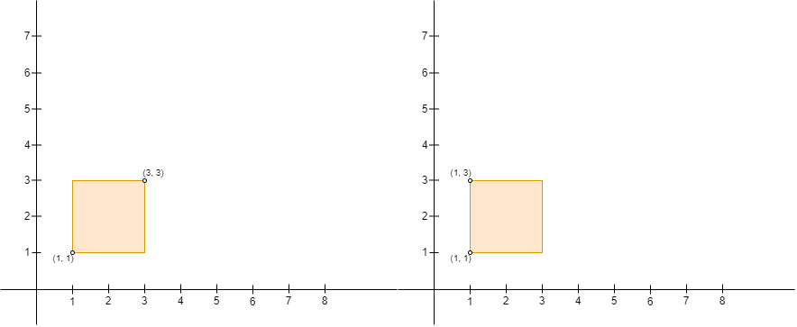
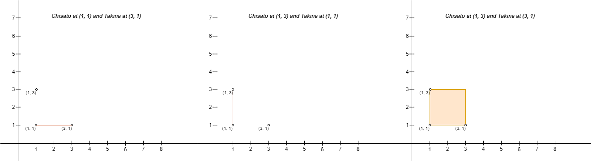

3025. Find the Number of Ways to Place People I

You are given a 2D array `points` of size `n x 2` representing integer coordinates of some points on a 2D-plane, where `points[i] = [xi, yi]`.

We define the **right** direction as positive x-axis (**increasing** x-coordinate) and the **left** direction as negative x-axis (**decreasing** x-coordinate). Similarly, we define the **up** direction as positive y-axis (**increasing** y-coordinate) and the **down** direction as negative y-axis (**decreasing** y-coordinate)

You have to place `n` people, including Chisato and Takina, at these points such that there is **exactly one** person at every point. Chisato wants to be alone with Takina, so Chisato will build a rectangular fence with Chisato's position as the **upper left** corner and Takina's position as the **lower right** corner of the fence (Note that the fence **might not** enclose any area, i.e. it can be a line). If any person other than Chisato and Takina is either inside the fence or on the fence, Chisato will be sad.

Return the number of **pairs of points** where you can place Chisato and Takina, such that Chisato does not become sad on building the fence.

**Note** that Chisato can only build a fence with Chisato's position as the upper left corner, and Takina's position as the lower right corner. For example, Chisato cannot build either of the fences in the picture below with four corners `(1, 1)`, `(1, 3)`, `(3, 1)`, and `(3, 3)`, because:

* With Chisato at `(3, 3)` and Takina at `(1, 1)`, Chisato's position is not the upper left corner and Takina's position is not the lower right corner of the fence.
* With Chisato at `(1, 3)` and Takina at `(1, 1)`, Takina's position is not the lower right corner of the fence.
`

 

**Example 1:**


```
Input: points = [[1,1],[2,2],[3,3]]
Output: 0
Explanation: There is no way to place Chisato and Takina such that Chisato can build a fence with Chisato's position as the upper left corner and Takina's position as the lower right corner. Hence we return 0. 
```

**Example 2:**


```
Input: points = [[6,2],[4,4],[2,6]]
Output: 2
Explanation: There are two ways to place Chisato and Takina such that Chisato will not be sad:
- Place Chisato at (4, 4) and Takina at (6, 2).
- Place Chisato at (2, 6) and Takina at (4, 4).
You cannot place Chisato at (2, 6) and Takina at (6, 2) because the person at (4, 4) will be inside the fence.
```

**Example 3:**


```
Input: points = [[3,1],[1,3],[1,1]]
Output: 2
Explanation: There are two ways to place Chisato and Takina such that Chisato will not be sad:
- Place Chisato at (1, 1) and Takina at (3, 1).
- Place Chisato at (1, 3) and Takina at (1, 1).
You cannot place Chisato at (1, 3) and Takina at (3, 1) because the person at (1, 1) will be on the fence.
Note that it does not matter if the fence encloses any area, the first and second fences in the image are valid.
```

**Constraints:**

* `2 <= n <= 50`
* `points[i].length == 2`
* `0 <= points[i][0], points[i][1] <= 50`
* All `points[i]` are distinct.

# Submissions
---
**Solution 1: (Brute Force, Sort)**
```
Runtime: 5 ms, Beats 67.41%
Memory: 32.55 MB, Beats 74.81%
```
```c++
class Solution {
public:
    int numberOfPairs(vector<vector<int>>& points) {
        int n = points.size(), i, j, k, ans = 0;
        bool flag;
        sort(points.begin(), points.end(), [](auto &pa, auto &pb){
            if (pa[0] != pb[0]) {
                return pa[0] < pb[0];
            }
            return pa[1] > pb[1];
        });
        for (i = 0; i < n; i++) {
            for (j = i + 1; j < n; j++) {
                if (points[i][1] >= points[j][1]) {
                    flag = true;
                    for (k = i + 1; k < j; k++) {
                        if (points[k][1] <= points[i][1] && points[k][1] >= points[j][1]) {
                            flag = false;
                        }
                    }
                    if (flag) {
                        ans += 1;
                    }
                }
            }
        }
        return ans;
    }
};
```
