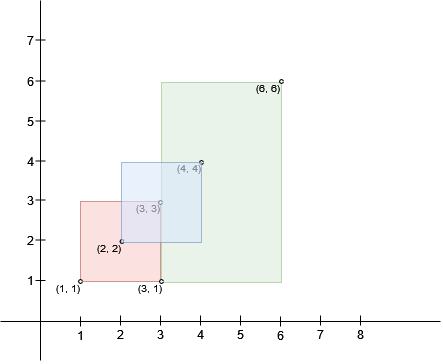
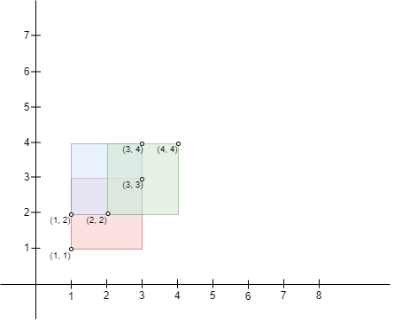
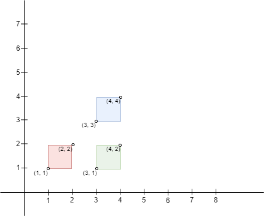

3047. Find the Largest Area of Square Inside Two Rectangles

There exist `n` rectangles in a 2D plane. You are given two **0-indexed** 2D integer arrays `bottomLeft` and `topRight`, both of size `n x 2`, where `bottomLeft[i]` and `topRight[i]` represent the **bottom-left** and **top-right** coordinates of the `i`th rectangle respectively.

You can select a region formed from the **intersection** of two of the given rectangles. You need to find the **largest** area of a **square** that can fit **inside** this region if you select the region optimally.

Return the **largest** possible area of a square, or `0` if there **do not** exist any intersecting regions between the rectangles.

 

**Example 1:**


```
Input: bottomLeft = [[1,1],[2,2],[3,1]], topRight = [[3,3],[4,4],[6,6]]
Output: 1
Explanation: A square with side length 1 can fit inside either the intersecting region of rectangle 0 and rectangle 1, or the intersecting region of rectangle 1 and rectangle 2. Hence the largest area is side * side which is 1 * 1 == 1.
It can be shown that a square with a greater side length can not fit inside any intersecting region.
```

**Example 2:**


```
Input: bottomLeft = [[1,1],[2,2],[1,2]], topRight = [[3,3],[4,4],[3,4]]
Output: 1
Explanation: A square with side length 1 can fit inside either the intersecting region of rectangle 0 and rectangle 1, the intersecting region of rectangle 1 and rectangle 2, or the intersection region of all 3 rectangles. Hence the largest area is side * side which is 1 * 1 == 1.
It can be shown that a square with a greater side length can not fit inside any intersecting region.
Note that the region can be formed by the intersection of more than 2 rectangles.
```

**Example 3:**


```
Input: bottomLeft = [[1,1],[3,3],[3,1]], topRight = [[2,2],[4,4],[4,2]]
Output: 0
Explanation: No pair of rectangles intersect, hence, we return 0.
```

**Constraints:**

* `n == bottomLeft.length == topRight.length`
* `2 <= n <= 10^3`
* `bottomLeft[i].length == topRight[i].length == 2`
* `1 <= bottomLeft[i][0], bottomLeft[i][1] <= 10^7`
* `1 <= topRight[i][0], topRight[i][1] <= 10^7`
* `bottomLeft[i][0] < topRight[i][0]`
* `bottomLeft[i][1] < topRight[i][1]`

# Submissions
---
**Solution 1: (Brute Force)**
```
Runtime: 197 ms
Memory: 58.80 MB
```
```c++
class Solution {
public:
    long long largestSquareArea(vector<vector<int>>& bottomLeft, vector<vector<int>>& topRight) {
        long long area=0;
        for (int i = 0; i < bottomLeft.size(); i ++) {
            for (int j = i+1; j < topRight.size(); j ++) {
                long long minimum_x = max(bottomLeft[i][0], bottomLeft[j][0]);
                long long maximum_x = min(topRight[i][0], topRight[j][0]);
                long long minimum_y = max(bottomLeft[i][1], bottomLeft[j][1]);
                long long maximum_y = min(topRight[i][1], topRight[j][1]);
                
                if (minimum_x < maximum_x && minimum_y < maximum_y){
                    long long s = min(maximum_x - minimum_x, maximum_y - minimum_y);
                    area = max(area, s*s);
                }
            }
        }
        return area;
    }
};
```

**Solution 2: (Brute Force)**

    bottomLeft = [[1,1],[2,2],[3,1]], topRight = [[3,3],[4,4],[6,6]]


6         .--------x
5         |        |  
4      .--|--x     |      |
3   .--|--x  |     | |h | |
2   |  x--|---     |    | |
1   x-----x---------
    1  2  3  4  5  6
       -w--
          |
          ---
    i  j  j
w      1  0
h      1  2
side   1  0
       i  j
w         1
h         2
side      1

```
Runtime: 86 ms, Beats 73.14%
Memory: 59.41 MB, Beats 56.20%
```
```c++
class Solution {
public:
    long long largestSquareArea(vector<vector<int>>& bottomLeft, vector<vector<int>>& topRight) {
        int n = bottomLeft.size();
        int maxSide = 0;

        for (int i = 0; i < n; i++) {
            for (int j = i + 1; j < n; j++) {
                int w = min(topRight[i][0], topRight[j][0]) -
                        max(bottomLeft[i][0], bottomLeft[j][0]);
                int h = min(topRight[i][1], topRight[j][1]) -
                        max(bottomLeft[i][1], bottomLeft[j][1]);

                maxSide = max(maxSide, min(w, h));
            }
        }

        return 1LL * maxSide * maxSide;
    }
};
```
