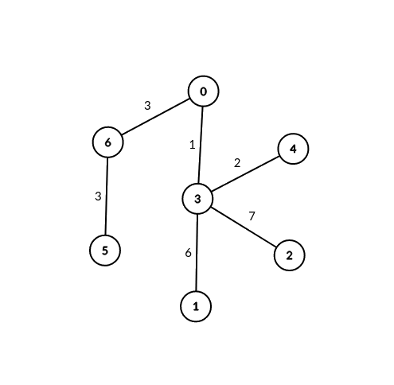

3067. Count Pairs of Connectable Servers in a Weighted Tree Network

You are given an unrooted weighted tree with `n` vertices representing servers numbered from `0` to `n - 1`, an array `edges` where `edges[i] = [ai, bi, weighti]` represents a bidirectional edge between vertices `ai` and `bi` of weight `weighti`. You are also given an integer `signalSpeed`.

Two servers `a` and `b` are **connectable** through a server `c` if:

* `a < b, a != c and b != c`.
* The distance from `c` to `a` is divisible by `signalSpeed`.
* The distance from `c` to `b` is divisible by `signalSpeed`.
* The path from `c` to `b` and the path from `c` to `a` do not share any edges.

Return an integer array `count` of length `n` where `count[i]` is the number of server pairs that are **connectable** through the server `i`.

 

**Example 1:**


```
Input: edges = [[0,1,1],[1,2,5],[2,3,13],[3,4,9],[4,5,2]], signalSpeed = 1
Output: [0,4,6,6,4,0]
Explanation: Since signalSpeed is 1, count[c] is equal to the number of pairs of paths that start at c and do not share any edges.
In the case of the given path graph, count[c] is equal to the number of servers to the left of c multiplied by the servers to the right of c.
```

**Example 2:**


```
Input: edges = [[0,6,3],[6,5,3],[0,3,1],[3,2,7],[3,1,6],[3,4,2]], signalSpeed = 3
Output: [2,0,0,0,0,0,2]
Explanation: Through server 0, there are 2 pairs of connectable servers: (4, 5) and (4, 6).
Through server 6, there are 2 pairs of connectable servers: (4, 5) and (0, 5).
It can be shown that no two servers are connectable through servers other than 0 and 6.
```

**Constraints:**

* `2 <= n <= 1000`
* `edges.length == n - 1`
* `edges[i].length == 3`
* `0 <= ai, bi < n`
* `edges[i] = [ai, bi, weighti]`
* `1 <= weighti <= 10^6`
* `1 <= signalSpeed <= 10^6`
* The input is generated such that `edges` represents a valid tree.

# Submissions
---
**Solution 1: (DFS)**
```
Runtime: 141 ms
Memory: 37.18 MB
```
```c++
class Solution {
    int dfs(int root, int par, int dist, vector<vector<pair<int, int>>>& graph, int& signalSpeed){
        int count = (dist % signalSpeed)?0:1;       // check if the current node is valid or not
        for(auto [n, w]: graph[root]){              
            if(n != par) count += dfs(n, root, dist + w, graph, signalSpeed);
        }
        return count;
    }
public:
    vector<int> countPairsOfConnectableServers(vector<vector<int>>& edges, int signalSpeed) {
        vector<vector<pair<int, int>>> graph(edges.size() + 1);
        for(auto e: edges){                        // create graph from the edges
            graph[e[0]].push_back({e[1], e[2]});
            graph[e[1]].push_back({e[0], e[2]});
        }
        
        vector<int> ans;
        for(int i = 0; i <= edges.size(); ++i){    // iterate over 0 to n and consider each node as the root node
            int nodeCount = 0, res = 0;
            for(auto [n, w]: graph[i]){            // for each root node, iterate over its child subtree and find the valid node count from each sub tree
                int t = dfs(n, i, w, graph, signalSpeed);
                res += nodeCount * t;  nodeCount += t;    // keep accumulating answer by multiplying the current sub tree valid node count with the previously seen node count
            }
            ans.push_back(res);
        }
        return ans;
    }
};
```
