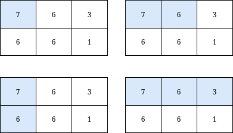

3070. Count Submatrices with Top-Left Element and Sum Less Than k

You are given a **0-indexed** integer matrix `grid` and an integer `k`.

Return the **number** of **submatrices** that contain the top-left element of the `grid`, and have a sum less than or equal to `k`.

 

**Example 1:**


```
Input: grid = [[7,6,3],[6,6,1]], k = 18
Output: 4
Explanation: There are only 4 submatrices, shown in the image above, that contain the top-left element of grid, and have a sum less than or equal to 18.
```

**Example 2:**


```
Input: grid = [[7,2,9],[1,5,0],[2,6,6]], k = 20
Output: 6
Explanation: There are only 6 submatrices, shown in the image above, that contain the top-left element of grid, and have a sum less than or equal to 20.
```

**Constraints:**

* `m == grid.length`
* `n == grid[i].length`
* `1 <= n, m <= 1000`
* `0 <= grid[i][j] <= 1000`
* `1 <= k <= 109`

# Submissions
---
**Solution 1: (Prefix sum)**
```
Runtime: 186 ms
Memory: 89.00 MB
```
```c++
class Solution {
public:
    int countSubmatrices(vector<vector<int>>& grid, int k) {
        int ans = 0;
        for (int i = 0; i < grid.size(); i ++) {
            for (int j = 0; j < grid[0].size(); j ++) {
                grid[i][j] += (i ? grid[i-1][j] : 0) + (j ? grid[i][j-1] : 0) - (i && j ? grid[i-1][j-1] : 0);
                if (grid[i][j] > k) {
                    break;
                }
                ans += 1;
            }
        }
        return ans;
    }
};
```
