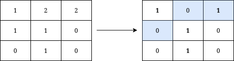
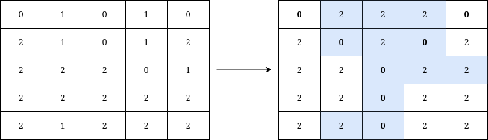

3071. Minimum Operations to Write the Letter Y on a Grid

You are given a **0-indexed** `n x n` grid where `n` is odd, and `grid[r][c]` is `0`, `1`, or `2`.

We say that a cell belongs to the Letter Y if it belongs to one of the following:

* The diagonal starting at the top-left cell and ending at the center cell of the grid.
* The diagonal starting at the top-right cell and ending at the center cell of the grid.
* The vertical line starting at the center cell and ending at the bottom border of the grid.

The Letter Y is written on the grid if and only if:

* All values at cells belonging to the Y are equal.
* All values at cells not belonging to the Y are equal.
* The values at cells belonging to the Y are different from the values at cells not belonging to the Y.

Return the **minimum** number of operations needed to write the letter Y on the grid given that in one operation you can change the value at any cell to `0`, `1`, or `2`.

 

**Example 1:**


```
Input: grid = [[1,2,2],[1,1,0],[0,1,0]]
Output: 3
Explanation: We can write Y on the grid by applying the changes highlighted in blue in the image above. After the operations, all cells that belong to Y, denoted in bold, have the same value of 1 while those that do not belong to Y are equal to 0.
It can be shown that 3 is the minimum number of operations needed to write Y on the grid.
```

**Example 2:**


```
Input: grid = [[0,1,0,1,0],[2,1,0,1,2],[2,2,2,0,1],[2,2,2,2,2],[2,1,2,2,2]]
Output: 12
Explanation: We can write Y on the grid by applying the changes highlighted in blue in the image above. After the operations, all cells that belong to Y, denoted in bold, have the same value of 0 while those that do not belong to Y are equal to 2. 
It can be shown that 12 is the minimum number of operations needed to write Y on the grid.
```

**Constraints:**

* `3 <= n <= 49`
* `n == grid.length == grid[i].length`
* `0 <= grid[i][j] <= 2`
* `n` is odd.

# Submissions
---
**Solution 1: (Brute Force, check all case)**
```
Runtime: 63 ms
Memory: 41.02 MB
```
```c++
class Solution {
public:
    int minimumOperationsToWriteY(vector<vector<int>>& grid) {
        int n = grid.size(), cur, ans = INT_MAX;
        for (int a = 0; a <= 2; a++) {
            for (int b = 0; b <= 2; b ++) {
                if (a == b) {
                    continue;
                }
                cur = 0;
                for (int i = 0; i < n; i ++) {
                    for (int j = 0; j < n; j ++) {
                        if ((i == j && i <= n/2) || (i+j == n-1 && i <= n/2) || (i >= n/2 && j == n/2)) {
                            if (grid[i][j] != a) {
                                cur += 1;
                            }
                        } else {
                            if (grid[i][j] != b) {
                                cur += 1;
                            }
                        }
                    }
                }
                ans = min(ans, cur);
            }
        }
        return ans;
    }
};
```
