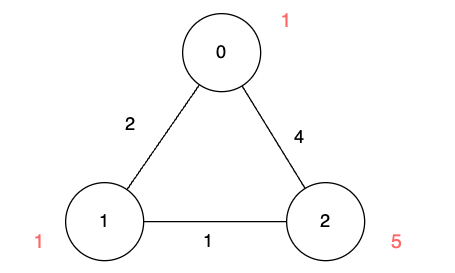

3112. Minimum Time to Visit Disappearing Nodes

There is an undirected graph of `n` nodes. You are given a 2D array `edges`, where `edges[i] = [ui, vi, lengthi]` describes an edge between node `ui` and node `vi` with a traversal time of `lengthi` units.

Additionally, you are given an array `disappear`, where `disappear[i]` denotes the time when the node `i` disappears from the graph and you won't be able to visit it.

Notice that the graph might be disconnected and might contain multiple `edges`.

Return the array `answer`, with `answer[i]` denoting the minimum units of time required to reach node `i` from node `0`. If node `i` is unreachable from node `0` then `answer[i]` is `-1`.

 

**Example 1:**


```
Input: n = 3, edges = [[0,1,2],[1,2,1],[0,2,4]], disappear = [1,1,5]

Output: [0,-1,4]

Explanation:

We are starting our journey from node 0, and our goal is to find the minimum time required to reach each node before it disappears.

For node 0, we don't need any time as it is our starting point.
For node 1, we need at least 2 units of time to traverse edges[0]. Unfortunately, it disappears at that moment, so we won't be able to visit it.
For node 2, we need at least 4 units of time to traverse edges[2].
```

**Example 2:**


```
Input: n = 3, edges = [[0,1,2],[1,2,1],[0,2,4]], disappear = [1,3,5]

Output: [0,2,3]

Explanation:

We are starting our journey from node 0, and our goal is to find the minimum time required to reach each node before it disappears.

For node 0, we don't need any time as it is the starting point.
For node 1, we need at least 2 units of time to traverse edges[0].
For node 2, we need at least 3 units of time to traverse edges[0] and edges[1].
```

**Example 3:**
```
Input: n = 2, edges = [[0,1,1]], disappear = [1,1]

Output: [0,-1]

Explanation:

Exactly when we reach node 1, it disappears.
```
 

**Constraints:**

* `1 <= n <= 5 * 10^4`
* `0 <= edges.length <= 10^5`
* `edges[i] == [ui, vi, lengthi]`
* `0 <= ui, vi <= n - 1`
* `1 <= lengthi <= 10^5`
* `disappear.length == n`
* `1 <= disappear[i] <= 10^5`

# Submissions
---
**Solution 1: (iDijkstra)**
```
Runtime: 387 ms
Memory: 176.92 MB
```
```c++
class Solution {
public:
    vector<int> minimumTime(int n, vector<vector<int>>& edges, vector<int>& disappear) {
        vector<vector<pair<int,int>>> g(n);
        for (auto e: edges) {
            g[e[0]].push_back({e[1], e[2]});
            g[e[1]].push_back({e[0], e[2]});
        }
        priority_queue<pair<int,int>,vector<pair<int,int>>,greater<pair<int,int>>> pq;
        vector<int> ans(n, -1);
        pq.push({0, 0});
        while (pq.size()) {
            auto [c, v] = pq.top();
            pq.pop();
            if (c > disappear[v] || (ans[v] != -1 && c > ans[v])) {
                continue;
            }
            ans[v] = c;
            for (auto [nv, dc]: g[v]) {
                if (c+dc < disappear[nv] && (ans[nv] == -1 || c+dc < ans[nv])) {
                    pq.push({c+dc, nv});
                }
            }
        }
        return ans;
    }
};
```
