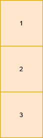

3122. Minimum Number of Operations to Satisfy Conditions

You are given a 2D matrix `grid` of size `m x n`. In one operation, you can change the value of **any** cell to **any** non-negative number. You need to perform some operations such that each cell `grid[i][j]` is:

* Equal to the cell below it, i.e. `grid[i][j] == grid[i + 1][j]` (if it exists).
* Different from the cell to its right, i.e. `grid[i][j] != grid[i][j + 1]` (if it exists).

Return the minimum number of operations needed.

 

**Example 1:**
```
Input: grid = [[1,0,2],[1,0,2]]

Output: 0

Explanation:
```

```
All the cells in the matrix already satisfy the properties.
```

**Example 2:**
```
Input: grid = [[1,1,1],[0,0,0]]

Output: 3

Explanation:
```

```
The matrix becomes [[1,0,1],[1,0,1]] which satisfies the properties, by doing these 3 operations:

Change grid[1][0] to 1.
Change grid[0][1] to 0.
Change grid[1][2] to 1.
```

**Example 3:**
```
Input: grid = [[1],[2],[3]]

Output: 2

Explanation:
```

```
There is a single column. We can change the value to 1 in each cell using 2 operations.
```
 

**Constraints:**

* `1 <= n, m <= 1000`
* `0 <= grid[i][j] <= 9`

# Submissions
---
**Solution 1: (DP Bottom-Up)**
```
Runtime: 231 ms
Memory: 116.73 MB
```
```c++
class Solution {
public:
    int minimumOperations(vector<vector<int>>& grid) {
        int m = grid.size(), n = grid[0].size();
        vector<vector<int>> cnt(n, vector<int>(10));
        for (int j = 0; j < n; j ++) {
            for (int i = 0; i < m; i ++) {
                cnt[j][grid[i][j]] += 1;
            }
            for (int i = 0; i < 10; i ++) {
                cnt[j][i] = m - cnt[j][i];
            }
        }
        int pre;
        for (int j = 1; j < n; j ++) {
            for (int i = 0; i < 10; i ++) {
                pre = INT_MAX;
                for (int k = 0; k < 10; k ++) {
                    if (i == k) {
                        continue;
                    }
                    pre = min(pre, cnt[j-1][k]);
                }
                cnt[j][i] += pre;
            }
        }
        return *min_element(cnt[n-1].begin(), cnt[n-1].end());
    } 
};
```

**Solution 2: (DP Bottom-Up, sort)**
```
Runtime: 211 ms
Memory: 114.64 MB
```
```c++
class Solution {
    int cnt[1000][10] = {}, dp[1001][2] = {}, top[1001] = {};
public:
    int minimumOperations(vector<vector<int>>& grid) {
        int m = grid.size(), n = grid[0].size();
        vector<int> ids{0, 1, 2, 3, 4, 5, 6, 7, 8, 9};
        for (int i = 0; i < m; ++i)
            for (int j = 0; j < n; ++j)
                ++cnt[j][grid[i][j]];
        for (int i = 1; i <= n; ++i) {
            partial_sort(begin(ids), begin(ids) + 3, end(ids), [&](int a, int b){ return cnt[i - 1][a] > cnt[i - 1][b]; });
            for (int id = 0; id < 3; ++id) {
                int cur = cnt[i - 1][ids[id]] + dp[i - 1][ids[id] == top[i - 1]];
                if (cur > dp[i][0]) {
                    dp[i][1] = exchange(dp[i][0], cur);
                    top[i] = ids[id];
                }
                else if (cur > dp[i][1])
                    dp[i][1] = cur;
            }
        }
        return n * m - dp[n][0];
    } 
};
```
