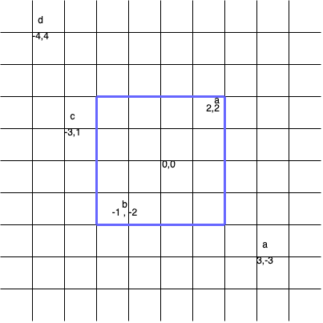

3143. Maximum Points Inside the Square

You are given a 2D array `points` and a string `s` where, `points[i]` represents the coordinates of point `i`, and `s[i]` represents the tag of point `i`.

A **valid** square is a square centered at the origin `(0, 0)`, has edges parallel to the axes, and **does not** contain two points with the same tag.

Return the **maximum** number of points contained in a valid square.

**Note:**

* A point is considered to be inside the square if it lies on or within the square's boundaries.
* The side length of the square can be zero.
 

**Example 1:**


```
Input: points = [[2,2],[-1,-2],[-4,4],[-3,1],[3,-3]], s = "abdca"

Output: 2

Explanation:

The square of side length 4 covers two points points[0] and points[1].
```

**Example 2:**


```
Input: points = [[1,1],[-2,-2],[-2,2]], s = "abb"

Output: 1

Explanation:

The square of side length 2 covers one point, which is points[0].
```

**Example 3:**

```
Input: points = [[1,1],[-1,-1],[2,-2]], s = "ccd"

Output: 0

Explanation:

It's impossible to make any valid squares centered at the origin such that it covers only one point among points[0] and points[1].
```
 

**Constraints:**

* `1 <= s.length, points.length <= 10^5`
* `points[i].length == 2`
* `-109 <= points[i][0], points[i][1] <= 10^9`
* `s.length == points.length`
* `points` consists of distinct coordinates.
* `s` consists only of lowercase English letters.

# Submissions
---
**Solution 1: (Hash Table)**
```
Runtime: 185 ms
Memory: 97.92 MB
```
```c++
class Solution {
public:
    int maxPointsInsideSquare(vector<vector<int>>& points, string s) {
        unordered_map<char, int> m;
        int mx = INT_MAX, d, ans = 0;

        for (int i = 0; i < points.size(); ++i) {
            d = max(abs(points[i][0]), abs(points[i][1]));
            if(!m.count(s[i])) {
                m[s[i]] = d;
            } else if(d < m[s[i]]) {
                mx = min(mx, m[s[i]]); 
                m[s[i]] = d;
            } else {
                mx = min(mx, d);
            }
        }

        for (auto [c, v] : m) {
            if (v < mx) {
                ans += 1;
            }
        }
        return ans;
    }
};
```
